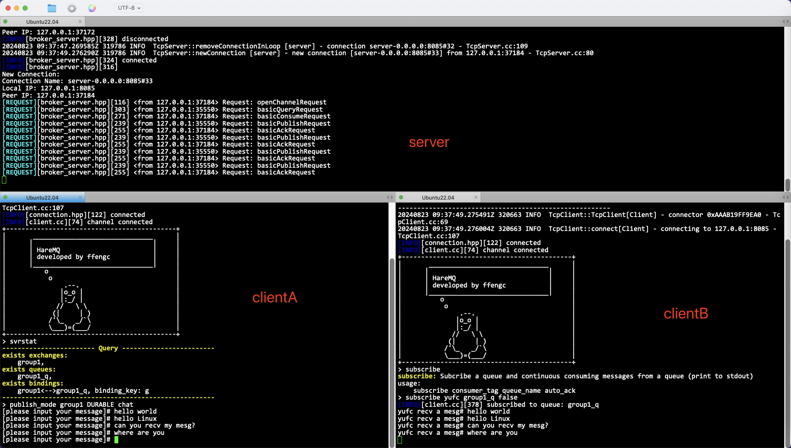
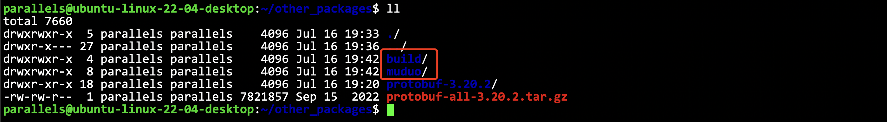
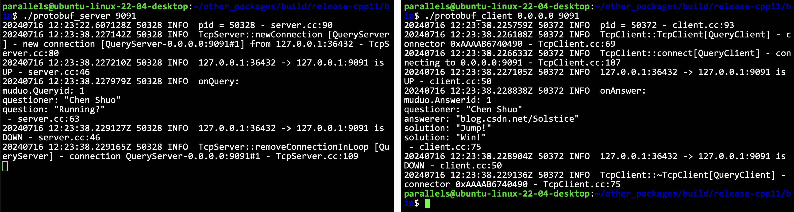
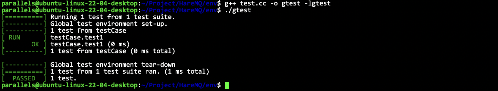
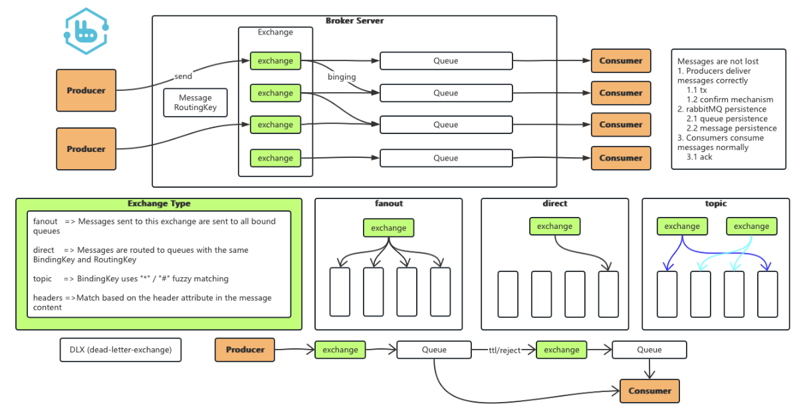

<!--  -->


# HareMQ

仿照RabbitMQ实现一个C++版本简化消息队列组件。为了学习RabbitMQ，这个项目囊括了高性能消息系统的精髓和核心功能，模仿 RabbitMQ 的基本架构，专注于发布-订阅机制。

<a href="https://github.com/ffengc">
    
</a>
<a href="https://ffengc.github.io">
    
</a>
<a href="https://ffengc.github.io/gh-blog/">
    
</a>

- **[简体中文](./README-cn.md)**
- **[English](./README.md)**

> [!TIP]
> 如果你对本项目的运行和实现有任何疑问，或者对本项目有更好的优化建议，可以直接联系我，或者在仓库的issue中留言。

## 关于MQ中间件

消息队列（MQ）中间件是一种软件或服务，用于在不同的应用程序、系统或服务之间异步传递消息。它允许各种系统之间独立通信，不必直接连接到彼此，从而提高了系统的可扩展性、灵活性和可维护性。消息队列中间件的一些典型用途包括解耦服务组件、增强并发处理能力、以及平衡负载。

RabbitMQ 是一个流行的开源消息队列系统，支持多种消息协议，主要使用 AMQP（高级消息队列协议）。RabbitMQ 允许应用程序通过简单的协议来发送、接收和存储消息，直到被接收。以下是其一些关键特点：

1. **灵活的路由**：RabbitMQ 提供了多种消息路由方式，包括直接、主题、头和扇出交换，这使得它在消息传递时非常灵活。
2. **可靠性**：RabbitMQ 支持消息持久化，确保消息不会因为服务器故障而丢失。
3. **高可用性**：可以配置RabbitMQ集群来保证服务的高可用性和故障转移。
4. **多种客户端支持**：支持多种编程语言的客户端库，如Python、Java、.NET等。

消息队列中间件如 RabbitMQ 在大数据处理、微服务架构、分布式系统和实时数据处理等多种场景下都有广泛应用。

**本项目会针对于RabbitMQ，学习并提取里面的精华部分，学习RabbitMQ的基本原理，并对它进行一个简单的模拟实现。通过学习这个项目，可以加深对消息队列中间件的理解，对后续的开发有很大的帮助。**

## 效果演示



如图所示，在服务端开启之后。用两个终端分别登录客户端，定义交换机、队列和绑定关系之后，`clientA` 向交换机 `group1` 发送消息，`clientB` 在订阅队列 `group1_q` 之后，能收到 `clientA` 发送的消息。这个就是最基本的功能演示，其他详细功能请见详细的使用文档。

- [The Documentation Of HareMQ](./docs/documentation.md)

## 技术栈

- **序列化框架：** Protobuf进行⼆进制序列化
- **⽹络通信：** ⾃定义应⽤层协议+muduo库：对tcp⻓连接的封装、并且使⽤epoll的事件驱动模式，实现⾼并发服务器与客⼾端•
- **源数据信息数据库：** SQLite3
-  **单元测试框架：** Gtest

## 环境配置

<details>
  <summary><strong>配置和部署</strong></summary>


### 基本工具

**首先需要以下基本工具：**

高于7的`gcc/g++`版本, git, cmake 等

### 安装`protobuf`

是一个序列化和反序列化工具。

安装依赖：
```sh
# centos
sudo yum install autoconf automake libtool curl make gcc-c++ unzip
# ubuntu
sudo apt update
sudo apt install autoconf automake libtool curl make g++ unzip
```
下载`protobuf`包：
```sh
wget https://github.com/protocolbuffers/protobuf/releases/download/v3.20.2/protobuf-all-3.20.2.tar.gz
```
编译安装：
```sh
# 解压
tar -zxf protobuf-all-3.20.2.tar.gz
cd protobuf-3.20.2/
# 运行目录配置脚本
./autogen.sh
# 运行配置脚本
./configure
# 编译(时间较长)
make
# 安装
sudo make install
# 确认是否安装成功
protoc --version
```

如图所示即安装成功。

### 安装muduo库

下载源代码：

```sh
git clone https://github.com/chenshuo/muduo.git
```

安装依赖：
```sh
# centos
sudo yum install gcc-c++ cmake make zlib zlib-devel boost-devel
# ubuntu
sudo apt update
sudo apt install g++ cmake make zlib1g zlib1g-dev libboost-all-dev
```
编译安装：
```
./build.sh
./build.sh install
```

> ‼️这里要说明一下，如果编译过程提示protoc相关库找不到，是因为protobuf当时安装路径和muduo要求的不同，需要行把相关库链接到指定位置（具体要看报错信息）。
> 此外还有可能出现的问题是，boost库相关的错误（机子上装有python的conda），可能会出现muduo找boost的时候找到conda的boost里面去了，解决方法就是暂时把annaconda3隐藏，就可以编译成功。

### 验证muduo是否安装成功

> **Tips:** 编译好之后的`muduo`可执行是在上级目录的`build`里的，而不是在`muduo`目录里，是在和`muduo`同级的`build`目录下。



进入muduo一些测试可执行的目录：`build/release-cpp11/bin`

运行demo服务端：
```sh
./protobuf_server 9091
```
同样，如果出现链接错误，就把对应的库链接到对应的地方即可。

启动demo客户端：
```sh
./protobuf_client 0.0.0.0 9091
```



如图所示即通过测试。

### 安装SQLite3

这是一个轻量级的数据库。

```sh
# centos
sudo yum install sqlite-devel
# ubuntu
sudo apt install sqlite3
# 验证安装
sqlite3 --version
```

### 安装gtest测试框架

```sh
# centos
sudo yum install epel-release
sudo yum install dnf
sudo dnf install dnf-plugins-core
sudo dnf install gtest gtest-devel
# ubuntu
sudo apt update
sudo apt install libgtest-dev
```

测试gtest是否安装成功：

运行`env/test.cc`代码，如果输出正常则安装成功。



</details>

## 项目相关框架介绍和学习

这是在我做这个项目过程中，学习一些要用的第三方框架所整理的文档和代码。

如果对这一部分不感兴趣可以直接跳过。

- 文档: [protobuf.md](./docs/proto.md), 代码: `HareMQ/demo/protobuf`
- 文档: [muduo.md](./docs/muduo.md), 代码: `HareMQ/demo/muduo`
- 文档: [sqlite.md](./docs/sqlite.md), 代码: `HareMQ/demo/sqlite`
- 文档: [gtest.md](./docs/gtest.md), 代码: `HareMQ/demo/gtest`
- 文档: [C++异步操作](./docs/asynchronous.md), 代码: `HareMQ/demo/asynchronous`
- 文档: [基于C++异步操作实现的线程池组件](./docs/thread_pool.md), 代码: `HareMQ/demo/thread_pool`

## 项目框架

### 基本框架



其中，`Broker Server` 是最核心的部分，负责消息的存储和转发

而在AMQP(Advanced Message Queuing Protocol-高级消息队列协议，一个提供统一消息服务的应用层标准高级消息队列协议，为面向消息的中间件设计，使得遵从该规范的客户端应用和消息中间件服务器的全功能互操作成为可能)模型中，也就是消息中间件服务器Broker中，又存在以下概念：
- 虚拟机 (VirtualHost):类似于 MySQL的"database",是一个逻辑上的集合。一个 BrokerServer 上可以存在多个 VirtualHost。
- 交换机 (Exchange):生产者把消息先发送到 Broker 的 Exchange 上，再根据不同的规则,把消息转发给不同的 Queue。
- 队列 (Queue):真正用来存储消息的部分，每个消费者决定自己从哪个 Queue 上读取消息
- 绑定 (Binding):Exchange 和 Queue 之间的关联关系，Exchange 和 Queue 可以理解成"多对多关系，使用一个关联表就可以把这两个概念联系起来
- 消息(Message): 传递的内容

> [!NOTE]
> 结构图上表示的数据结构，既需要在内存中存储，也需要在硬盘中存储。
> - 内存存储：方便实用
> - 硬盘存储：重启数据不丢失

### 核心API

对于Broker来说，要实现以下核心API，通过这些API来实现消息队列的基本功能。

1. 创建交换机 `exchangeDeclare`
2. 销毁交换机 `exchangeDelete`
3. 创建队列 `queueDeclare`
4. 销毁队列 `queueDelete`
5. 创建绑定 `queueBind`
6. 解除绑定 `queueUnbind`
7. 发布消息 `basicPublish`
8. 订阅消息 `basicConsume`
9. 确定消息 `basicAck`
10. 取消订阅 `basicCancel`

另一方面，生产者和消费者通过网络的方式远程调用这些API，实现生产者消费者模型。

> [!NOTE]
> 关于`VirtualHost`: 对于 RabbitMQ 来说, `VirtualHost` 也是可以随意创建删除的。
> 此处在这个项目中暂时不做这部分功能（实现起来比较简单，代码中会完成部分和虚拟主机相关的结构设计，可以自行完成/修改管理逻辑）

### exchange

对于RabbitMQ来说，主要支持4种exchange类型:
- **Direct**: 生产者发送消息的时候，直接指定被该交换机绑定的队列名。
- **Fanout**: 生产者发送的消息会被复制到该交换机的所有队列中。
- **Topic**: 绑定队列到交换机上时，指定一个字符串为`bindingKey`。发送消息指定一个字符串为`routingKey`。当`routingKey`和`bindingKey`满足一定的匹配条件的时候，则把消息投递到指定的队列中。
- **Header**: 比较复杂比较少见，项目只实现前三种。

> [!TIP]
> 这三种操作就像给群聊发红包一样
> - Derect就是发一个专属的红包，只有指定的人能领取
> - Fanout是使用了魔法，发一个10元的红包，群里每一个人都能领到10元
> - Topic是发一个画图红包，发10元红包，同时出题，画的像的人才能领取，同样也是能领取到10元。


### 持久化

`Exchange, Queue, Binding, Message`等数据都有持久化要求。
当程序重启/主机重启，保证内容不丢失。

### 网络通信

生产者和消费者都是客户端，Broker是作为服务器，通过网络进行通信。上面的内容已经说了 Broker 需要提供的网络api，现在列举客户端所需要的api。

1. 创建`Connection`
2. 关闭`Connection`
3. 创建`Channel`
4. 关闭`Channel`
5. 创建交换机 `exchangeDeclare`
6. 销毁交换机 `exchangeDelete`
7. 创建队列 `queueDeclare`
8. 销毁队列 `queueDelete`
9. 创建绑定 `queueBind`
10. 解除绑定 `queueUnbind`
11. 发布消息 `basicPublish`
12. 订阅消息 `basicConsume`
13. 确定消息 `basicAck`
14. 取消订阅 `basicCancel`

所以在 Broker 的基础上，客户端还要增加 `Connection` 操作和 `Channel` 操作。

- `Connection` 对应一个 TCP 连接
- `Channel` 则是 `Connection` 中的逻辑通道

一个 `Connection` 中可以包含多个 `Channel`。`Channel` 和 `Channel` 之间的数据是独立的，不会相互干扰，这样做主要是为了能够更好的复用TCP连接，达到长连接的效果，避免频繁的创建关闭TCP连接。

> [!TIP]
> `Connection` 可以理解成一根网线 `Channel` 则是网线里具体的线缆。


### 消息应答

被消费的消息，需要进行应答。应答模式分为两种:
- 自动应答: 消费之只要消费离开消息，就算应答完毕，Broker直接删除这个消息。
- 手动应答: 消费者手动调用应答借口，Broker收到应答请求之后，才删除这个消息。

> [!TIP]
> 手动应答的目的,是为了保证消息确实被消费者处理成功了,在一些对于数据可靠性要求高的场景,比较常见。

## 项目模块划分

<details>
  <summary><strong>详细的模块划分</strong></summary>

<br>

**总体分为三个部分实现:**

1. 服务端
2. 发布客户端
3. 订阅客户端

### 服务端模块:

**1. 数据管理模块**
- 交换机数据管理模块
- 队列数据管理模块
- 绑定数据管理模块
- 消息数据管理模块
- 以上四个模块分别实现数据的管理（增删查），以及持久化的存储。

**2. 虚拟机数据管理模块**
- 虚拟机其实就是交换机+队列+绑定+消息的整体逻辑单元。
- 因此虚拟的数据管理其实就是将以上四个模块的合并管理。

**3. 交换路由模块**
- 消息的发布，将一条新消息发布到交换机上，由交换机决定放入哪些队列而决定交给哪个队列。
- 其中交换机类型起了很大作用（直接交换，广交换，主题交换）直接交换和广播交换思想都较为简单，而主题交换涉及到了一个规则匹配的流程。
- 而交换路由模块就是专门做匹配过程的。

**4. 消费者管理模块**
- 消费者指的是订阅了一个队列消息的客户端，一旦这个队列有了消息就会推送给这个客户端。
- 在核心API中有个订阅消息的服务——注意了，这里的订阅不是订阅某条消息，而是订阅了某个队列的消息。
- 当前主要实现了消息推送功能，因此一旦有了消息就要能找到消费者相关的信息（消费者对应的信道）。

**5. 信道（通信通道）管理模块**
- 个连接可能会对应有多个通信通道。
- 一旦某个客户端要关闭通信，关闭的不是连接，而是自己对应的通信通道，关闭信道我们就需要将客户端的订阅给取消。

**6. 连接管理模块**
- 就是一个网络通信对应的连接。
- 因为当一个连接要关闭的时候，就应该把连接关联的信道全部关闭，因此也有数据管理至少要管理关联的信道。

**7. 服务端BrokerServer模块**
- 这个模块是对以上所有模块的整合，整合成为一个服务器。

### 客户端模块:

**1. 消费者管理模块**

- 个订阅客户端，当订阅一个队列消息的时候，其就相当于创建了一个消费者。

**2. 信道管理模块**
- 客户端的信道与服务端的信道是一一对应的，服务端信道提供的服务，客户端都有相当于，服务端为客户端提供服务，客户端为用户提供服务。

**3. 连接管理模块**
- 对于用户来说，所有的服务都是通过信道完成的，信道在用户的角度就是一个通信通道（而不是连接），因此所有的请求都是通过信道来完成的连接的管理就包含了客户端资源的整合。

**4. 基于以上的三个模块封装实现:**
- 订阅客户端：订阅一个队列的消息，收到推送过来的消息进行处理。
- 发布客户端：向一个交换机发布消息。


</details>

## 详细实现

- **[./docs/work.md](./docs/work.md)**

## 项目扩展

这个项目最终也只是 `RabbitMQ` 的一个简化版本，只实现了 `RabbitMQ` 中最最核心的功能，做这个项目的目的也只是去学习 `RabbitMQ` 的底层精髓逻辑，因此还有很多地方是可以去扩展的。

- 虚拟机管理: 在当前实现的项目中，是只支持一台虚拟主机的。但是在 `RabbitMQ` 中，是可以支持多台主机的，支持虚拟机的管理。
- 用户管理/用户认证/登录功能: 在这个项目中，只是简单的在 `client` 代码中硬定义队列，交换机和他们的绑定关系，用户名也是简单的 `consumer1`，因此用户管理是可以去扩展维护的。
- 交换机/队列的独占模式和自动删除
- 发送方确认（broker给生产者的确认应答）
- 消息的管理方式
- 管理接口
- 管理页面: `RabbitMQ` 是会提供一个网页作为客户端，让用户进行交换机管理，队列管理和虚拟机管理等功能。