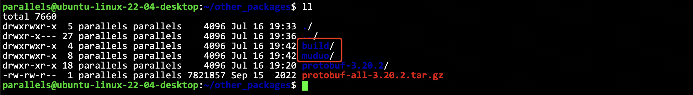
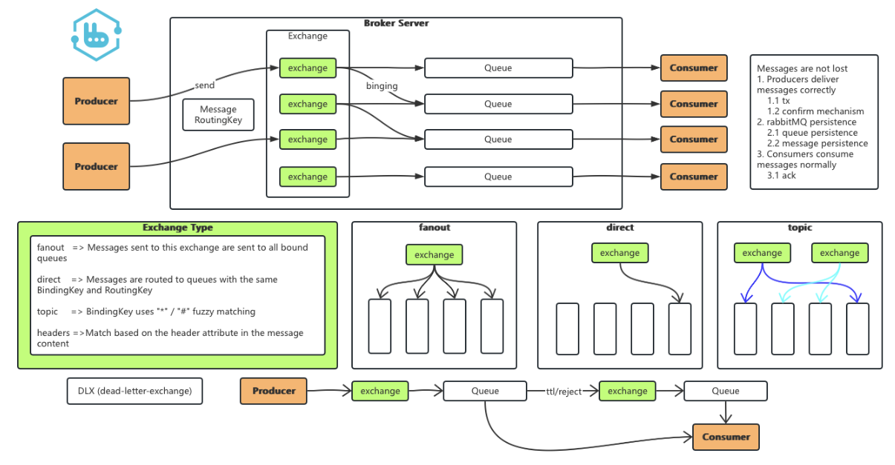

<!--  -->

# HareMQ

A C++ version of the simplified message queue component is implemented based on RabbitMQ. In order to learn RabbitMQ, this project encompasses the essence and core functions of a high-performance messaging system, imitates the basic architecture of RabbitMQ, and focuses on the publish-subscribe mechanism.

<a href="https://github.com/ffengc">
    
</a>
<a href="https://ffengc.github.io">
    
</a>
<a href="https://ffengc.github.io/gh-blog/">
    
</a>


- **[简体中文](./README-cn.md)**
- **[English](./README.md)**

> [!TIP]
> If you have any questions about the operation and implementation of this project, or if you have better optimization suggestions for this project, you can contact me directly or leave an issue in the repository.

## About MQ Middleware

Message queuing (MQ) middleware is a software or service used to asynchronously pass messages between different applications, systems, or services. It allows various systems to communicate independently without having to connect directly to each other, thereby improving the scalability, flexibility, and maintainability of the system. Some typical uses of message queue middleware include decoupling service components, enhancing concurrent processing capabilities, and balancing loads.

RabbitMQ is a popular open source message queue system that supports multiple message protocols, mainly using AMQP (Advanced Message Queuing Protocol). RabbitMQ allows applications to send, receive, and store messages through a simple protocol until they are received. Here are some of its key features:

1. **Flexible routing**: RabbitMQ provides a variety of message routing methods, including direct, topic, header, and fan-out exchanges, which makes it very flexible in messaging.
2. **Reliability**: RabbitMQ supports message persistence to ensure that messages are not lost due to server failures.
3. **High availability**: RabbitMQ clusters can be configured to ensure high availability and failover of services.
4. **Multiple client support**: Supports client libraries in multiple programming languages, such as Python, Java, .NET, etc.


Message queue middleware such as RabbitMQ is widely used in various scenarios such as big data processing, microservice architecture, distributed systems, and real-time data processing.

**This project will focus on RabbitMQ, learn and extract the essence of it, learn the basic principles of RabbitMQ, and perform a simple simulation implementation of it. By studying this project, you can deepen your understanding of message queue middleware, which will be of great help to subsequent development.**

## Effect Demonstration


As shown in the figure, after the server is turned on, log in to the client using two terminals, define the switch, queue and binding relationship, and then `clientA` sends a message to the switch `group1`. After `clientB` subscribes to the queue `group1_q`, it can receive the message sent by `clientA`. This is the most basic function demonstration. For other detailed functions, please refer to the detailed usage documentation.

- [The Documentation Of HareMQ](./docs/documentation-en.md)

## Technology stack

- **Serialization framework:** Protobuf for binary serialization
- **Network communication:** Custom application layer protocol + muduo library: Encapsulation of TCP long connection, and use of epoll event-driven mode to achieve high-concurrency server and client•
- **Source data information database:** SQLite3
- **Unit test framework:** Gtest


## Environment Configuration

<details>
  <summary><strong>Configuration and deployment</strong></summary>


### Basic tools

**First, you need the following basic tools:**

`gcc/g++` versions higher than 7, git, cmake, etc.

### Install `protobuf`

It is a serialization and deserialization tool.

Installation dependencies:
```sh
# centos
sudo yum install autoconf automake libtool curl make gcc-c++ unzip
# ubuntu
sudo apt update
sudo apt install autoconf automake libtool curl make g++ unzip
```
Download the protobuf package:
```sh
wget https://github.com/protocolbuffers/protobuf/releases/download/v3.20.2/protobuf-all-3.20.2.tar.gz
```
Compile and install:

```sh
# unzip
tar -zxf protobuf-all-3.20.2.tar.gz
cd protobuf-3.20.2/
# Run the directory configuration script
./autogen.sh
# Run the configuration script
./configure
# Compile (takes longer)
make
# Install
sudo make install
# Confirm whether the installation is successful
protoc --version
```


The installation is successful as shown in the figure.

### Install the muduo lib

Download the code.
```sh
git clone https://github.com/chenshuo/muduo.git
```

Installation dependencies:
```sh
# centos
sudo yum install gcc-c++ cmake make zlib zlib-devel boost-devel
# ubuntu
sudo apt update
sudo apt install g++ cmake make zlib1g zlib1g-dev libboost-all-dev
```

> ‼️ Here I want to explain that if the compilation process prompts that the protoc related library cannot be found, it is because the installation path of protobuf at that time is different from that required by muduo. You need to link the related library to the specified location (depending on the error message).
> Another possible problem is the error related to the boost library (python conda is installed on the machine). It may appear that when muduo looks for boost, it finds the boost in conda. The solution is to temporarily hide annaconda3, and then the compilation will be successful.

### Verify that muduo is installed successfully

> **Tips:** The compiled `muduo` executable is in the `build` directory of the parent directory, not in the `muduo` directory. It is in the `build` directory at the same level as `muduo`.



Enter the directory where muduo tests can be executed: `build/release-cpp11/bin`


run the demo server:
```sh
./protobuf_server 9091
```
Similarly, if a link error occurs, just link the corresponding library to the corresponding place.

run the demo client:

```sh
./protobuf_client 0.0.0.0 9091
```


The test is passed as shown in the figure.

### Install SQLite3

This is a lightweight database.

```sh
# centos
sudo yum install sqlite-devel
# ubuntu
sudo apt install sqlite3
# Verify installation
sqlite3 --version
```

### Install the gtest testing framework

```sh
# centos
sudo yum install epel-release
sudo yum install dnf
sudo dnf install dnf-plugins-core
sudo dnf install gtest gtest-devel
# ubuntu
sudo apt update
sudo apt install libgtest-dev
```

Test whether gtest is installed successfully:

Run the `env/test.cc` code. If the output is normal, the installation is successful.


</details>

## Introduction and learning of project related frameworks

These are the documents and codes I compiled while learning some third-party frameworks I needed to use during this project.

If you are not interested in this part or have already mastered the use of these frameworks, you can skip it directly.

- doc: [protobuf.md](./docs/proto-en.md), code: `HareMQ/demo/protobuf`
- doc: [muduo.md](./docs/muduo-en.md), code: `HareMQ/demo/muduo`
- doc: [sqlite.md](./docs/sqlite-en.md), code: `HareMQ/demo/sqlite`
- doc: [gtest.md](./docs/gtest-en.md), code: `HareMQ/demo/gtest`
- doc: [asynchronous in C++11](./docs/asynchronous-en.md), code: `HareMQ/demo/asynchronous`
- doc: [Thread pool component based on C++ asynchronous operation](./docs/thread_pool-en.md), code: `HareMQ/demo/thread_pool`

## Project Framework

### Basic Framework



Among them, `Broker Server` is the core part, responsible for the storage and forwarding of messages

In the AMQP (Advanced Message Queuing Protocol, an application layer standard advanced message queue protocol that provides unified message services, designed for message-oriented middleware, making full-function interoperability between client applications and message middleware servers that comply with this specification possible) model, that is, in the message middleware server Broker, there are the following concepts:
- Virtual Machine (VirtualHost): Similar to MySQL's "database", it is a logical collection. There can be multiple VirtualHosts on a BrokerServer.
- Exchange (Exchange): The producer first sends the message to the Broker's Exchange, and then forwards the message to different Queues according to different rules.
- Queue: The part that actually stores messages. Each consumer decides which queue to read messages from.
- Binding: The relationship between Exchange and Queue. Exchange and Queue can be understood as a "many-to-many relationship. A relationship table can be used to link these two concepts.
- Message: The content of the transmission

> [!NOTE]
> The data structure shown in the structure diagram needs to be stored in both memory and hard disk.
> - Memory storage: convenient and practical
> - Hard disk storage: data is not lost after restart

### Core API

For Broker, the following core APIs need to be implemented to implement the basic functions of the message queue.

1. Create an exchange `exchangeDeclare`
2. Destroy an exchange `exchangeDelete`
3. Create a queue `queueDeclare`
4. Destroy a queue `queueDelete`
5. Create a binding `queueBind`
6. Unbind `queueUnbind`
7. Publish a message `basicPublish`
8. Subscribe to a message `basicConsume`
9. Confirm a message `basicAck`
10. Unsubscribe `basicCancel`

On the other hand, producers and consumers remotely call these APIs through the network to implement the producer-consumer model.

> [!NOTE]
> About `VirtualHost`: For RabbitMQ, `VirtualHost` can also be created and deleted at will.
> This part of the function is not temporarily implemented in this project (it is relatively simple to implement, and some structural designs related to virtual hosts will be completed in the code, and the management logic can be completed/modified by yourself)


### exchange

For RabbitMQ, four exchange types are mainly supported:
- **Direct**: When the producer sends a message, it directly specifies the queue name bound to the switch.
- **Fanout**: The message sent by the producer will be copied to all queues of the switch.
- **Topic**: When binding a queue to a switch, specify a string as `bindingKey`. When sending a message, specify a string as `routingKey`. When `routingKey` and `bindingKey` meet certain matching conditions, the message is delivered to the specified queue.
- **Header**: It is more complex and rare, and the project only implements the first three.


> [!TIP]
> These three operations are just like sending red envelopes to a group chat
> - Derect is to send a dedicated red envelope, which can only be received by designated people
> - Fanout is to use magic, send a 10 yuan red envelope, and everyone in the group can receive 10 yuan
> - Topic is to send a drawing red envelope, send a 10 yuan red envelope, and set a question at the same time. Only those who draw like pictures can receive it, and they can also receive 10 yuan.


### Durability

`Exchange, Queue, Binding, Message` and other data all have persistence requirements.
When the program is restarted/the host is restarted, the content is guaranteed not to be lost.


### Network communication

Both the producer and the consumer are clients, and the Broker acts as a server, communicating over the network. The above content has already mentioned the network APIs that the Broker needs to provide. Now let's list the APIs required by the client.

1. Create `Connection`
2. Close `Connection`
3. Create `Channel`
4. Close `Channel`
5. Create an exchange `exchangeDeclare`
6. Destroy an exchange `exchangeDelete`
7. Create a queue `queueDeclare`
8. Destroy a queue `queueDelete`
9. Create a binding `queueBind`
10. Unbind `queueUnbind`
11. Publish a message `basicPublish`
12. Subscribe to a message `basicConsume`
13. Confirm a message `basicAck`
14. Unsubscribe `basicCancel`

Therefore, on the basis of Broker, the client also needs to add `Connection` operation and `Channel` operation.

- `Connection` corresponds to a TCP connection
- `Channel` is the logical channel in `Connection`

A `Connection` can contain multiple `Channel`. The data between `Channel` and `Channel` are independent and will not interfere with each other. This is mainly to better reuse TCP connections, achieve the effect of long connections, and avoid frequent creation and closing of TCP connections.


> [!TIP]
> `Connection` can be understood as a network cable, and `Channel` is the specific cable in the network cable.


### Message Response

Consumed messages need to be responded to. There are two response modes:
- Automatic response: As long as the consumer leaves the message, the response is completed and the Broker directly deletes the message.
- Manual response: The consumer manually calls the response interface, and the Broker deletes the message only after receiving the response request.

> [!TIP]
> The purpose of manual response is to ensure that the message is successfully processed by the consumer. It is more common in some scenarios with high data reliability requirements.


## Project module division

<details>
<summary><strong>Detailed module division</strong></summary>

<br>


**The overall implementation is divided into three parts:**

1. Server

2. Publishing client

3. Subscribing client

### Server module:

**1. Data management module**
- Switch data management module
- Queue data management module
- Binding data management module
- Message data management module
- The above four modules respectively implement data management (addition, deletion and query) and persistent storage.

**2. Virtual machine data management module**
- Virtual machine is actually the overall logical unit of switch + queue + binding + message.
- Therefore, virtual data management is actually the combined management of the above four modules.

**3. Switch routing module**
- Message publishing, publish a new message to the switch, and the switch decides which queue to put it in and which queue to hand it over to.
- The switch type plays a big role (direct exchange, broadcast exchange, topic exchange). The ideas of direct exchange and broadcast exchange are relatively simple, while topic exchange involves a rule matching process.
- The exchange routing module is specifically for the matching process.

**4. Consumer management module**
- Consumer refers to a client that subscribes to a queue message. Once the queue has a message, it will be pushed to the client.
- In the core API, there is a service for subscribing to messages. Please note that the subscription here does not mean subscribing to a message, but subscribing to a message in a queue.
- Currently, the main function of message push is implemented, so once there is a message, it is necessary to find the information related to the consumer (the channel corresponding to the consumer).

**5. Channel (communication channel) management module**
- A connection may correspond to multiple communication channels.
- Once a client wants to close the communication, it does not close the connection, but the corresponding communication channel. To close the channel, we need to cancel the client's subscription.

**6. Connection management module**
- It is a connection corresponding to a network communication.
- Because when a connection is to be closed, all the channels associated with the connection should be closed, so there is also data management to at least manage the associated channels.

**7. BrokerServer module on the server side**
- This module is an integration of all the above modules into a server.

### Client module:

**1. Consumer management module**

- A subscription client, when subscribing to a queue message, is equivalent to creating a consumer.

**2. Channel management module**
- The client's channel corresponds to the server's channel one-to-one. The services provided by the server channel are equivalent to the client. The server provides services to the client, and the client provides services to the user.

**3. Connection management module**
- For users, all services are completed through channels. From the user's perspective, the channel is a communication channel (not a connection), so all requests are completed through channels. Connection management includes the integration of client resources.

**4. Encapsulation implementation based on the above three modules:**
- Subscription client: subscribe to a queue message, receive the pushed message and process it.
- Publishing client: publish a message to a switch.

</details>

## Detailed implementation

- **[./docs/work.md](./docs/work-en.md)**


## Project Extension

This project is ultimately just a simplified version of `RabbitMQ`, which only implements the most core functions of `RabbitMQ`. The purpose of doing this project is just to learn the underlying essential logic of `RabbitMQ`, so there are still many places that can be expanded.

- Virtual machine management: In the current implementation project, only one virtual host is supported. But in `RabbitMQ`, multiple hosts can be supported, and virtual machine management is supported.
- User management/user authentication/login function: In this project, queues, switches and their binding relationships are simply hard-defined in the `client` code, and the user name is also simply `consumer1`, so user management can be expanded and maintained.
- Exclusive mode and automatic deletion of switches/queues
- Sender confirmation (broker's confirmation response to the producer)
- Message management method
- Management interface
- Management page: `RabbitMQ` will provide a web page as a client, allowing users to manage switches, queues and virtual machines.