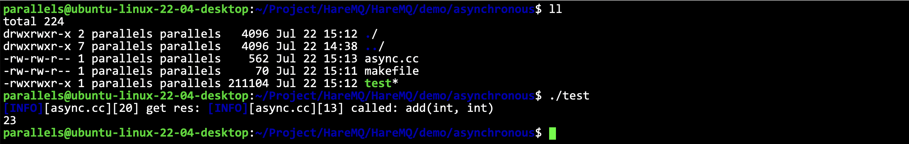

# C++11中的异步操作

- [简体中文](./asynchronous.md)
- [English](./asynchronous-en.md)

***
- [C++11中的异步操作](#c11中的异步操作)
  - [`std::future`是什么](#stdfuture是什么)
  - [使用`std::async`关联异步任务](#使用stdasync关联异步任务)
  - [使用例子](#使用例子)
  - [使用`std::promise`和`std::future`配合](#使用stdpromise和stdfuture配合)
  - [`std::packaged_task`结合`std::future`的使用](#stdpackaged_task结合stdfuture的使用)


学习这一部分主要是为了实现一个线程池。如果一个线程池中，不关系线程的运行结果，只需要把任务丢出去，那么这个线程池是非常简单的，很容易实现的。但是如果我们关心线程池的结果，就需要异步操作才能实现了。

## `std::future`是什么

**文档: [https://legacy.cplusplus.com/reference/future](https://legacy.cplusplus.com/reference/future/future/?kw=future)**

`std::future` 是C++11标准库中的一个模板类，它表示一个异步操作的结果。当我们在多线程编程中使用异步任务时，`std:future`可以帮助我们在需要的时候获取任务的执行结果。`std:future`的一个重要特性是能够阻塞当前线程，直到异步操作完成，从而确保我们在获取结果时不会遇到未完成的操作。

**应用场景**

- 异步任务: 当我们需要在后台执行一些耗时操作时，如网络请求或计算密集型任务等，`std:future`可以用来表示这些异步任务的结果。通过将任务与主线程分离，我们可以实现任务的并行处理，从而提高程序的执行效率。
- 并发控制: 在多线程编程中，我们可能需要等待某些任务完成后才能继续执行其他操作。通过使用`std:future`，我们可以实现线程之间的同步，确保任务完成后再获取结果并继续执行后续操作
- 结果获取: `std:future`提供了一种安全的方式来获取异步任务的结果。我们可以使用`std::future:get()`函数来获取任务的结果，此函数会阻塞当前线程，直到异步操作完成。这样，在调用`get()`函数时，我们可以确保已经获取到了所需的结果。


## 使用`std::async`关联异步任务

`std::async`是一种将任务与`std::future`任务，并返回一个与该关联的简单方法。它创建并运行一个异出任务结果关联的`std::future`对象。默认情况下，`std:async`是否启动一个新线程或者在等待`future`内参数。这个参数为`std::launch`类型时，任务是否同步运行都取决于你给的参数，这个参数的类型为`std::launch`类型。
- `std::launch::deferred`表明该系数会被延迟调用，直到在`future`上调用`get()`或者`wait()`才会开始执行任务。
- `std::launch::async`表明函数会在自己创建的线程上运行。
- `std::launch::deferred`, `std::launch::async`内部通过系统等条件自动选择策略。


## 使用例子

```cpp
#include "../log.hpp"
#include <future>
#include <iostream>
#include <thread>

int add(int num1, int num2) {
    LOG(INFO) << "called: add(int, int)" << std::endl;
    return num1 + num2;
}
int main() {
    // std::async(func, ...), std::async(policy, func, ...)
    std::future<int> res = std::async(std::launch::deferred, add, 11, 12);
    LOG(INFO) << "get res: " << res.get() << std::endl;
    return 0;
}
```



很明显就是一个异步。

很明显，如果我们不去`get()`调用，他是不会执行的。

如果换成`std::future<int> res = std::async(std::launch::async, add, 11, 12);`，效果就会不同了，只要调用了`async`就会开始执行了，什么时候执行，不知道！但是一定不会等到调用`get()`的时候才执行。

## 使用`std::promise`和`std::future`配合

**文档: [https://legacy.cplusplus.com/reference/future/promise/](https://legacy.cplusplus.com/reference/future/promise/?kw=promise)**

`std::promise` 提供了一种设置值的方式，它可以在设置之后通过相关联的`std::future`对象进行读取。换种说法就是之前说过`std::future`可以读取一个异步函数的返回值了，但是要等待就绪，而`std::promise`就提供一种方式手动让`std:future`就绪。


```cpp
#include "../log.hpp"
#include <future>
#include <iostream>
#include <thread>

int add(int num1, int num2, std::promise<int>& prom) {
    LOG(INFO) << "called: add(int, int)" << std::endl;
    prom.set_value(num1 + num2);
    return num1 + num2;
}

int main() {
    // 通过 get_future 来建立 prom和fu 的关联
    std::promise<int> prom;
    std::future<int> fu = prom.get_future();
    std::thread thr(add, 11, 22, std::ref(prom));
    int res = fu.get();
    LOG(INFO) << "sum: " << res << std::endl;
    thr.join();
    return 0;
}
```

线程执行的任务什么时候执行是不知道的，但是我们可以通过 `get_future` 来获取异步任务中的量。


> [!NOTE]
> 为什么要采取这种方式，直接传递一个整型的地址不是也可以拿到这个值吗？如果这样操作，因为线程执行是异步的，什么时候设置的是不知道的，如果使用`promise`，才能保证：异步结果一定赋值了，外面才会拿到，这是一种同步控制，其他方式是没有同步控制的！比如下面这段代码，使用输出参数去设置。

```cpp
int add(int num1, int num2, int* result) {
    std::this_thread::sleep_for(std::chrono::seconds(3));
    LOG(INFO) << "called: add(int, int)" << std::endl;
    *result = num1 + num2;
    return num1 + num2;
}
int main() {
    int result = 0;
    std::thread thr(add, 11, 22, &result);
    int res = result;
    LOG(INFO) << "sum: " << res << std::endl;
    thr.join();
    return 0;
}
```


没有进行同步，所以外面获取结果不会等待计算结束，而是会直接没有被设置过的结果，本质就是没有进行同步！其实同步还可以用其他方法，比如`pthread`库里面的同步变量，也是同一个道理。

## `std::packaged_task`结合`std::future`的使用

**文档: [https://legacy.cplusplus.com/reference/future/packaged_task/](https://legacy.cplusplus.com/reference/future/packaged_task/)**

```cpp
int add(int num1, int num2) {
    std::this_thread::sleep_for(std::chrono::seconds(3));
    LOG(INFO) << "called: add(int, int)" << std::endl;
    return num1 + num2;
}

int main() {
    // std::packaged_task<int(int, int)> task(add);
    // std::future<int> fu = task.get_future();

    // task(11, 22) 可以这样调用
    // 但是不能当作函数对象，也就是说，不能这样调用 std::thread thr(task) 这样是不行的
    // std::thread thr(task) 和 std::async(std::launch::async, task) 本质是一样的，都是异步操作，async里面也是起线程
    // std::async(std::launch::async, task, 11, 22); // 不能这样调用

    // 但是我们可以把task定义成一个指针，传递到线程中，然后进行解引用执行
    // 如果用普通指针，容易出现指针的生命周期问题，所以使用智能指针

    auto ptask = std::make_shared<std::packaged_task<int(int, int)>>(add);
    std::thread thr([ptask]() {
        (*ptask); // 调用这个函数
    });
    std::future<int> fu = ptask->get_future();
    LOG(INFO) << "result: " << fu.get() << std::endl;
    thr.join();
    return 0;
}
```

