# Documentation

- [简体中文](./documentation.md)
- [English](./documentation-en.md)

***
- [Documentation](#documentation)
  - [Compile and run the project](#compile-and-run-the-project)
  - [Command Manual](#command-manual)
    - [All legal commands](#all-legal-commands)
    - [`cmds`](#cmds)
    - [`clear`](#clear)
    - [`logo`](#logo)
    - [`exit`](#exit)
    - [`cid`](#cid)
    - [`svrstat`](#svrstat)
    - [`declare_exchange`](#declare_exchange)
    - [`delete_exchange`](#delete_exchange)
    - [`declare_queue`](#declare_queue)
    - [`delete_queue`](#delete_queue)
    - [`publish/publish_mode`](#publishpublish_mode)
    - [`subscribe`](#subscribe)
  - [Usage Examples](#usage-examples)
  - [Start the client using the configuration file](#start-the-client-using-the-configuration-file)
  - [Logs](#logs)


## Compile and run the project

For project configuration, please see the [README file](../README-cn.md).

The project server code is in the `HareMQ/mqserver` directory, and the project client code is in the `HareMQ/mqclient` directory.

Compile the server and run:
```sh
cd HareMQ/mqserver
make clean;make;
./server
```

The effect after running is as follows, which means that the server runs successfully.

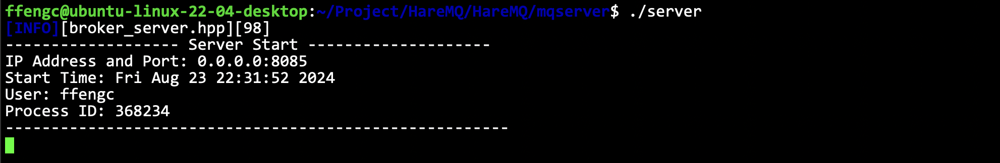

The basic information of the server is printed, including the IP and port that the server listens on, the time when the server was started, the system user who started the service, and the PID of the program.

Of course, you can choose to use `tmux` or other methods to deploy the service to the background.

Compile the client and run the client:

```sh
cd HareMQ/mqserver
make clean;make;
./client
```

There may be a bug here, which has not been resolved yet. For details, see [issue#30](https://github.com/ffengc/HareMQ/issues/30). Temporary solution: If a segmentation error occurs during startup, repeat `./client` until it succeeds.

As shown in the figure, the client runs successfully:

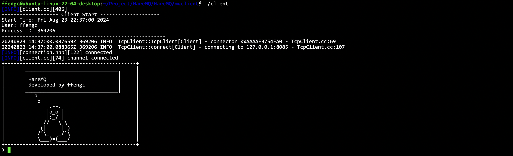

After starting the client, you will enter the client's control command line.

## Command Manual

### All legal commands

| Command            | Description                                                                                    |
| ------------------ | ---------------------------------------------------------------------------------------------- |
| `subscribe`        | Subcribe a queue and continuous consuming messages from a queue (print to stdout)              |
| `publish`          | Push a message to the specified exchange                                                       |
| `publish_mode`     | Continuous push message to specified exchange                                                  |
| `svrstat`          | View the exchange information, queue information and binding information of the current server |
| `declare_exchange` | Declare an exchange on the server                                                              |
| `declare_queue`    | Declare a message queue on the server                                                          |
| `delete_exchange`  | Delete an exchange on the server                                                               |
| `delete_queue`     | Delete and queue on the server                                                                 |
| `bind`             | Bind an exchange and a queue                                                                   |
| `unbind`           | Unbind a binding between an exchagne and a queue                                               |
| `cid`              | Show current client's channel id                                                               |
| `cmds`             | Show all commands                                                                              |
| `exit`             | Quit the client                                                                                |
| `clear`            | Clean the terminal                                                                             |
| `logo`             | Print the project logo                                                                         |

### `cmds` 

Function: View all legal commands.

**Usage:**
```sh
cmds
```

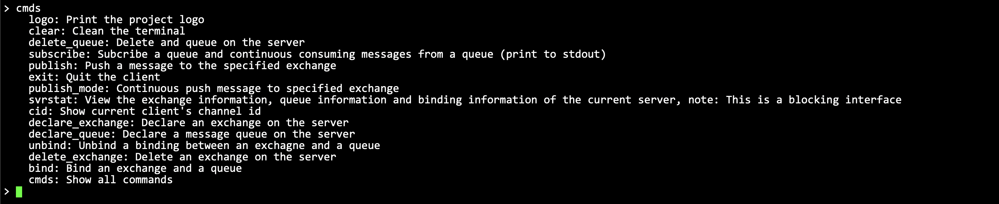

### `clear`

Function: Clean up the command line.

**Usage:**
```sh
clear
```

Effect after running:


### `logo`

Function: Print project logo.

**Usage:**
```sh
logo
```

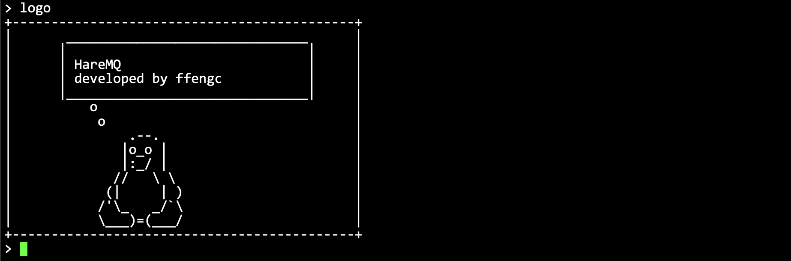

### `exit`

Function: Exit the client

**Usage:**
```sh
exit
```

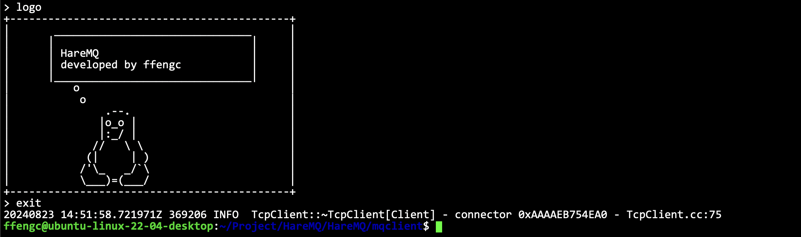

### `cid`

Function: Print the current client channel id.

**Usage:**
```sh
cid
```

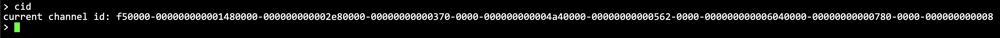

### `svrstat`

Function: Check the current switch status, queue status and binding status of the server. This is a blocking interface and needs to be blocked to wait for the server to return the result.

**Usage:**
```sh
svrstat
```


It can be observed that there is currently a switch, a queue, and a binding information on the server.

> [!NOTE]
> Although the server has been restarted many times, the server can retain historical data, so all information will be loaded from the file. This is information persistence, which I also mentioned in README.


### `declare_exchange`

Function: declare an exchange.

**Usage:**
```sh
declare_exchange exchange_name ExchangeType durable auto_delete other_args;
@ExchangeType: TOPIC/FANOUT/DIRECT
@durable, auto_delete: true/false
@other_args format: k1=v1&k2=v2&k3=v3...
```

### `delete_exchange`

Function: delete an exchange.

**Usage:**
```sh
delete_exchange exchange_name
```

### `declare_queue`

Function: declare a queue.

**Usage:**
```sh
declare_queue queue_name durable exclusive auto_delete other_args
@durable, exclusive, auto_delete: true/false
@other_args format: k1=v1&k2=v2&k3=v3...
```

### `delete_queue`

Function: Delete a queue.

**Usage:**
```sh
delete_queue queue_name
```

### `publish/publish_mode`

Function: Push a message to a specified switch/continuous push mode

**Usage:**
```sh
publish/publish_mode exchange_name DURABLE binding_key
@DURABLE: hare_mq::DeliveryMode::DURABLE/UNDURABLE
```

### `subscribe`


Function: Subscribe to a queue's messages and continue to consume the messages on the subscribed queue on `stdout`. Enter `quit` + Enter on the screen to exit the mode and automatically cancel the subscription.

**Usage:**
```sh
publish/publish_mode exchange_name DURABLE binding_key
@DURABLE: hare_mq::DeliveryMode::DURABLE/UNDURABLE
```

## Usage Examples

Start the server and start the two clients.

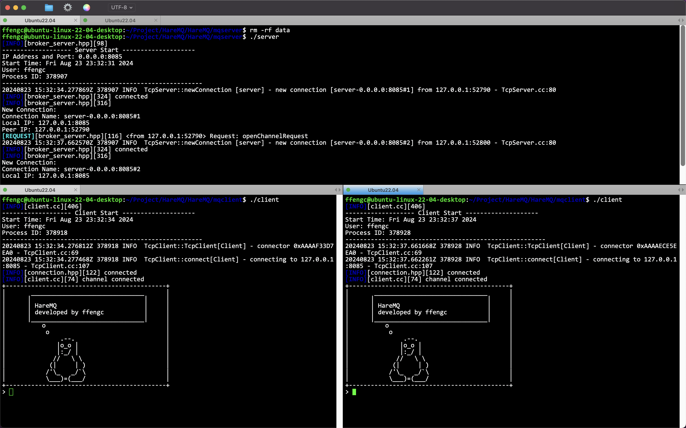

Define a switch, define a queue, and bind them. If the command format is incorrect, the usage instructions will be displayed.

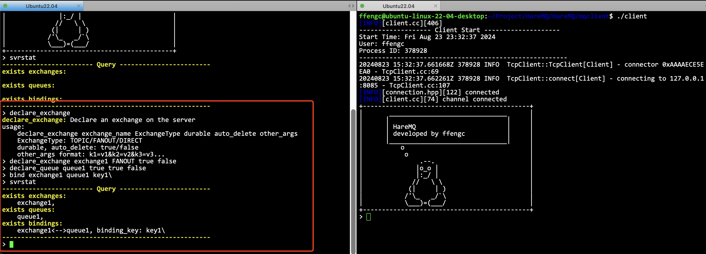

An endpoint uses `publish` and `publish_mode` to push messages to a specified exchange.
An endpoint uses `subscribe` to subscribe to messages in a queue.

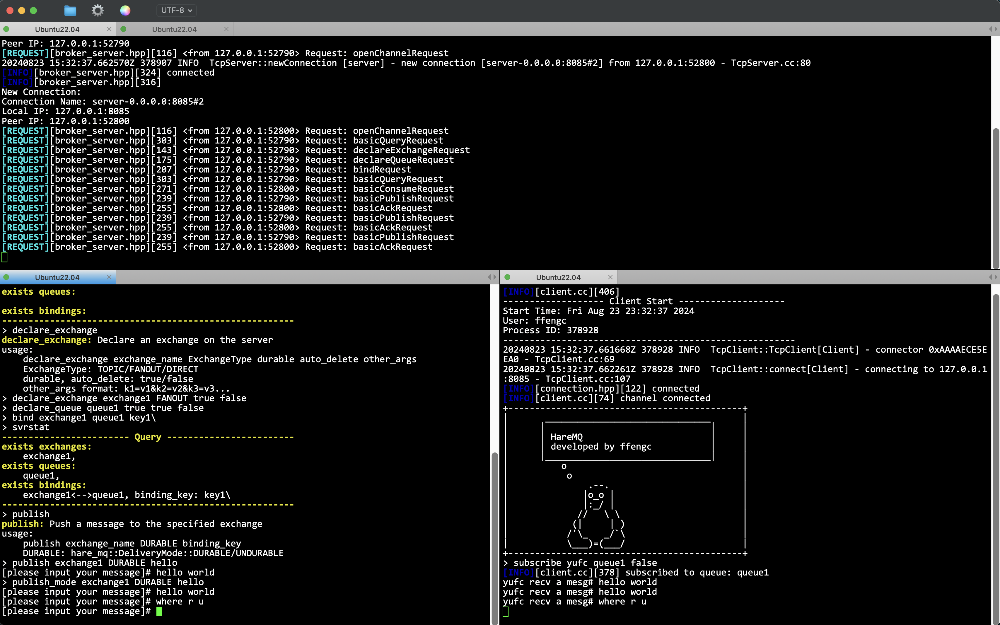

Both consumer terminals can use quit to exit the current mode.

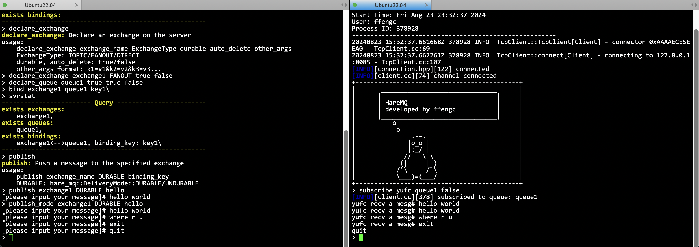

## Start the client using the configuration file

In order to automatically and quickly build switches, queues and binding information after starting the client, a configuration file startup method can be provided.

**Usage:**
```sh
./client file_name
```

For example, writing configuration files.

```conf
declare_exchange exchange1 FANOUT true false
declare_queue queue1 true false false k1=v1&k2=v2
declare_queue queue2 true false false
bind exchange1 queue1 news.pop.#
bind exchange1 queue2 queue2
```

**Configuration file format:**
1. Each line is a command
2. The format of each command is the same as the terminal input format
3. If there is an error in the configuration file, the process will be terminated (but at this time, some commands may have been configured for the server, and the server status needs to be checked.
4. How to format the server status: delete the `data` directory under the `mqserver` directory.


Start the client using the configuration file:

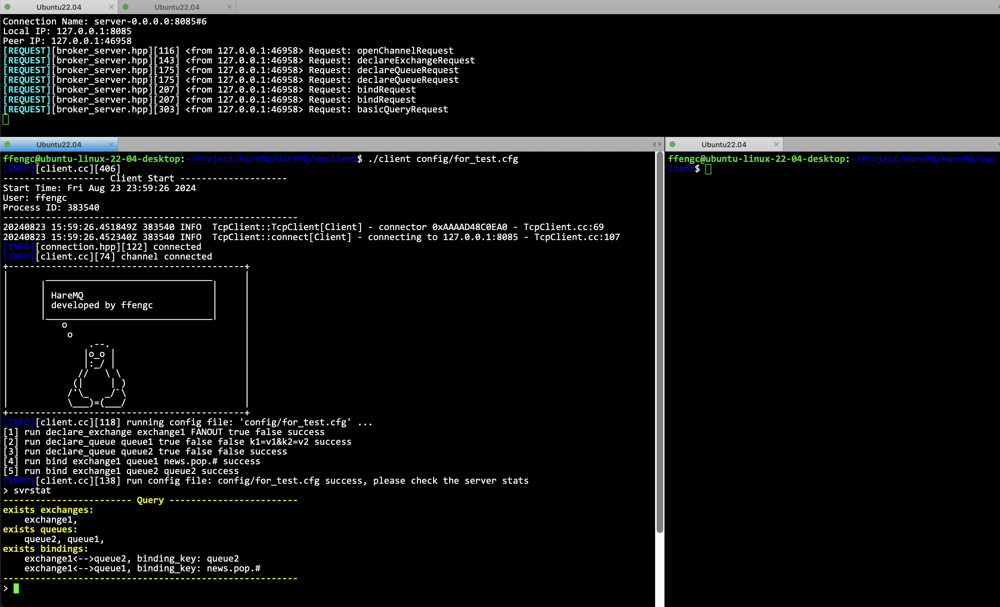


## Logs

Every time you start a server or client, a log of the program will be generated in the same directory as the executable program to facilitate operation and maintenance.

For example, the server log:

```log
[INFO][broker_server.hpp][98] 
------------------- Server Start --------------------
IP Address and Port: 0.0.0.0:8085
Start Time: Fri Aug 23 23:32:31 2024
User: ffengc
Process ID: 378907
-------------------------------------------------------
[INFO][broker_server.hpp][324] connected
[INFO][broker_server.hpp][316] 
New Connection: 
Connection Name: server-0.0.0.0:8085#1
Local IP: 127.0.0.1:8085
Peer IP: 127.0.0.1:52790
[REQUEST][broker_server.hpp][116] <from 127.0.0.1:52790> Request: openChannelRequest
[INFO][broker_server.hpp][324] connected
[INFO][broker_server.hpp][316] 
New Connection: 
Connection Name: server-0.0.0.0:8085#2
Local IP: 127.0.0.1:8085
Peer IP: 127.0.0.1:52800
[REQUEST][broker_server.hpp][116] <from 127.0.0.1:52800> Request: openChannelRequest
[REQUEST][broker_server.hpp][303] <from 127.0.0.1:52790> Request: basicQueryRequest
[REQUEST][broker_server.hpp][143] <from 127.0.0.1:52790> Request: declareExchangeRequest
[REQUEST][broker_server.hpp][175] <from 127.0.0.1:52790> Request: declareQueueRequest
[REQUEST][broker_server.hpp][207] <from 127.0.0.1:52790> Request: bindRequest
...
```

**Log file name: `year-month-day-hour-minute_pid.log`**

