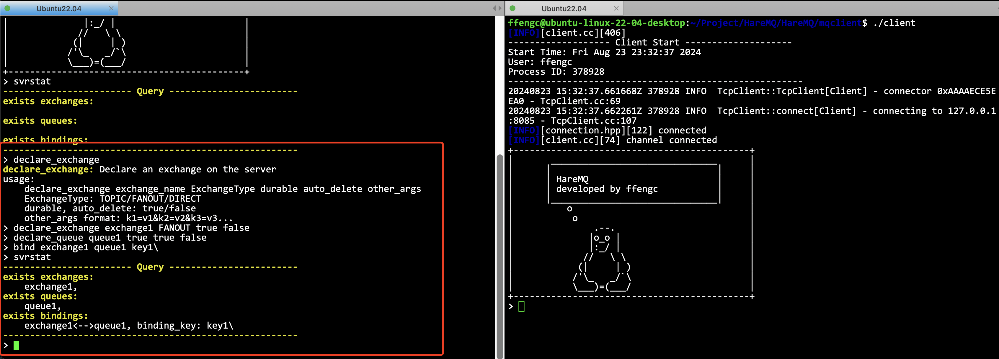
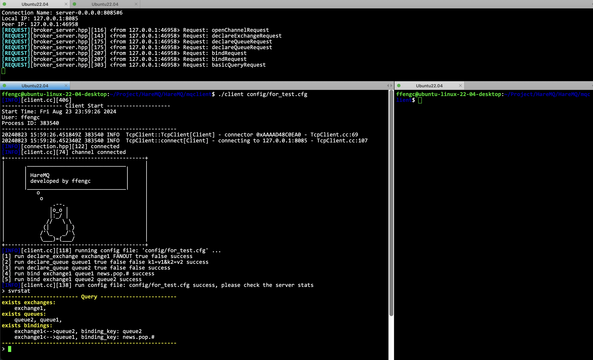

# HareMQ使用文档

- [简体中文](./documentation.md)
- [English](./documentation-en.md)

***
- [HareMQ使用文档](#haremq使用文档)
  - [编译运行项目](#编译运行项目)
  - [命令手册](#命令手册)
    - [所有合法命令](#所有合法命令)
    - [`cmds`](#cmds)
    - [`clear`](#clear)
    - [`logo`](#logo)
    - [`exit`](#exit)
    - [`cid`](#cid)
    - [`svrstat`](#svrstat)
    - [`declare_exchange`](#declare_exchange)
    - [`delete_exchange`](#delete_exchange)
    - [`declare_queue`](#declare_queue)
    - [`delete_queue`](#delete_queue)
    - [`publish/publish_mode`](#publishpublish_mode)
    - [`subscribe`](#subscribe)
  - [使用例子](#使用例子)
  - [使用配置文件启动客户端](#使用配置文件启动客户端)
  - [日志](#日志)


## 编译运行项目

关于项目的配置，请见 [README文件](../README-cn.md)。

项目服务端代码在 `HareMQ/mqserver` 目录中，项目客户端代码在 `HareMQ/mqclient` 目录中。

编译服务端，并运行服务端:
```sh
cd HareMQ/mqserver
make clean;make;
./server
```
运行后效果如下所示，则表示服务端运行成功。


打印的是服务端的基本信息，包括服务端监听的ip和端口，服务器启动的时间，启动服务的系统用户，程序的PID。

当然，你可以选择使用 `tmux` 或者其他方式，把服务部署到后台当中。

编译客户端，并运行客户端:
```sh
cd HareMQ/mqserver
make clean;make;
./client
```

这里可能会遇到bug，暂时还没有解决，具体可见 [issue#30](https://github.com/ffengc/HareMQ/issues/30)，**临时的解决方法：如果启动遇到段错误，则重复运行 `./client` 至成功。**

如图所示，则客户端运行成功:


启动客户端之后，即进入了客户端的控制命令行。

## 命令手册

### 所有合法命令

| 命令               | 简单描述                                                                                   |
| ------------------ | ------------------------------------------------------------------------------------------ |
| `subscribe`        | 订阅一个队列的消息，并持续在 `stdout` 上消费订阅队列上的消息（需要手动退出此模式）         |
| `publish`          | 推送一条消息到指定交换机中                                                                 |
| `publish_mode`     | 连续推送消息模式                                                                           |
| `svrstat`          | 检查服务器当前交换机状态、队列状态和绑定状态，这是一个阻塞接口，需要阻塞等待服务器返回结果 |
| `declare_exchange` | 声明一台交换机                                                                             |
| `declare_queue`    | 声明一个队列                                                                               |
| `delete_exchange`  | 删除一台交换机                                                                             |
| `delete_queue`     | 删除一个队列                                                                               |
| `bind`             | 绑定一题台交换机和队列                                                                     |
| `unbind`           | 解除绑定                                                                                   |
| `cid`              | 查看当前客户端使用信道的id                                                                 |
| `cmds`             | 查看所有合法命令                                                                           |
| `exit`             | 退出客户端                                                                                 |
| `clear`            | 清理命令行                                                                                 |
| `logo`             | 打项目印logo                                                                               |

### `cmds` 

功能: 查看所有合法命令。

**Usage:**
```sh
cmds
```


### `clear`

功能：清理命令行。

**Usage:**
```sh
clear
```

运行后效果：


### `logo`

功能：打印项目logo。

**Usage:**
```sh
logo
```


### `exit`

功能：退出客户端

**Usage:**
```sh
exit
```


### `cid`

功能：打印当前客户端信道id。

**Usage:**
```sh
cid
```


### `svrstat`

功能：检查服务器当前交换机状态、队列状态和绑定状态，这是一个阻塞接口，需要阻塞等待服务器返回结果。

**Usage:**
```sh
svrstat
```


可以观察到，目前服务器上有一台交换机，一个队列，和一个绑定信息。

> [!NOTE]
> 虽然服务器已经重启多次，但是服务器是能保留历史数据的，因此所有的信息都会从文件中加载出来，这个即为信息持久化，我在 README 中也有提到。


### `declare_exchange`

功能：声明一台交换机。

**Usage:**
```sh
declare_exchange exchange_name ExchangeType durable auto_delete other_args;
@ExchangeType: TOPIC/FANOUT/DIRECT
@durable, auto_delete: true/false
@other_args format: k1=v1&k2=v2&k3=v3...
```

### `delete_exchange`

功能：删除一台交换机。

**Usage:**
```sh
delete_exchange exchange_name
```

### `declare_queue`

功能：声明一个队列。

**Usage:**
```sh
declare_queue queue_name durable exclusive auto_delete other_args
@durable, exclusive, auto_delete: true/false
@other_args format: k1=v1&k2=v2&k3=v3...
```

### `delete_queue`

功能：删除一个队列。

**Usage:**
```sh
delete_queue queue_name
```

### `publish/publish_mode`

功能：推送一条消息到指定交换机中/持续推送模式

**Usage:**
```sh
publish/publish_mode exchange_name DURABLE binding_key
@DURABLE: hare_mq::DeliveryMode::DURABLE/UNDURABLE
```

### `subscribe`


功能：订阅一个队列的消息，并持续在 `stdout` 上消费订阅队列上的消息，在屏幕上输入 `quit` + 回车，退出该模式，并自动取消订阅。

**Usage:**
```sh
publish/publish_mode exchange_name DURABLE binding_key
@DURABLE: hare_mq::DeliveryMode::DURABLE/UNDURABLE
```

## 使用例子

启动服务端，并启动两个客户端。


定义一台交换机，定义一个队列，并进行绑定。如果命令格式有误，则会显示usage使用说明。



一个终端利用 `publish` 和 `publish_mode` 向指定交换机推送消息。
一个终端利用 `subscribe` 订阅队列的消息。


两个消费者终端都可以使用quit来退出当前的模式。


## 使用配置文件启动客户端

为了启动客户端后可以自动化快速搭建交换机和队列以及绑定信息，因此可以提供配置文件启动方式。

**Usage:**
```sh
./client file_name
```

比如, 编写配置文件。

```conf
declare_exchange exchange1 FANOUT true false
declare_queue queue1 true false false k1=v1&k2=v2
declare_queue queue2 true false false
bind exchange1 queue1 news.pop.#
bind exchange1 queue2 queue2
```

**配置文件格式：**
1. 每一行为一条命令
2. 每条命令格式和终端输入格式相同
3. 如果配置文件出现错误，则进程会被终止（但此时有可能已经对服务器配置了一部分命令，需要检查服务器状态。
4. 格式化服务器状态方法：删除 `mqserver` 目录下的 `data` 目录。

使用配置文件启动客户端：




## 日志

每一次启动服务端或客户端，都会在可执行程序同级目录下生成该程序的日志，便于运维工作的开展。

比如服务端的日志：

```log
[INFO][broker_server.hpp][98] 
------------------- Server Start --------------------
IP Address and Port: 0.0.0.0:8085
Start Time: Fri Aug 23 23:32:31 2024
User: ffengc
Process ID: 378907
-------------------------------------------------------
[INFO][broker_server.hpp][324] connected
[INFO][broker_server.hpp][316] 
New Connection: 
Connection Name: server-0.0.0.0:8085#1
Local IP: 127.0.0.1:8085
Peer IP: 127.0.0.1:52790
[REQUEST][broker_server.hpp][116] <from 127.0.0.1:52790> Request: openChannelRequest
[INFO][broker_server.hpp][324] connected
[INFO][broker_server.hpp][316] 
New Connection: 
Connection Name: server-0.0.0.0:8085#2
Local IP: 127.0.0.1:8085
Peer IP: 127.0.0.1:52800
[REQUEST][broker_server.hpp][116] <from 127.0.0.1:52800> Request: openChannelRequest
[REQUEST][broker_server.hpp][303] <from 127.0.0.1:52790> Request: basicQueryRequest
[REQUEST][broker_server.hpp][143] <from 127.0.0.1:52790> Request: declareExchangeRequest
[REQUEST][broker_server.hpp][175] <from 127.0.0.1:52790> Request: declareQueueRequest
[REQUEST][broker_server.hpp][207] <from 127.0.0.1:52790> Request: bindRequest
...
```

**日志文件名为: `year-month-day-hour-minute_pid.log`**

