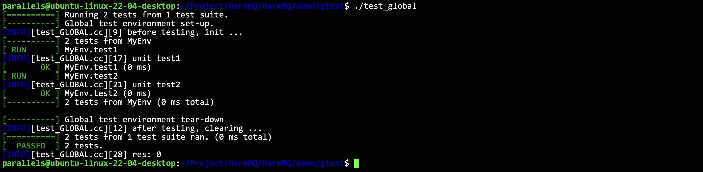
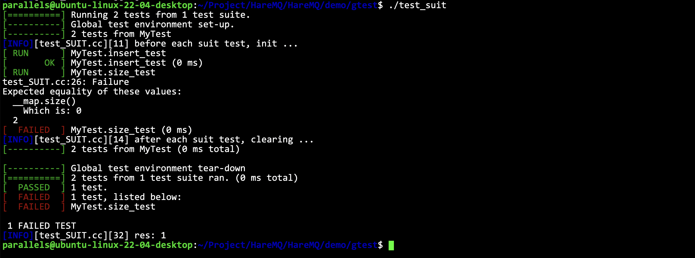

# GTest

- [简体中文](./gtest.md)
- [English](./gtest-en.md)

***
- [GTest](#gtest)
  - [What is GTest](#what-is-gtest)
  - [GTest functions we need to learn](#gtest-functions-we-need-to-learn)
  - [Macro Assertions](#macro-assertions)
  - [Event mechanism](#event-mechanism)
    - [Global test suite](#global-test-suite)
    - [Independent test suite](#independent-test-suite)

## What is GTest

GTest is a cross-platform C++ unit testing framework released by Google. GTest is generated for writing C++ unit tests on different platforms. It provides rich assertions, fatal and non-fatal judgments, parameterization, etc.

## GTest functions we need to learn

1. Simple macro assertion mechanism

2. Event mechanism (global test, single case test)

## Macro Assertions

Assertions in GTest can be divided into two categories:
- `ASSERT_` series: if the current test fails, exit the current function
- `EXPECT_` series: if the current test fails, continue to execute

```cpp
// Boolean value check
ASSERT_TRUE(res)    // Expects that res is true
ASSERT_FALSE(res)   // Expects that res is false
// Numeric data check
ASSERT_EQ(arg1, arg2) // Returns true if arg1 == arg2
ASSERT_NE(arg1, arg2) // Returns true if arg1 != arg2
ASSERT_LT(arg1, arg2) // Returns true if arg1 < arg2
ASSERT_GT(arg1, arg2) // Returns true if arg1 > arg2
ASSERT_LE(arg1, arg2) // Returns true if arg1 <= arg2
ASSERT_GE(arg1, arg2) // Returns true if arg1 >= arg2
```

```cpp
TEST(test1, MYTEST) {

}
```
All tests must be placed under a unit test. The first parameter of the macro represents the "test suite name" and the second parameter represents the "test name".

```cpp
testing::InitGoogleTest(&argc, argv);
RUN_ALL_TESTS();
```
This is how all tests are initialized and run.

## Event mechanism

In a test, there can be multiple test suites (including a set of unit tests)

Test suite: It can be understood as a test environment. The test environment can be initialized before the unit test and cleaned up after the test is completed

- Global test suite: In the overall test, the environment will only be initialized once, and the environment will be cleaned up after all test cases are completed

- Case test suite: In each unit test, the test environment will be reinitialized and cleaned up after completion

### Global test suite

```cpp
#include "../log.hpp"
#include <gtest/gtest.h>
#include <iostream>

class MyEnv : public testing::Environment {
public:
    virtual void SetUp() override {
        LOG(INFO) << "before testing, init ..." << std::endl;
    }
    virtual void TearDown() override {
        LOG(INFO) << "after testing, clearing ..." << std::endl;
    }
};
TEST(MyEnv, test1) {
    LOG(INFO) << "unit test1" << std::endl;
}
TEST(MyEnv, test2) {
    LOG(INFO) << "unit test2" << std::endl;
}
int main(int argc, char** argv) {
    testing::AddGlobalTestEnvironment(new MyEnv);
    testing::InitGoogleTest(&argc, argv);
    auto res = RUN_ALL_TESTS();
    LOG(INFO) << "res: " << res << std::endl;
    return 0;
}
```

Observe the location of each print message and observe when the global suite is initialized and cleaned up.




### Independent test suite

- Member variables can be defined in the test environment class. Member variables are independent and can only be accessed by unit tests related to the current test suite.
- The unit test macro name has become `TEST_F()`, and the first parameter of this macro function (the total test name) must be consistent with the suite environment class name. (In the unit test macro function, class member variables can be directly accessed)

```cpp
#include "../log.hpp"
#include <gtest/gtest.h>
#include <iostream>
#include <unordered_map>

class MyTest : public testing::Test {
public:
    static void SetUpTestCase() {
        LOG(INFO) << "before each suit test, init ..." << std::endl;
    }
    static void TearDownTestCase() {
        LOG(INFO) << "after each suit test, clearing ..." << std::endl;
    }
    virtual void SetUp() override { }
    virtual void TearDown() override { }
public:
    std::unordered_map<std::string, std::string> __map;
};

TEST_F(MyTest, insert_test) {
    __map.insert({ "hello", "nihao" });
    __map.insert({ "bye", "zaijian" });
}
TEST_F(MyTest, size_test) {
    ASSERT_EQ(__map.size(), 2);
}

int main(int argc, char** argv) {
    testing::InitGoogleTest(&argc, argv);
    auto res = RUN_ALL_TESTS();
    LOG(INFO) << "res: " << res << std::endl;
    return 0;
}
```

If you run the program now, you will find that the test fails because `__map` is independent of each test unit. Therefore, the data added in `insert_test` will not appear in `size_test`.




If you want to have two data at the beginning, you can use:

```cpp
    virtual void SetUp() override { }
    virtual void TearDown() override { }
```

Perform all initialization, that is, public initialization.