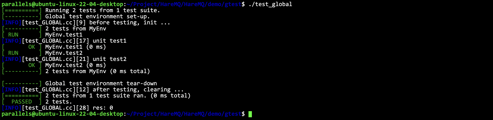
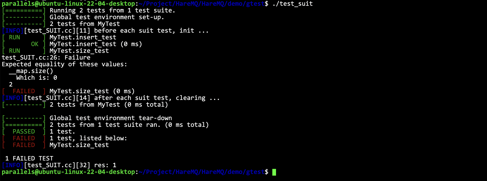

# GTest

- [简体中文](./gtest.md)
- [English](./gtest-en.md)

***
- [GTest](#gtest)
  - [GTest是什么](#gtest是什么)
  - [我们需要学习的GTest功能](#我们需要学习的gtest功能)
  - [宏断言](#宏断言)
  - [事件机制](#事件机制)
    - [全局测试套件](#全局测试套件)
    - [独立测试套件](#独立测试套件)

## GTest是什么

GTest是一个跨平台的 C++单元测试框架，由google公司发布。gtest是为了在不同平台上为编写C++单元测试而生成的。它提供了丰富的断言、致命和非致命判断、参数化等等。

## 我们需要学习的GTest功能

1. 简单的宏断言机制
2. 事件机制（全局测试，单独用例测试）

## 宏断言

GTest中断言的宏可以分为两类：
- `ASSERT_`系列：如果当前检测失败则推出当前函数
- `EXPECT_`系列: 如果当前检测失败则继续向下执行

```cpp
// bool值检查
ASSERT_TRUE(res)    // 期待res是true
ASSERT_FALSE(res)   // 期待res是false
//数值型数据检查
ASSERT_EQ(arg1, arg2) // arg1 == arg2 返回 true
ASSERT_NE(arg1, arg2) // arg1 != arg2 返回 true
ASSERT_LT(arg1, arg2) // arg1 < arg2  返回 true
ASSERT_GT(arg1, arg2) // arg1 > arg2  返回 true
ASSERT_LE(arg1, arg2) // arg1 <= arg2 返回 true
ASSERT_GE(arg1, arg2) // arg1 >= arg2 返回 true
```

```cpp
TEST(test1, MYTEST) {

}
```
所有的测试都要放在一个单元测试下才行的。宏的第一个参数表示“测试套件名称”，第二个参数表示“测试名称”。

```cpp
testing::InitGoogleTest(&argc, argv);
RUN_ALL_TESTS();
```
通过这种方式来初始化和运行所有的测试。

## 事件机制

测试中，可以有多个测试套件（包含有一组单元测试）

测试套件: 可以理解成一个测试环境，可以在单元测试之前进行测试环境初始化，测试完毕后进行测试环境清理

- 全局测试套件：在整体的测试中，只会初始化一次环境，在所有测试用例完毕后，才会清理环境
- 用例测试套件：在每次的单元测试中，都会重新初始化测试环境，完毕后清理环境

### 全局测试套件

```cpp
#include "../log.hpp"
#include <gtest/gtest.h>
#include <iostream>

class MyEnv : public testing::Environment {
public:
    virtual void SetUp() override {
        LOG(INFO) << "before testing, init ..." << std::endl;
    }
    virtual void TearDown() override {
        LOG(INFO) << "after testing, clearing ..." << std::endl;
    }
};
TEST(MyEnv, test1) {
    LOG(INFO) << "unit test1" << std::endl;
}
TEST(MyEnv, test2) {
    LOG(INFO) << "unit test2" << std::endl;
}
int main(int argc, char** argv) {
    testing::AddGlobalTestEnvironment(new MyEnv);
    testing::InitGoogleTest(&argc, argv);
    auto res = RUN_ALL_TESTS();
    LOG(INFO) << "res: " << res << std::endl;
    return 0;
}
```

观察每条打印信息的位置，观察全局套件是何时初始化和何时清理的。




### 独立测试套件

- 测试环境类中，可以定义成员变量，成员变量是独立的，是与当前测试套件相关的单元测试才能访问的。
- 单元测试宏名称变成了`TEST_F()`，而且这个宏函数的第一个参数（总测试名称），一定要和套件环境类名一致。（在单元测试宏函数中，能够直接访问类成员变量）

```cpp
#include "../log.hpp"
#include <gtest/gtest.h>
#include <iostream>
#include <unordered_map>

class MyTest : public testing::Test {
public:
    static void SetUpTestCase() {
        LOG(INFO) << "before each suit test, init ..." << std::endl;
    }
    static void TearDownTestCase() {
        LOG(INFO) << "after each suit test, clearing ..." << std::endl;
    }
    virtual void SetUp() override { }
    virtual void TearDown() override { }
public:
    std::unordered_map<std::string, std::string> __map;
};

TEST_F(MyTest, insert_test) {
    __map.insert({ "hello", "nihao" });
    __map.insert({ "bye", "zaijian" });
}
TEST_F(MyTest, size_test) {
    ASSERT_EQ(__map.size(), 2);
}

int main(int argc, char** argv) {
    testing::InitGoogleTest(&argc, argv);
    auto res = RUN_ALL_TESTS();
    LOG(INFO) << "res: " << res << std::endl;
    return 0;
}
```

此时运行可以发现，是通过不了测试的，因为 `__map` 是每个测试单元独立的。所以`insert_test`里添加的数据不会出现在`size_test`中。




如果想让一开始就有两个数据，可以在:

```cpp
    virtual void SetUp() override { }
    virtual void TearDown() override { }
```

进行全部的初始化，就是公共的初始化。