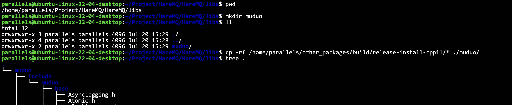
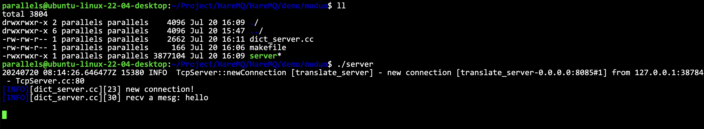
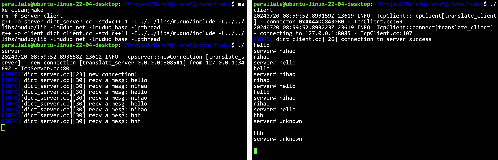
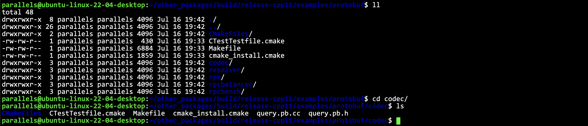
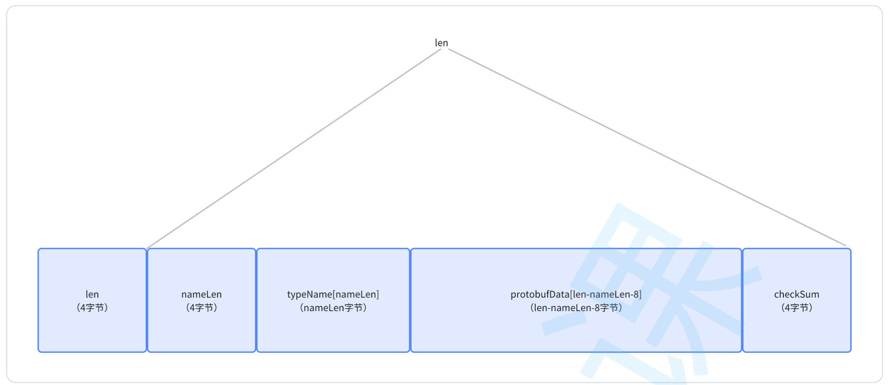
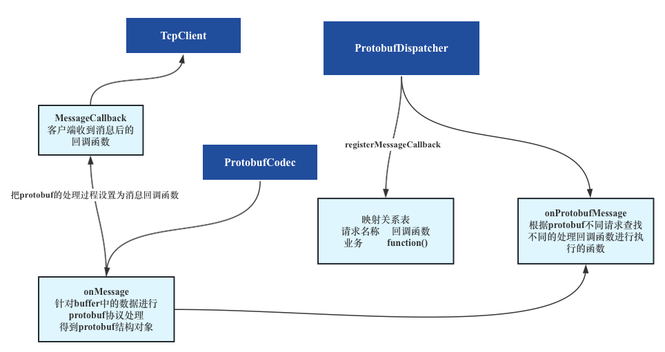
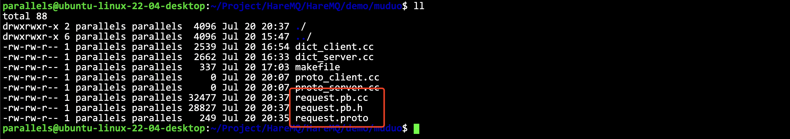
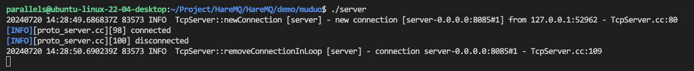

# muduo

- [简体中文](./muduo.md)
- [English](./muduo-en.md)

***
- [muduo](#muduo)
  - [What is Muduo Library](#what-is-muduo-library)
  - [Quickly build a server](#quickly-build-a-server)
  - [Quickly build a client](#quickly-build-a-client)
  - [What are the problems with the server-client communication built above?](#what-are-the-problems-with-the-server-client-communication-built-above)
  - [protobuf in the muduo library](#protobuf-in-the-muduo-library)
  - [Implement a server based on the protobuf protocol in the muduo library](#implement-a-server-based-on-the-protobuf-protocol-in-the-muduo-library)

## What is Muduo Library

Muduo was developed by Chen Shuo. It is a C++ high-concurrency TCP network programming library based on non-blocking 10 and event-driven. It is a network library based on the master-slave Reactor model. The thread model it uses is `oneloop perthread`. The so-called `one loop per thread` means:

- A thread can only have one event loop (EventLoop) to respond to timers and IO events.
- A file can only be read and written by one thread. In other words, a TCP link must belong to a certain EventLoop management

I also have a detailed description of the reactor mode in the project, so I will not repeat it here

- Reactor mode: **[ffengc/Reactor-based-HyperWebServer](https://github.com/ffengc/Reactor-based-HyperWebServer)**
- Event-driven: **[ffengc/Event-Driven-Pipeline-Communication-System-Framework](https://github.com/ffengc/Event-Driven-Pipeline-Communication-System-Framework)**
  
## Quickly build a server

Simply write an English-Chinese server and client to quickly get started with the Muduo library.

Prepare everything first: if the third-party library is not installed in the system directory like protobuf, just put it in `HareMQ/libs`.

In muduo, we need `include` and `lib` in `build/release-install-cpp11/`



Include it like this:

```cpp
#ifndef __YUFC_DEMO_DICT_SERVER_USE_MUDUO__
#define __YUFC_DEMO_DICT_SERVER_USE_MUDUO__

#include "../../libs/muduo/include/muduo/net/TcpServer.h"
#include "../../libs/muduo/include/muduo/net/EventLoop.h"
#include "../../libs/muduo/include/muduo/net/TcpConnection.h"

#endif
```

Let’s write a simple service as an example:

```cpp
class translate_server {
private:
    muduo::net::EventLoop __base_loop; // Basic event loop (needs to be passed to the server, so placed at the front)
    muduo::net::TcpServer __server; // Server object
private:
    // Callback function when a new connection is successfully established
    // This is called when a connection is successfully established and when it is closed
    void onConnection(const muduo::net::TcpConnectionPtr& conn) {
        if (conn->connected() == true)
            LOG(INFO) << "new connection!" << std::endl;
        else
            LOG(INFO) << "connection close" << std::endl;
    }
    // Callback function when a communication connection receives a request
    void onMessage(const muduo::net::TcpConnectionPtr& conn, muduo::net::Buffer* buf, muduo::Timestamp) {
        std::string str = buf->retrieveAllAsString();
        std::string resp = translate(str);
        conn->send(resp); // Send response to the client
    }
    std::string translate(const std::string& str) {
        // A simple example suffices
        static std::unordered_map<std::string, std::string> __dict_map = {
            { "hello", "nihao" }, { "nihao", "hello" }
        };
        auto it = __dict_map.find(str);
        if (it == __dict_map.end())
            return "unknown";
        return it->second;
    }

public:
    translate_server(int port)
        : __server(&__base_loop,
              muduo::net::InetAddress("0.0.0.0", port),
              "translate_server",
              muduo::net::TcpServer::kReusePort) {
        __server.setConnectionCallback(std::bind(&translate_server::onConnection,
            this, std::placeholders::_1)); // Set callback
        __server.setMessageCallback(std::bind(&translate_server::onMessage,
            this, std::placeholders::_1,
            std::placeholders::_2,
            std::placeholders::_3)); // Set callback
    }
    void start() {
        __server.start(); // Begin event listening
        __base_loop.loop(); // Begin event monitoring, this is a blocking loop interface
    }
};

#endif

int main() {
    translate_server server(8085);
    server.start();
    return 0;
}
```

This example is very simple, so I won't go into too much detail. Just maintain the event loop object and the server object.

makefile‼️
```makefile
server: dict_server.cc
	g++ -o $@ $^ -std=c++11 -I../../libs/muduo/include -L../../libs/muduo/lib -lmuduo_net -lmuduo_base -lpthread
.PHONY:clean
clean:
	rm -f server
```

> [!CAUTION]
> Note that the `-L` option is used to specify the address of the library.
> The name of the static library on Linux needs to remove the `lib` at the beginning and the `.a` at the end. For more information, please go to the Linux library mechanism.
> Use `-I` to specify the header file path‼ ️ Then the header file path in the cc file can be modified accordingly

Server example complete code

```cpp
#ifndef __YUFC_DEMO_DICT_SERVER_USE_MUDUO__
#define __YUFC_DEMO_DICT_SERVER_USE_MUDUO__

// #include "../../libs/muduo/include/muduo/net/EventLoop.h"
// #include "../../libs/muduo/include/muduo/net/TcpConnection.h"
// #include "../../libs/muduo/include/muduo/net/TcpServer.h"
#include "../log.hpp"
#include "muduo/net/EventLoop.h"
#include "muduo/net/TcpConnection.h" // Direct usage like this due to header paths specified in the Makefile
#include "muduo/net/TcpServer.h"
#include <unordered_map>

class translate_server {
private:
    muduo::net::EventLoop __base_loop; // Basic event loop (must be passed to the server, so placed at the front)
    muduo::net::TcpServer __server; // Server object
private:
    // Callback function for when a new connection is successfully established
    // Called when a connection is successfully established and when it is closed
    void onConnection(const muduo::net::TcpConnectionPtr& conn) {
        if (conn->connected() == true)
            LOG(INFO) << "new connection!" << std::endl;
        else
            LOG(INFO) << "connection close" << std::endl;
    }
    // Callback function for when a communication connection receives a request
    void onMessage(const muduo::net::TcpConnectionPtr& conn, muduo::net::Buffer* buf, muduo::Timestamp) {
        std::string str = buf->retrieveAllAsString();
        LOG(INFO) << "recv a mesg: " << str << std::endl;
        std::string resp = translate(str);
        conn->send(resp); // Send to the client
    }
    std::string translate(const std::string& str) {
        // A simple example will suffice
        static std::unordered_map<std::string, std::string> __dict_map = {
            { "hello", "nihao" }, { "nihao", "hello" }
        };
        auto it = __dict_map.find(str); // The 'str' includes '\n', needs additional handling, but not dealt with here as it's just for server learning purposes
        if (it == __dict_map.end())
            return "unknown\n";
        return it->second;
    }

public:
    translate_server(int port)
        : __server(&__base_loop,
              muduo::net::InetAddress("0.0.0.0", port),
              "translate_server",
              muduo::net::TcpServer::kReusePort) {
        __server.setConnectionCallback(std::bind(&translate_server::onConnection,
            this, std::placeholders::_1)); // Set callback
        __server.setMessageCallback(std::bind(&translate_server::onMessage,
            this, std::placeholders::_1,
            std::placeholders::_2,
            std::placeholders::_3)); // Set callback
    }
    void start() {
        __server.start(); // Begin event listening
        __base_loop.loop(); // Begin event monitoring, this is a blocking loop interface
    }
};

#endif

int main() {
    translate_server server(8085);
    server.start();
    return 0;
} 
```

> [!WARNING]
> Note: Because we did not process the string we sent, we are just learning how to use muduo, so sending `hello` is actually sending `hello\n`, so the server always returns `unknown`. I will not process this, just know the reason, our focus is not here.





## Quickly build a client

It is basically the same as the server, but you need to pay attention to::

> [!CAUTION]
> The client cannot be completely non-blocking. The client must successfully establish a connection before it can proceed.
> However, because of the muduo library, all operations are asynchronous and non-blocking.
> Therefore, the `CountDownLatch` component is needed to maintain synchronization


The complete client code is shown below.

```cpp
#ifndef __YUFC_DEMO_DICT_CLIENT_USE_MUDUO__
#define __YUFC_DEMO_DICT_CLIENT_USE_MUDUO__

#include "../log.hpp"
#include "muduo/base/CountDownLatch.h"
#include "muduo/net/EventLoopThread.h"
#include "muduo/net/TcpClient.h"
#include "muduo/net/TcpConnection.h"

/* Note that the client connection to the server requires blocking until the connection is successfully established before returning, hence the use of CountDownLatch */

class translate_client {
private:
    muduo::CountDownLatch __latch;
    muduo::net::EventLoopThread __loop_thread;
    muduo::net::TcpClient __client;
    muduo::net::TcpConnectionPtr __conn;

private:
    // Callback for successful connection
    void onConnection(const muduo::net::TcpConnectionPtr& conn) {
        if (conn->connected()) {
            // If the connection is successfully established, decrement the counter
            __latch.countDown();
            LOG(INFO) << "connection to server success" << std::endl;
            __conn = conn; // Save this connection
        } else {
            // Connection closed
            LOG(INFO) << "connection to server end" << std::endl;
            __conn.reset(); // Clear
        }
    }
    // Callback when a message is received from the server
    void onMessage(const muduo::net::TcpConnectionPtr& conn, muduo::net::Buffer* buf, muduo::Timestamp) {
        std::cout << "server# " << buf->retrieveAllAsString() << std::endl;
    }

public:
    translate_client(const std::string& sip, int sport)
        : __latch(1)
        , __client(__loop_thread.startLoop(),
              muduo::net::InetAddress(sip, sport),
              "translate_client") {
        __client.setConnectionCallback(std::bind(&translate_client::onConnection,
            this, std::placeholders::_1));
        __client.setMessageCallback(std::bind(&translate_client::onMessage,
            this, std::placeholders::_1,
            std::placeholders::_2,
            std::placeholders::_3));
    }
    void connect() {
        __client.connect(); // This returns immediately, but we need to control blocking wait!
        __latch.wait();
    }
    bool send(const std::string& mesg) {
        // Since all operations in muduo are asynchronous, connections might close at any time, so we need to check
        if (__conn->connected()) {
            __conn->send(mesg);
            return true;
        }
        return false;
    }
};

#endif

int main() {
    translate_client client("127.0.0.1", 8085);
    client.connect();
    while (1) {
        std::string buf;
        std::cin >> buf;
        client.send(buf);
    }
    return 0;
}
```

makefile:

```makefile
.PHONY:all
all: server client

server: dict_server.cc
	g++ -o $@ $^ -std=c++11 -I../../libs/muduo/include -L../../libs/muduo/lib -lmuduo_net -lmuduo_base -lpthread
client: dict_client.cc
	g++ -o $@ $^ -std=c++11 -I../../libs/muduo/include -L../../libs/muduo/lib -lmuduo_net -lmuduo_base -lpthread
.PHONY:clean
clean:
	rm -f server client
```

Now we can use our own client instead of telnet.

> [!WARNING]
> Note: We just used `telnet`, because we did not process the string we sent, we were just learning how to use muduo, so sending `hello` actually sent `hello\n`, so the server always returned `unknown`, I will not deal with this, just know this reason, our focus is not here.
> But here, the muduo library we use will handle this `\n` for us, so we can get the correct result.





## What are the problems with the server-client communication built above?

The problem is very big, and it is also a commonplace problem. There is no problem of handling sticky packets and no protocol.

Therefore, we will use `protobuf` and combine it with the `muduo` library to simply implement a server demo.

## protobuf in the muduo library

The muduo library has already written a network communication protocol framework based on protobuf for us. It has been written.

Path: `muduo/examples/protobuf/codec`.



The customized protocol is as follows:



The call flow is as follows:



After understanding the above relationship, we can write our client/server communication through the interface provided by Chen Shuo in the muduo library. The most convenient thing is that we can focus more on the implementation of business processing functions instead of server construction or protocol parsing.

## Implement a server based on the protobuf protocol in the muduo library

Based on the processing code for the protobuf protocol in the muduo library, implement a translation + addition server and client.
1. Write the proto file and generate the relevant structure code
2. Write the server code and build the server
3. Write the client code and build the client

Define the proto file.

```proto
syntax = "proto3";

package yufc;

message translateRequest {
    string msg = 1;
};

message translateResponse {
    string msg = 1;
};

message addRequest {
    int32 num1 = 1;
    int32 num2 = 2;
};

message addResponse {
    int32 result = 1;
};
```

Generate proto file as shown in the figure.




Next we need to prepare the header files, which are in the example.

We need to put `dispatcher.h`, `codec.cc` and `codec.h` under `muduo/examples/protobuf/codec` into the place where we have sorted out the third-party libraries.

> [!NOTE]
> Here you can copy the methods in `codec.cc` to `codec.h`, so that you can call the header file directly
> If you don't do this, remember to compile `codec.cc` when you compile

> [!CAUTION]
> Note: If you don't copy the above step, the original header file path included in `codec.cc` is `#include "examples/protobuf/codec/codec.h"`
> This is wrong. The current `codec.h` is in the same directory as `codec.cc`, so it should be directly modified to `#include "codec.h"`
> In addition, different versions may have other problems, such as missing header files, etc. You need to find them in the source code yourself and then put them in the corresponding location


For how to write the specific server-side client code, you can see my demo code, which is actually written with reference to the example below `muduo/examples/protobuf/codec`!

Updated `makefile`

There were many problems encountered during this process, and everyone needs to remember the details such as linking libraries.

```makefile
server: proto_server.cc request.pb.cc /home/parallels/Project/HareMQ/HareMQ/libs/muduo/include/muduo/protoc/codec.cc
	g++ -o $@ $^ -std=c++11 -I../../libs/muduo/include -L../../libs/muduo/lib -lmuduo_net -lmuduo_base -lpthread -lprotobuf -lz
client: proto_client.cc request.pb.cc /home/parallels/Project/HareMQ/HareMQ/libs/muduo/include/muduo/protoc/codec.cc
	g++ -o $@ $^ -std=c++11 -I../../libs/muduo/include -L../../libs/muduo/lib -lmuduo_net -lmuduo_base -lpthread -lprotobuf -lz
.PHONY:clean
clean:
	rm -f server client
```




This means the test is successful.