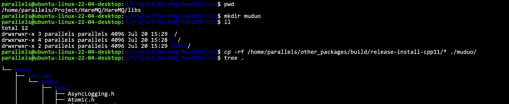
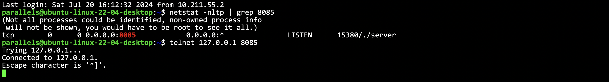
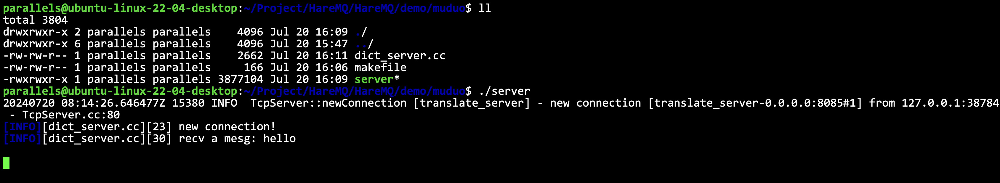
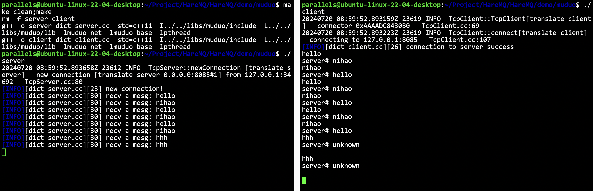
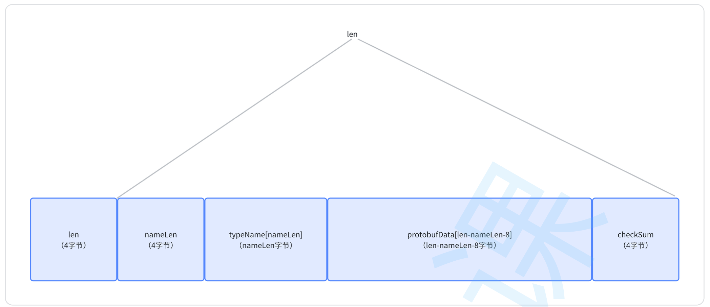
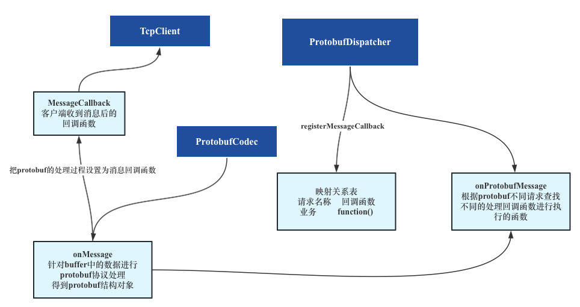
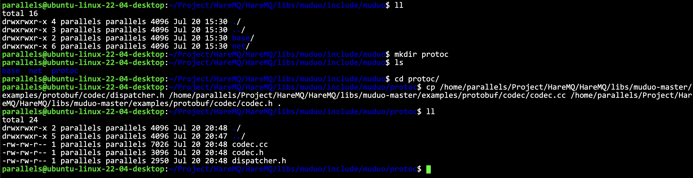
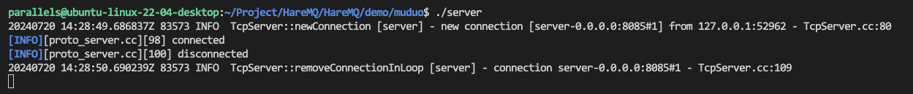

# muduo库

- [简体中文](./muduo.md)
- [English](./muduo-en.md)

***
- [muduo库](#muduo库)
  - [muduo库是什么](#muduo库是什么)
  - [快速上手搭建服务端](#快速上手搭建服务端)
  - [快速上手搭建客户端](#快速上手搭建客户端)
  - [上面搭建的服务端-客户端通信还有什么问题?](#上面搭建的服务端-客户端通信还有什么问题)
  - [muduo库中的protobuf](#muduo库中的protobuf)
  - [基于muduo库中的protobuf协议实现一个服务器](#基于muduo库中的protobuf协议实现一个服务器)

## muduo库是什么

Muduo由陈硕大佬开发，是一个基于非阻塞10和事件驱动的C++高并发TCP网络编程库。 它是一款基于主从Reactor模型的网络库，其使用的线程模型是`oneloop perthread`，所谓`one loop per thread`指的是：

- 一个线程只能有一个事件循环（EventLoop），用于响应计时器和IO事件。
- 一个文件米哦啊舒服只能由一个线程进行读写，换句话说，就是一个TCP链接必须归属于某个EventLoop管理

我对reactor模式在项目中也是有详细的描述的，这里不再重复

- Reactor模式: **[ffengc/Reactor-based-HyperWebServer](https://github.com/ffengc/Reactor-based-HyperWebServer)**
- 事件驱动: **[ffengc/Event-Driven-Pipeline-Communication-System-Framework](https://github.com/ffengc/Event-Driven-Pipeline-Communication-System-Framework)**
  
## 快速上手搭建服务端

简单写一个英译汉服务器和客户端，快速上手Muduo库。

要先把东西准备好：第三方库如果没有像protobuf一样安装到系统目录下了，就统一放到`HareMQ/libs`里面去就行了。

muduo中我们需要的是`build/release-install-cpp11/`里面的`include`和`lib`



这样包含就行了：

```cpp
#ifndef __YUFC_DEMO_DICT_SERVER_USE_MUDUO__
#define __YUFC_DEMO_DICT_SERVER_USE_MUDUO__

#include "../../libs/muduo/include/muduo/net/TcpServer.h"
#include "../../libs/muduo/include/muduo/net/EventLoop.h"
#include "../../libs/muduo/include/muduo/net/TcpConnection.h"

#endif
```

直接写一个简单服务作为例子：

```cpp
#ifndef __YUFC_DEMO_DICT_SERVER_USE_MUDUO__
#define __YUFC_DEMO_DICT_SERVER_USE_MUDUO__

#include "../../libs/muduo/include/muduo/net/EventLoop.h"
#include "../../libs/muduo/include/muduo/net/TcpConnection.h"
#include "../../libs/muduo/include/muduo/net/TcpServer.h"
#include "../log.hpp"

class translate_server {
private:
    muduo::net::EventLoop __base_loop; // 基本的事件循环(这个要传给server, 所以要放前面)
    muduo::net::TcpServer __server; // 服务器对象
private:
    // 新连接建立成功时的回调函数
    // 会在一个连接建立成功，以及关闭的时候被调用
    void onConnection(const muduo::net::TcpConnectionPtr& conn) {
        if (conn->connected() == true)
            LOG(INFO) << "new connection!" << std::endl;
        else
            LOG(INFO) << "connection close" << std::endl;
    }
    // 通信连接收到请求时的回调函数
    void onMessage(const muduo::net::TcpConnectionPtr& conn, muduo::net::Buffer* buf, muduo::Timestamp) {
        std::string str = buf->retrieveAllAsString();
        std::string resp = translate(str);
        conn->send(resp); // 向客户端进行发送
    }
    std::string translate(const std::string& str) {
        // 用个简单例子就行
        static std::unordered_map<std::string, std::string> __dict_map = {
            { "hello", "nihao" }, { "nihao", "hello" }
        };
        auto it = __dict_map.find(str);
        if (it == __dict_map.end())
            return "unknown";
        return it->second;
    }

public:
    translate_server(int port)
        : __server(&__base_loop,
              muduo::net::InetAddress("0.0.0.0", port),
              "translate_server",
              muduo::net::TcpServer::kReusePort) {
        __server.setConnectionCallback(std::bind(&translate_server::onConnection,
            this, std::placeholders::_1)); // 设置回调
        __server.setMessageCallback(std::bind(&translate_server::onMessage,
            this, std::placeholders::_1,
            std::placeholders::_2,
            std::placeholders::_3)); // 设置回调
    }
    void start() {
        __server.start(); // 开始事件监听
        __base_loop.loop(); // 开始事件监控，这是一个死循环阻塞接口
    }
};

#endif

int main() {
    translate_server server(8085);
    server.start();
    return 0;
}
```

这个例子很简单，不作过多描述，维护好事件loop对象和服务器对象即可。

makefile‼️
```makefile
server: dict_server.cc
	g++ -o $@ $^ -std=c++11 -I../../libs/muduo/include -L../../libs/muduo/lib -lmuduo_net -lmuduo_base -lpthread
.PHONY:clean
clean:
	rm -f server
```

> [!CAUTION]
> 这里要注意，用`-L`选项来指定库的地址。
> Linux上静态库库的名称需要去掉头上的`lib`和后面的`.a`，具体为什么可以另外去了解linux库的机制
> 用`-I`指定头文件路径‼️然后cc文件里面的头文件路径就可以相应修改了

服务器小例子完整代码

```cpp
#ifndef __YUFC_DEMO_DICT_SERVER_USE_MUDUO__
#define __YUFC_DEMO_DICT_SERVER_USE_MUDUO__

// #include "../../libs/muduo/include/muduo/net/EventLoop.h"
// #include "../../libs/muduo/include/muduo/net/TcpConnection.h"
// #include "../../libs/muduo/include/muduo/net/TcpServer.h"
#include "../log.hpp"
#include "muduo/net/EventLoop.h"
#include "muduo/net/TcpConnection.h" // 因为makefile指定了头文件路径，所以这里直接这样用
#include "muduo/net/TcpServer.h"
#include <unordered_map>

class translate_server {
private:
    muduo::net::EventLoop __base_loop; // 基本的事件循环(这个要传给server, 所以要放前面)
    muduo::net::TcpServer __server; // 服务器对象
private:
    // 新连接建立成功时的回调函数
    // 会在一个连接建立成功，以及关闭的时候被调用
    void onConnection(const muduo::net::TcpConnectionPtr& conn) {
        if (conn->connected() == true)
            LOG(INFO) << "new connection!" << std::endl;
        else
            LOG(INFO) << "connection close" << std::endl;
    }
    // 通信连接收到请求时的回调函数
    void onMessage(const muduo::net::TcpConnectionPtr& conn, muduo::net::Buffer* buf, muduo::Timestamp) {
        std::string str = buf->retrieveAllAsString();
        LOG(INFO) << "recv a mesg: " << str << std::endl;
        std::string resp = translate(str);
        conn->send(resp); // 向客户端进行发送
    }
    std::string translate(const std::string& str) {
        // 用个简单例子就行
        static std::unordered_map<std::string, std::string> __dict_map = {
            { "hello", "nihao" }, { "nihao", "hello" }
        };
        auto it = __dict_map.find(str); // 这里的str包含了\n，需要额外处理，不过这里只是为了学习使用服务器，不处理了
        if (it == __dict_map.end())
            return "unknown\n";
        return it->second;
    }

public:
    translate_server(int port)
        : __server(&__base_loop,
              muduo::net::InetAddress("0.0.0.0", port),
              "translate_server",
              muduo::net::TcpServer::kReusePort) {
        __server.setConnectionCallback(std::bind(&translate_server::onConnection,
            this, std::placeholders::_1)); // 设置回调
        __server.setMessageCallback(std::bind(&translate_server::onMessage,
            this, std::placeholders::_1,
            std::placeholders::_2,
            std::placeholders::_3)); // 设置回调
    }
    void start() {
        __server.start(); // 开始事件监听
        __base_loop.loop(); // 开始事件监控，这是一个死循环阻塞接口
    }
};

#endif

int main() {
    translate_server server(8085);
    server.start();
    return 0;
}
```

> [!WARNING]
> 注意：因为我们对发送的字符串没有做处理，我们只是学习muduo的使用方法，所以发送`hello`其实是发送`hello\n`，所以服务器返回一直是`unknown`，这个我也不进行处理了，知道这个原因即可，我们的重点不在这。






## 快速上手搭建客户端

和服务端基本是一样的，但是需要注意:

> [!CAUTION]
> 客户端不能完全非阻塞，客户端建立连接一定要成功才能继续往下走的
> 但是因为muduo库里面所以操作都是异步非阻塞的
> 因此需要使用`CountDownLatch`组件来维持同步‼️


客户端完整代码如下所示。

```cpp
#ifndef __YUFC_DEMO_DICT_CLIENT_USE_MUDUO__
#define __YUFC_DEMO_DICT_CLIENT_USE_MUDUO__

#include "../log.hpp"
#include "muduo/base/CountDownLatch.h"
#include "muduo/net/EventLoopThread.h"
#include "muduo/net/TcpClient.h"
#include "muduo/net/TcpConnection.h"

/* 注意，客户端连接服务器是需要阻塞等待连接建立成功之后才返回的，所以才需要使用 CountDownLatch */

class translate_client {
private:
    muduo::CountDownLatch __latch;
    muduo::net::EventLoopThread __loop_thread;
    muduo::net::TcpClient __client;
    muduo::net::TcpConnectionPtr __conn;

private:
    // 连接成功的回调
    void onConnection(const muduo::net::TcpConnectionPtr& conn) {
        if (conn->connected()) {
            // 如果连接建立成功了，就计数器--
            __latch.countDown();
            LOG(INFO) << "connection to server success" << std::endl;
            __conn = conn; // 保存这个连接
        } else {
            // 连接关闭
            LOG(INFO) << "connection to server end" << std::endl;
            __conn.reset(); // 清空
        }
    }
    // 收到服务器发来的消息的回调
    void onMessage(const muduo::net::TcpConnectionPtr& conn, muduo::net::Buffer* buf, muduo::Timestamp) {
        std::cout << "server# " << buf->retrieveAllAsString() << std::endl;
    }

public:
    translate_client(const std::string& sip, int sport)
        : __latch(1)
        , __client(__loop_thread.startLoop(),
              muduo::net::InetAddress(sip, sport),
              "translate_client") {
        __client.setConnectionCallback(std::bind(&translate_client::onConnection,
            this, std::placeholders::_1));
        __client.setMessageCallback(std::bind(&translate_client::onMessage,
            this, std::placeholders::_1,
            std::placeholders::_2,
            std::placeholders::_3));
    }
    void connect() {
        __client.connect(); // 这里是立即返回的，但是我们需要控制阻塞等待！
        __latch.wait();
    }
    bool send(const std::string& mesg) {
        // 因为muduo里面的所有操作都是异步的，不知道什么时候可能连接都关闭了，所以是要判断的
        if (__conn->connected()) {
            __conn->send(mesg);
            return true;
        }
        return false;
    }
};

#endif

int main() {
    translate_client client("127.0.0.1", 8085);
    client.connect();
    while (1) {
        std::string buf;
        std::cin >> buf;
        client.send(buf);
    }
    return 0;
}
```

makefile:

```makefile
.PHONY:all
all: server client

server: dict_server.cc
	g++ -o $@ $^ -std=c++11 -I../../libs/muduo/include -L../../libs/muduo/lib -lmuduo_net -lmuduo_base -lpthread
client: dict_client.cc
	g++ -o $@ $^ -std=c++11 -I../../libs/muduo/include -L../../libs/muduo/lib -lmuduo_net -lmuduo_base -lpthread
.PHONY:clean
clean:
	rm -f server client
```

现在我们就可以用自己的客户端了，不用telnet了。

> [!WARNING]
> 注意：刚才使用`telnet`，因为我们对发送的字符串没有做处理，我们只是学习muduo的使用方法，所以发送`hello`其实是发送`hello\n`，所以服务器返回一直是`unknown`，这个我也不进行处理了，知道这个原因即可，我们的重点不在这。
> 但是在这里，我们使用的muduo库会办我们处理这个`\n`，因此我们可以得到正确的结果。





## 上面搭建的服务端-客户端通信还有什么问题?

问题非常大，也是老生常谈的问题了，没有处理粘包的问题，没有协议。

因此后面我们就要利用`protobuf`，结合`muduo`库，来简单实现一个服务器的demo。

## muduo库中的protobuf

muduo库已经给我们写好基于protobuf的网络通信协议框架了，已经写好了。

路径: `muduo/examples/protobuf/codec`里面。


定制的协议如下所示：



调用流程如图所示:




了解了上述关系，接下来就可以通过muduo库中陈硕大佬提供的接口来编写我们的客户端/服务器端通信了，其最为简便之处就在于我们可以把更多的精力放到业务处理函数的实现上，而不是服务器的搭建或者协议的解析处理上了。

## 基于muduo库中的protobuf协议实现一个服务器

基于muduo库中，对于protobuf协议的处理代码，实现一个翻译+加法服务器与客户端。
1. 编写proto文件，生成相关结构代码
2. 编写服务端代码，搭建服务器
3. 编写客户端代码，搭建客户端

定义proto文件。

```proto
syntax = "proto3";

package yufc;

message translateRequest {
    string msg = 1;
};

message translateResponse {
    string msg = 1;
};

message addRequest {
    int32 num1 = 1;
    int32 num2 = 2;
};

message addResponse {
    int32 result = 1;
};
```

如图所示生成proto文件。


接下来我们要准备好头文件，是在example里面的。

我们要把`muduo/examples/protobuf/codec`下的`dispatcher.h`, `codec.cc`和`codec.h`放到我们整理好的第三方库的地方去。

> [!NOTE]
> 这里可以把`codec.cc`里面的方法复制到`codec.h`里面，这样直接调用头文件即可
> 如果不这样操作，等下编译的时候记得把`codec.cc`也进行编译

> [!CAUTION]
> 注意：如果没做上面这一步复制，`codec.cc`里面原来包含的头文件路径是`#include "examples/protobuf/codec/codec.h"`
> 这个是错误的，现在的`codec.h`就在`codec.cc`同级目录下，所以应该直接修改成 `#include "codec.h"`
> 此外，不同版本可能还会出现其他问题，头文件缺失等，需要自行去源代码中寻找，然后放到相应位置即可



具体服务端客户端代码如何写，可以见我的demo代码，其实就是参照`muduo/examples/protobuf/codec`下面的例子去写的！

更新后的 `makefile`

这过程中遇到了许多问题，大家要记得链接库等这些细节了。

```makefile
server: proto_server.cc request.pb.cc /home/parallels/Project/HareMQ/HareMQ/libs/muduo/include/muduo/protoc/codec.cc
	g++ -o $@ $^ -std=c++11 -I../../libs/muduo/include -L../../libs/muduo/lib -lmuduo_net -lmuduo_base -lpthread -lprotobuf -lz
client: proto_client.cc request.pb.cc /home/parallels/Project/HareMQ/HareMQ/libs/muduo/include/muduo/protoc/codec.cc
	g++ -o $@ $^ -std=c++11 -I../../libs/muduo/include -L../../libs/muduo/lib -lmuduo_net -lmuduo_base -lpthread -lprotobuf -lz
.PHONY:clean
clean:
	rm -f server client
```




这样就是测试成功了。