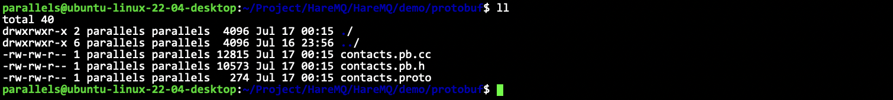

# protobuf

- [简体中文](./proto.md)
- [English](./proto-en.md)

***
- [protobuf](#protobuf)
  - [What is it](#what-is-it)
  - [Get started quickly](#get-started-quickly)

## What is it

ProtoBuf (full name Protocol Buffer) is a data structure serialization and deserialization framework, which has the following features:
- Language-independent, platform-independent: ProtoBuf supports multiple languages ​​such as Java, C++, Python, and supports multiple platforms
- Efficient: It is smaller, faster, and simpler than XML
- Good scalability and compatibility: You can update the data structure without affecting or destroying the original old program
- Write a `.proto` file to define the structure object (message) and attribute content
- Use the `protoc` compiler to compile the .proto file and generate a series of interface codes, which are stored in the newly generated header file and source file
- Rely on the generated interface, include the compiled header file into our code, and implement the setting and getting of the fields defined in the `.proto` file, and serialization and deserialization of the `message` object.

## Get started quickly

`contacts.proto` is defined as follows.
```proto
syntax = "proto3";  // Declaration syntax version
package contacts;   // Declaring a namespace

// Description of structured object
message contact {
    // Description of each field
    /* Field type Field name = Field unique number */
    uint64 sn = 1;
    string name = 2;
    float score = 3;
};
```

After defining the proto file, we need to let proto generate the corresponding `.h` and `.cc` for us.

```sh
protoc  --cpp_out=. contacts.proto
```



This will generate successfully.


```cpp
namespace contacts {
PROTOBUF_CONSTEXPR contact::contact(
```

The namespace here is the name of the package we determined.

So how to call and use it?

Note that you need to link it when using it.

makefile
```makefile
test: main.cc contacts.pb.cc
	g++ -o $@ $^ -lprotobuf -std=c++11
.PHONY:clean
clean:
	rm -f test
```

main.cc
```cpp
int main() {
    contacts::contact conn;
    conn.set_sn(10001);
    conn.set_name("Sam");
    conn.set_score(60.5);

    std::string str = conn.SerializeAsString();
    // conn.SerializeToString(&str); // same
    contacts::contact stu;
    bool ret = stu.ParseFromString(str);
    if (ret == false) // Deserialization failed
        assert(false);
    std::cout << stu.sn() << " " << stu.name() << " " << stu.score() << std::endl;
    return 0;
}
```

This is a basic usage.