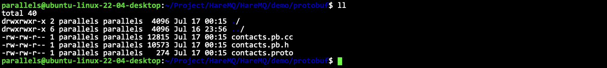

# protobuf

- [简体中文](./proto.md)
- [English](./proto-en.md)

***
- [protobuf](#protobuf)
  - [是什么](#是什么)
  - [快速上手](#快速上手)

## 是什么

ProtoBuf(全称Protocol Buffer)是数据结构序列化和反序列化框架，它具有以下特点:
- 语言无关、平台无关：即 ProtoBuf支持 Java、C++、Python 等多种语言，支持多个平台
- 高效：即比 XML 更小、更快、更为简单
- 扩展性、兼容性好：你可以更新数据结构，而不影响和破坏原有的旧程序


- 编写`.proto`文件，目的是为了定义结构对象(message)及属性内容
- 使用`protoc`编译器编译.proto 文件，生成一系列接口代码，存放在新生成头文件和源文件中
- 依赖生成的接口，将编译生成的头文件包含进我们的代码中，实现对`.proto`文件中定义的字段进行设置和获取，和对 `message` 对象进行序列化和反序列化。

## 快速上手

`contacts.proto`定义如下。
```proto
syntax = "proto3";  // 声明语法版本
package contacts;   // 声明命名空间

// 结构化对象的描述
message contact {
    // 各个字段描述
    /* 字段类型 字段名 = 字段唯一编号 */
    uint64 sn = 1;
    string name = 2;
    float score = 3;
};
```

定义完成proto文件之后，就要让proto给我们生成对应的`.h`和`.cc`了。

```sh
protoc  --cpp_out=. contacts.proto
```



这样就生成成功了。

```cpp
namespace contacts {
PROTOBUF_CONSTEXPR contact::contact(
```
这里的命名空间就是我们确定的package的名字。

那么如何调用和使用呢？

注意，使用的时候需要链接上去。

makefile
```makefile
test: main.cc contacts.pb.cc
	g++ -o $@ $^ -lprotobuf -std=c++11
.PHONY:clean
clean:
	rm -f test
```

main.cc
```cpp
int main() {
    contacts::contact conn;
    conn.set_sn(10001);
    conn.set_name("Sam");
    conn.set_score(60.5);

    std::string str = conn.SerializeAsString();
    // conn.SerializeToString(&str); // 一样的
    contacts::contact stu;
    bool ret = stu.ParseFromString(str);
    if (ret == false) // 反序列化失败
        assert(false);
    std::cout << stu.sn() << " " << stu.name() << " " << stu.score() << std::endl;
    return 0;
}
```
这就是一个基本的使用。