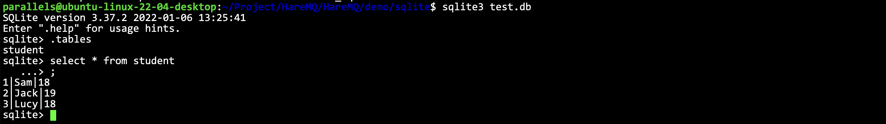

# SQLite3

## 什么是SQLite

SQLite是一个进程内的轻量级数据库，它实现了自给自足的、无服务器的、零配置的、事务性的 SQL数据库引擎。它是一个零配置的数据库，这意味着与其他数据库不一样，我们不需要在系统中配置。像其他数据库，SQLite引擎不是一个独立的进程，可以按应用程序需求进行静态或动态连接，SQLite直接访问其存储文件。

## 为什么需要用SQLite

> [!NOTE]
> - 不需要一个单独的服务器进程或操作的系统(无服务器的)。
> - SQLite不需要配置。
> - 一个完整的SQLite数据库是存储在一个单一的跨平台的磁盘文件。
> - SQLite是非常小的，是轻量级的，完全配置时小于400KiB，省略可选功能配置时小于250KiB, SQLite是自给自足的，这意味着不需要任何外部的依赖。
> - SQLite 事务是完全兼容 ACID 的，允许从多个进程或线程安全访问。
> - SQLite支持SQL92(SQL2)标准的大多数查询语言的功能。
> - SQLite使用 ANSI-C 编写的，并提供了简单和易于使用的 API。
> - SQLite可在UNlX(Linux, MacOs-X, Android, iOS)和 Windows(Win32, WinCE, WinRT)中运行。

## 官方文档

- **[https://www.sqlite.org/c3ref/funclist.html](https://www.sqlite.org/c3ref/funclist.html)**

## 封装Helper

因为不是所有的功能我们都会用到，因此我们先封装一些常用的方法到一个`.hpp`文件里面，方便后续使用即可。

```cpp
/**
 * 封装sqlite常用方法
 */

#ifndef __YUFC_SQLITE_HELPER__
#define __YUFC_SQLITE_HELPER__

#include "../log.hpp"
#include <iostream>
#include <sqlite3.h>
#include <string>

class sqlite_helper {
public:
    typedef int (*sqlite_callback)(void*, int, char**, char**);

private:
    sqlite3* __handler;
    std::string __db_file;

public:
    sqlite_helper(const std::string& db_file)
        : __db_file(db_file)
        , __handler(nullptr) { }
    bool open(int safe_lavel = SQLITE_OPEN_FULLMUTEX) {
        // 打开数据库(文件)
        // int sqlite3_open_v2(const char* filename, sqlite3 **ppDb, int flags, const char* zVfs);
        int ret = sqlite3_open_v2(__db_file.c_str(), &__handler, SQLITE_OPEN_READWRITE | SQLITE_OPEN_CREATE | safe_lavel, nullptr);
        if (ret != SQLITE_OK) {
            LOG(ERROR) << "create database failed: " << sqlite3_errmsg(__handler) << std::endl;
            return false;
        }
        return true;
    }
    bool exec(const std::string& sql, sqlite_callback& cb, void* arg) {
        // 执行语句
        // int sqlite3_exec(sqlite3*, char* sql, int (*callback)(void*, int, char**, char**), void* arg, char**err);
        int ret = sqlite3_exec(__handler, sql.c_str(), cb, arg, nullptr);
        if (ret != SQLITE_OK) {
            LOG(ERROR) << "run exec: [" << sql << "] failed: " << sqlite3_errmsg(__handler) << std::endl;
            return false;
        }
        return true;
    }
    bool close() {
        // 关闭数据库(文件)
        if (__handler) {
            if (sqlite3_close_v2(__handler))
                return true;
            LOG(ERROR) << "close error" << std::endl;
            return false;
        }
        LOG(ERROR) << "null sql handler" << std::endl;
        return false;
    }
};

#endif
```

## 进行一些实验

插入一些数据试试:

```cpp
int main() {
    // 1. 创建/打开库文件
    sqlite_helper helper("./test.db");
    assert(helper.open());
    // 2. 创建表（不存在则创建）
    const char* create_sql = "create table if not exists student(sn int primary key, name varchar(32), age int);";
    assert(helper.exec(create_sql, nullptr, nullptr));
    // 3. 新增数据（增删查改）
    const char* insert_sql = "insert into student values(1, 'Sam', 18), (2, 'Jack', 19), (3, 'Lucy', 18);";
    assert(helper.exec(insert_sql, nullptr, nullptr));
    // 4. 关闭数据库
    helper.close();
    return 0;
}
```

运行之后就会有一个 `test.db` 的数据库文件

```sh
sqlite3 test.db # 打开数据库
```

就可以看到我们的数据了:



测试查询：

```cpp
int select_cb(void* arg, int col_count, char** result, char** fields_name) {
    std::vector<std::string>* arr = (std::vector<std::string>*)arg; // 拿到传进来的数组
    arr->push_back(result[0]); // 因为查询结果只有一个字段，所以push一个就行了
    return 0; // 这里一定要返回0表示正常，否则可能会触发abort
}

int main() {
    // 1. 创建/打开库文件
    sqlite_helper helper("./test.db");
    assert(helper.open());
    // 2. 创建表（不存在则创建）
    const char* create_sql = "create table if not exists student(sn int primary key, name varchar(32), age int);";
    assert(helper.exec(create_sql, nullptr, nullptr));
    // 3. 新增数据（增删查改）
    const char* insert_sql = "insert into student values(1, 'Sam', 18), (2, 'Jack', 19), (3, 'Lucy', 18);";
    assert(helper.exec(insert_sql, nullptr, nullptr));
    const char* select_sql = "select name from student;";
    std::vector<std::string> arr;
    assert(helper.exec(select_sql, select_cb, &arr));
    for (const auto& name : arr)
        std::cout << name << " ";
    std::cout << std::endl;
    // 4. 关闭数据库
    helper.close();
    return 0;
}
```


