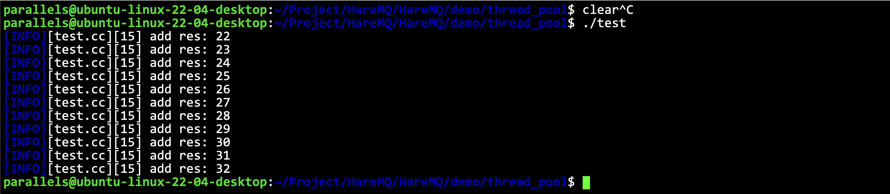

# 利用C++11的异步操作实现一个线程池

- [利用C++11的异步操作实现一个线程池](#利用c11的异步操作实现一个线程池)
  - [介绍](#介绍)
  - [关于一些代码细节的解释](#关于一些代码细节的解释)
  - [测试](#测试)


## 介绍

基于线程池执行任务的时候，入口函数内部执行逻辑是固定的，因此选择`std::packaged_task`加上`std::future`的组合来实现。

线程池的工作思想：
- 用户传入要执行的函数，以及需要处理的数据（函数的参数），由线程池中的工作线程来执行函数完成任务；

**代码: [HareMQ/demo/thread_pool](../HareMQ/demo/thread_pool/thread_pool.hpp)**


## 关于一些代码细节的解释

**`push`函数参数的解释**

```cpp
    template <typename func, typename... Args>
    auto push(func&& f, Args&&... args) -> std::future<decltype(f(args...))>;
```
push 进来的首先是一个函数（用户要执行的函数），接下来是不定参数，表示要处理的数据，也就是要穿入的参数，然后在push内部，把这个函数封装成一个异步操作(packaged_task)，丢给线程执行!

**返回值的解释**

因为我们不知道用户的线程给我们返回的是什么类型的值(因为我们是不知道用户要执行的函数要长什么样的)，所以只能用`auto`表示类型，但是直接用`auto`肯定是不行的，因为系统不知道要开辟多少空间压栈，所以C++中提供的一个类型推导: `decltype(func(args...))` 表示返回类型就是 `func(args...)` 的返回类型。

**`push`函数内部的一些解释**

```cpp
    auto push(func&& f, Args&&... args) -> std::future<decltype(f(args...))> {
        // 1. 对传入的函数封装成 packaged_task 任务包
        using return_type = decltype(f(args...)); // 返回值类型
        auto bind_func = std::bind(std::forward<func>(f), std::forward<Args>(args)...); // 函数+参数类型
        auto task = std::make_shared<std::packaged_task<return_type()>>(bind_func);
        std::future<return_type> fu = task->get_future();
        // 2. 构造 lambda 匿名函数（捕获任务对象，函数内执行任务对象）
        {
            std::unique_lock<std::mutex> lock(__mtx_lock);
            // 3. 将构造出来的匿名函数对象，抛入到任务队列中
            __task_queue.push_back([task]() {
                (*task)();
            });
            // 4. 唤醒消费者
            __cond.notify_one();
        }
        return fu;
    }
```

首先，因为每个用户传递进来的函数可能是不一样的，参数返回值都不一样，在`push`里一定要做一个统一。

首先是返回值类型，我们要做推导:

```cpp
using return_type = decltype(f(args...)); // 返回值类型
```

然后我们要把函数和函数参数绑定在一起，所以要用`bind`，因为是一个可变参数，所以要`...`展开，因为为了保持参数的性质，需要用一个完美转发`std::forward`。

```cpp
auto bind_func = std::bind(std::forward<func>(f), std::forward<Args>(args)...); // 函数+参数类型
```

然后后面就和 [asynchronous.md](./asynchronous.md) 里面的 demo 一样了，要用一个指针，来封装 `std::packaged_task`。

```cpp
auto task = std::make_shared<std::packaged_task<return_type()>>(bind_func);
std::future<return_type> fu = task->get_future();
```

## 测试

```cpp
#include "thread_pool.hpp"

int add(int a, int b) { return a + b; }

int main() {
    thread_pool pool;
    for (int i = 0; i < 11; i++) {
        std::future<int> fu = pool.push(add, i, 22);
        LOG(INFO) << "add res: " << fu.get() << std::endl;
    }
    pool.stop();
    return 0;
}
```

