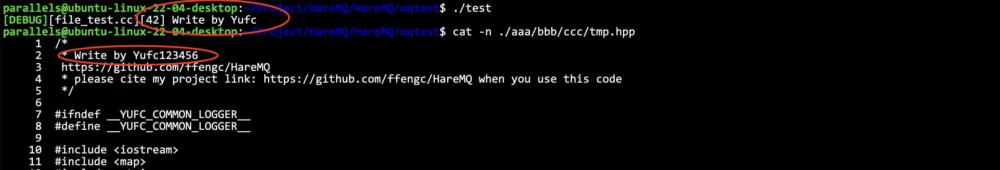

# Detailed implementation

**From the Chinese version, translated using Google Translate**

- [简体中文](./work.md)
- [English](./work-en.md)

***
- [Detailed implementation](#detailed-implementation)
  - [Create project directory structure](#create-project-directory-structure)
  - [Tools preparation](#tools-preparation)
    - [Log printing tool](#log-printing-tool)
    - [Basic sqlite operations](#basic-sqlite-operations)
    - [String Operations](#string-operations)
    - [UUID generation class](#uuid-generation-class)
    - [Basic file operations](#basic-file-operations)
    - [Test file-related operations](#test-file-related-operations)
  - [Message type definition](#message-type-definition)
  - [Switch data management](#switch-data-management)
  - [Unit test of the exchange part](#unit-test-of-the-exchange-part)
  - [Queue data management](#queue-data-management)
  - [Queue unit test](#queue-unit-test)
  - [Binding information management](#binding-information-management)
  - [Binding information management test](#binding-information-management-test)
  - [Message management](#message-management)
    - [What data does the message include](#what-data-does-the-message-include)
    - [Message persistence management](#message-persistence-management)
      - [The idea of ​​persistence](#the-idea-of-persistence)
      - [Interface operations provided](#interface-operations-provided)
    - [Implementation of message persistence](#implementation-of-message-persistence)
    - [Message management in memory](#message-management-in-memory)
    - [General message management class for external use](#general-message-management-class-for-external-use)
  - [Virtual machine operation module](#virtual-machine-operation-module)
  - [Routing exchange module](#routing-exchange-module)
    - [Basic concepts](#basic-concepts)
    - [Rules for `binding_key` and `routing_key`](#rules-for-binding_key-and-routing_key)
    - [How to match](#how-to-match)
  - [Consumption module/subscription module](#consumption-modulesubscription-module)
    - [Consumer information structure](#consumer-information-structure)
    - [Consumer management (management based on queues-queue consumer management structure)](#consumer-management-management-based-on-queues-queue-consumer-management-structure)
    - [Unify the management structure of consumers](#unify-the-management-structure-of-consumers)
  - [Channel Management Module (Part 1)](#channel-management-module-part-1)
    - [Basic Concepts](#basic-concepts-1)
    - [Network communication protocol design (design server-side network interface)](#network-communication-protocol-design-design-server-side-network-interface)
      - [Requirements analysis](#requirements-analysis)
      - [Application layer protocol design](#application-layer-protocol-design)
      - [Define request/response parameters](#define-requestresponse-parameters)
  - [Reorganize the calling logic of the entire server](#reorganize-the-calling-logic-of-the-entire-server)
  - [Channel Management Module (Part 2)](#channel-management-module-part-2)
    - [Improve the external class for adding, deleting and modifying channels](#improve-the-external-class-for-adding-deleting-and-modifying-channels)
  - [Connection management module](#connection-management-module)
  - [Server setup](#server-setup)
  - [Basic structure of the client](#basic-structure-of-the-client)
  - [Client subscriber module](#client-subscriber-module)
  - [Client channel management](#client-channel-management)
  - [Client asynchronous worker thread implementation](#client-asynchronous-worker-thread-implementation)
  - [Client connection module](#client-connection-module)
  - [Functional joint debugging](#functional-joint-debugging)
    - [Basic steps](#basic-steps)
  - [Project Summary](#project-summary)


## Create project directory structure


## Tools preparation

We need the following tool codes:

- Log printing tool
- Basic file operations
- Basic sqlite operations
- String operations
- UUID generation class


### Log printing tool

I often use this log component, just see the code. `HareMQ/mqcommon/logger.hpp`.

### Basic sqlite operations

Create a `helper.hpp` in `mqcommon`, and copy the content of `db.hpp` implemented in the demo.

**For detailed explanation, please refer to the demo documentation: [docs/sqlite.md](../docs/sqlite.md)**

### String Operations

In fact, it is string cutting. I have written it many times before. Just use the one in `boost`.

```cpp
class string_helper {
    static size_t split(const std::string& str, const std::string& sep, std::vector<std::string>* out, bool if_compress = true) {
        // boost split
        if (if_compress) {
            boost::split(*out, str, boost::is_any_of(sep), boost::token_compress_on);
            return out->size();
        } else {
            boost::split(*out, str, boost::is_any_of(sep), boost::token_compress_off);
            return out->size();
        }
    }
};
```

### UUID generation class

> [!TIP]
> UUID (Universally Unique Identifier), also known as Universally Unique Identifier, is usually composed of 32 hexadecimal characters. The standard form of UUID contains 32 hexadecimal characters, divided into five segments by hyphens, and the form is 8-4-4-4-12 32 characters, such as: `550e8400-e29b-41d4-a716-446655440000`. Here, we generate uuid by generating 8 random numbers, plus an 8-byte sequence number, a total of 16 bytes to generate a combination of 32 hexadecimal characters to ensure global uniqueness and to distinguish data based on the sequence number.

```cpp
class uuid_helper {
public:
    std::string uuid() {
        std::random_device rd;
        std::mt19937_64 generator(rd());
        std::uniform_int_distribution<int> distribution(0, 255);
        std::stringstream ss;
        for (int i = 0; i < 8; ++i) {
            ss << std::setw(2) << std::setfill('0') << std::hex << distribution(generator);
            if (i == 3 || i == 5 || i == 7)
                ss << "-";
            static std::atomic<size_t> seq(1); // 这里一定要静态，保证多次调用都是自增的
            size_t num = seq.fetch_add(1);
            for (int i = 7; i >= 0; i--) {
                ss << std::setw(2) << std::setfill('0') << std::hex << ((num >> (i * 8)) & 0xff);
                if (i == 6)
                    ss << "-";
            }
        }
        return ss.str();
    }
};
```

### Basic file operations


Basic framework:

```cpp
class file_helper {
private:
    std::string __file_name;

public:
    file_helper(const std::string& file_name)
        : __file_name(file_name) { }
    ~file_helper() = default;

public:
    bool exists();
    size_t size();
    bool read(std::string& body);
    bool read(std::string& body, size_t offset, size_t len);
    bool write(const std::string& body);
    bool write(const std::string& body, size_t offset);
    bool create();
    bool remove();
    bool create_dir();
    bool remove_dir();
    static std::string parent_dir(const std::string& file_name);
    bool rename(const std::string& name);
};
```

### Test file-related operations

`mptest/file_test.cc`

First test two simple functions:

```cpp
void test1() {
    hare_mq::file_helper helper("../mqcommon/logger.hpp");
    hare_mq::LOG(DEBUG) << "file if exists: " << helper.exists() << std::endl;
    hare_mq::LOG(DEBUG) << "file size: " << helper.size() << std::endl;
}
```


Test directory creation and file creation:

```cpp
void test2() {
    hare_mq::file_helper helper("./aaa/bbb/ccc/tmp.hpp");
    if (helper.exists() == false) {
        std::string p = hare_mq::file_helper::parent_dir(helper.path()); // Get the parent directory first
        hare_mq::LOG(DEBUG) << p << std::endl;
        if (hare_mq::file_helper(p).exists() == false) {
            // Create a Directory
            hare_mq::file_helper::create_dir(p);
        }
        hare_mq::file_helper::create(helper.path());
    }
}
```


Test global read and write:


```cpp
void test3() {
    hare_mq::file_helper helper1("../mqcommon/logger.hpp");
    hare_mq::file_helper helper2("./aaa/bbb/ccc/tmp.hpp");
    std::string body;
    helper1.read(body);
    // write to tmp.hpp
    helper2.write(body);
}
```

Read the data in `logger.hpp` and write it to `tmp.hpp`.

Test the reading and writing of a specific location:

```cpp
void test4() {
    hare_mq::file_helper helper("./aaa/bbb/ccc/tmp.hpp");
    // Read out bytes 6-19
    char str[16] = {0};
    helper.read(str, 6, 13); // Here we need to read the characters (6, 19], so we should pass in 6, 13
    hare_mq::LOG(DEBUG) << std::string(str) << std::endl;
    helper.write("123456\n", 19, 7);
}
```



Passed the test.


Test `rename`:

```cpp
void test5() {
    hare_mq::file_helper helper("./aaa/bbb/ccc/tmp.hpp");
    helper.rename(hare_mq::file_helper::parent_dir(helper.path()) + "/test.hpp");
}
```


As expected.

Test deletion:

```cpp
void test6() {
    hare_mq::LOG(DEBUG) << "before run" << std::endl;
    system("tree .");
    hare_mq::file_helper::create("./aaa/bbb/ccc/tmp.hpp");
    hare_mq::LOG(DEBUG) << "run: create(\"./aaa/bbb/ccc/tmp.hpp\");" << std::endl;
    system("tree .");
    hare_mq::file_helper::remove("./aaa/bbb/ccc/tmp.hpp");
    hare_mq::LOG(DEBUG) << "run: remove(\"./aaa/bbb/ccc/tmp.hpp\");" << std::endl;
    system("tree .");
    hare_mq::file_helper::remove_dir("./aaa/bbb/ccc/");
    hare_mq::LOG(DEBUG) << "run: remove_dir(\"./aaa/bbb/ccc/\");" << std::endl;
    system("tree .");
    hare_mq::file_helper::remove_dir("./aaa");
    hare_mq::LOG(DEBUG) << "run: remove_dir(\"./aaa\");" << std::endl;
    system("tree .");
}
```


## Message type definition

Therefore, defining a message type is actually defining a proto file of the message type and generating related code.

Message structure:

1. Elements of the message itself:

1. Message attributes: Message attributes include these contents. Message ID, message delivery mode: non-persistent/persistent mode, message `routing_key`

2. Message payload content

2. Elements required for additional storage of the message

3. Elements required for additional storage of the message

1. Storage length of the message

2. Length of the message

3. Whether the message is valid: Note that the bool type is not used here, but the character 0/1 is used, because the bool type occupies different lengths when persisted, which will cause the message length to change after modifying the valid bit of the message in the file, so the bool type is not used.

Define the proto file.

```proto
syntax = "proto3";
package hare_mq;
enum ExchangeType {
    UNKNOWTYPE = 0;
    DIRECT = 1;
    FANOUT = 2;
    TOPIC = 3;
};
enum DeliveryMode {
    UNKNOWTYPE = 0;
    UNDURABLE = 1;
    DURABLE = 2;
};
message BasicProperties {
    string id = 1;
    DeliveryMode delivery_mode = 2;
    string routing_key = 3;
};
message Message {
    message Payload {
        BasicProperties properties = 1;
        string body = 2;
    };
    Payload payload = 1;
    uint32 offset = 2;
    uint32 length = 3;
    string valid = 4;
};
```


## Switch data management

Now we need to start writing `exchagne,.hpp` in `mqserver`.

The basic structure of the code is as follows:

```cpp
namespace hare_mq {
/**
    * 1. exchange class
    * 2. exchange data persistence management class
    * 3. exchange data memory management class
 */
struct exchange {
    /* exchange class */
public:
    using ptr = std::shared_ptr<exchange>;
    std::string name;
    ExchangeType type;
    bool durable;
    bool auto_delete;
    std::unordered_map<std::string, std::string> args;
public:
    exchange(const std::string ename,
        ExchangeType etype,
        bool edurable,
        bool eauto_delete,
        const std::unordered_map<std::string, std::string>& eargs)
        : name(ename)
        , type(etype)
        , auto_delete(eauto_delete)
        , args(eargs) { }
    // The format of args storage is key-value pair. When storing in the database, a string will be organized for storage key=value&key=value
    void set_args(const std::string& str_args) {
        /**
        * Parse str_args string: key=value&key=value... and store it in args member variable
        */
    }
    std::string get_args() {
        /**
        * The reverse operation of set_args(), serializing the data in args into the format of key=value&key=value...
        */  
    }
};

class exchange_mapper {
    /* exchange_mapper */
private:
    sqlite_helper __sql_helper;
public:
    exchange_mapper(const std::string& dbfile); 
public:
    void create_table(); 
    void remove_table(); 
    void insert(exchange::ptr& e); 
    void remove(const std::string& name); 
    exchange::ptr one(const std::string& name); 
    std::unordered_map<std::string, exchange::ptr> all(); 
};

class exchange_manager {
    /* exchange_manager */
private:
    exchange_mapper __mapper;
    std::unordered_map<std::string, exchange::ptr> __exchanges;
    std::mutex __mtx; 
public:
    exchange_manager(const std::string& dbfile);
    void declare_exchange(const std::string& name,
        ExchangeType type,
        bool durable,
        bool auto_delete,
        std::unordered_map<std::string, std::string>& args);
    void delete_exchange(const std::string& name); 
    exchange::ptr select_exchange(const std::string& name); 
    bool exists(const std::string& name); 
    void clear_exchange(); 
};

} // namespace hare_mq
```

The specific code can be seen in the code.

## Unit test of the exchange part

I found a lot of bugs in the unit test part and changed some places. See the code for details. `HareMQ/mqtest/exchange_test.cc`

## Queue data management

The basic structure of this part is as follows.

**Define the queue description data class:**

1. Queue name

2. Persistence flag

**Define the queue data persistence class (data persistence in sqlite3 database)**

1. Create/delete queue data table

2. Add queue data

3. Remove queue data

4. Query all queue data

**Define queue data management class:**

1. Create a queue and add management (do not create if it exists)

2. Delete the queue

3. Get the specified queue

4. Determine all queues

5. Determine whether the specified queue exists

6. Get the number of queues

7. Destroy all queue data

The specific code is basically the same as `exchange.hpp`, so it will not be repeated here. For details, see the code.

## Queue unit test

This part is basically the same as the switch part.

See the code for details. `HareMQ/mqtest/queue_test.cc`

## Binding information management

Essentially, it is a description of which queues are associated with a switch.

**Define binding information class:**
1. Switch name
2. Queue name
3. `binding_key` (distribution matching rules - determines which data can be put into the queue by the switch)

**Define binding information data persistence class:**
1. Create/delete binding information data table
2. Add binding information data
3. Remove specified binding information data
4. Remove binding information data related to the specified switch
5. Remove binding information data related to the specified queue
6. Query all binding information data
7. Query specified binding information data (according to switch-queue name)

**Define binding information data management class:**
1. Create binding information and add management (OK if it exists, create if it does not exist)
2. Delete all binding information of the specified queue
3. Delete all binding information related to the switch
4. Get all binding information related to the switch
5. Determine whether the current binding information exists
6. Get the current number of binding information
7. Destroy all binding information data

Similarly, the third class is external, which is actually the same as the previous one.

**Some implementation tips:**

```cpp
using msg_queue_binding_map = std::unordered_map<std::string, binding::ptr>;
using binding_map = std::unordered_map<std::string, msg_queue_binding_map>;
```

Why is it designed this way?

**Because a switch can have multiple binding information, but one binding information must only correspond to one queue. **

**So let the queue and binding information first construct a one-to-one correspondence map. **

The rest of the basic things are basically the same as what was written before. Please note here:


```cpp
    static int select_callback(void* arg, int numcol, char** row, char** fields) {
        binding_map* result = (binding_map*)arg;
        binding::ptr bp = std::make_shared<binding>(row[0], row[1], row[2]);
        // In order to prevent the binding information from already existing, the queue mapping cannot be created directly. If it is added directly, the historical data will be overwritten.
        // Therefore, you must first obtain the mapping object corresponding to the switch and add data to it.
        // However, if there is no mapping information corresponding to the switch at this time, the acquisition here must use a reference (it will be guaranteed to be automatically created if it does not exist)
        msg_queue_binding_map& qmap = (*result)[bp->exchange_name];
        qmap.insert({ bp->msg_queue_name, bp });
        return 0;
    }
```
Pay attention to the type, not direct insertion. Just pay attention to these two types.

```cpp
using msg_queue_binding_map = std::unordered_map<std::string, binding::ptr>;
using binding_map = std::unordered_map<std::string, msg_queue_binding_map>;
```

Whether the binding information needs to be persisted depends on: switch persistence + queue persistence, and only the binding information needs to be persisted.

```cpp
bool bind(const std::string& ename, const std::string& qname, const std::string& key, bool durable)
```

However, in order to decouple these hpps, `bool durable` is directly passed here, so that the external, joint call can directly tell me whether persistence is needed, instead of getting the data of the switch and queue in this file, which is coupled, which is not particularly good.

## Binding information management test

The test is basically the same as the previous one, so it will not be repeated. For details, see the code. `HareMQ/mqtest/binding_test.cc`.

## Message management

### What data does the message include

The previous chapters are basically preparations, and starting from message management is the core.

What are the elements of the message? This protobuf file has defined them all, and now I will explain them again.

```protobuf
message BasicProperties {
    string id = 1;
    DeliveryMode delivery_mode = 2;
    string routing_key = 3;
};
message Message {
    message Payload {
        BasicProperties properties = 1;
        string body = 2;
        string valid = 3;
    };
    Payload payload = 1;
    uint32 offset = 2;
    uint32 length = 3;
};
```

The message can be divided into two parts. The first part is the data message itself, which is the core data of network transmission, which is the `Payload` above. The second part is the additional elements required for message management on the server, the most important of which is persistence management.

What are the additional elements required for message management on the server:

1. Message validity flag: This field needs to be persisted along with the persistent content of the message.
Each message may need to be stored persistently, and will be deleted when it is pushed to the client. However, the file is rewritten every time a piece of data is deleted, which is too inefficient. If the valid flag is set, you only need to modify the data corresponding to the valid flag to invalid each time. 2. The actual storage location of the message (the offset relative to the start position of the file) When you want to delete a message, you need to rewrite the corresponding position of the message in the file (set the valid flag to invalid) At this time, you need to find this message. 3. The length of the message When restoring historical messages and reading message contents, you need to solve the problem of sticky packets, so you must know how long the message is. Regarding the `valid` field, modify it to put it in `Payload`, because the contents of `Payload` need to be stored persistently.


### Message persistence management

#### The idea of ​​persistence

Idea: Use queues as units for message persistence management.

> When the message file is garbage collected, all valid messages need to be loaded and a new data file needs to be regenerated. However, after the new data file is generated, the storage location of the message changes, and the data in the memory needs to be updated.

At this time, all queue data needs to be locked and then updated, so the lock conflicts are too frequent and the efficiency is low.

Therefore, if each queue has its own independent data file, only the queue data of the operation needs to be locked each time.

Here we should pay attention to:

> [!NOTE]
> The persistent management of messages does not use the database. We use files directly because we do not use it for query, but for backup, and the length of the message is often uncertain, so it is better to choose to use files.

If you want to store it in a file, you must standardize the format.

Our format is: `[4-byte length|data][4-byte length|data][4-byte length|data][4-byte length|data]...` This format is used for storage.

This method can solve the problem of sticking packages.

#### Interface operations provided

1. Creation and deletion of message files

2. Persistence of added messages/persistence of deleted messages (not really deleted, just set the flag to invalid)

3. Historical data recovery/garbage collection

1. When garbage collection is needed: Because each deletion of data is actually set to invalid, not really deleted, so the data in the file will increase, but not every deletion needs to be recycled. When there are more than 2,000 messages in the file and the valid ratio is less than 50%, it will be recycled.

2. Recycling ideas:

- Load all valid messages in the file, then delete the original file, and then generate a new file to write the data. (This method has risks. What if the writing fails?)

- Load all valid messages in the file, write them to a temporary file first, then delete the original file, and finally change the name of the temporary file to the corresponding name.

### Implementation of message persistence

The framework is as follows.

```cpp
namespace hare_mq {
#define DATAFILE_SUBFIX ".mqd"
#define TMPFILE_SUBFIX ".mqd.tmp" // Define the file name suffix for persistent files and temporary files
using message_ptr = std::shared_ptr<Message>;
class message_mapper {
private:
    std::string __queue_name;
    std::string __data_file;
    std::string __tmp_file; 
public:
    message_mapper(const std::string& base_dir, const std::string& qname);
    void create_msg_file();
    void remove_msg_file();
    void insert(message_ptr& msg);
    void remove(const message_ptr& msg);
    std::list<message_ptr> gc(); // Garbage Collection
};
} // namespace hare_mq
```

具体实现可以见代码。

For specific implementation, see the code.

### Message management in memory

Corresponding to persistent management (messages in disk), the management in memory now also needs to be managed in queues.

So two layers of encapsulation are needed. Each queue needs a class to manage it, and then finally to manage all queues externally, so another layer of encapsulation is needed.

**So inner layer: queue message management**

Operation:

1. When constructing an object: create/open the queue data file, restore the queue historical message data

2. Add a message/confirm a message (delete): After each ack (remove), check the garbage collection. When the total amount of persistent data exceeds 2000 and the effective ratio is less than 50%, perform garbage collection

3. Get the head message

4. Delete all messages in the queue

5. Get the number of messages to be pushed

6. Get the number of messages to be confirmed

7. Get the number of persistent messages

Fields:

0. Queue name

1. Persistent management handle

2. Message list to be pushed: head insertion and tail deletion method

3. A hash table of persistent messages: message data needs to be updated after garbage collection (actual storage location)

4. A hash table of messages to be confirmed: a message is pushed to the client. After it is pushed, has the client received it? So it needs to be confirmed, but not all messages need to be confirmed, so it needs to be distinguished. So when you push a message to the client, you must first retrieve the message (it must be retrieved, otherwise it will be pushed repeatedly later), and then put it in the map to be confirmed and wait for confirmation.
5. Number of valid messages in the persistent file
6. Total number of messages in the persistent file: can be used to calculate the proportion of valid messages in the file to decide whether to perform garbage collection.

The basic structure is as follows:

```cpp
/* queue_message */
class queue_message {
private:
    std::string __queue_name; // Queue Name
    size_t __valid_count; // Number of valid messages
    size_t __total_count; // Total number of messages
    message_mapper __mapper; // Persistent handles
    std::list<message_ptr> __msgs; // Messages to be pushed
    std::unordered_map<std::string, message_ptr> __durable_msgs; // Messages to be persisted
    std::unordered_map<std::string, message_ptr> __wait_ack_msgs; // Messages to be confirmed
public:
    queue_message(const std::string& base_dir, const std::string& qname)
        : __mapper(base_dir, qname) { }
    bool insert(const BasicProperties* bp, const std::string& body);
    bool remove(const std::string& msg_id); // ack, check whether gc is needed after each remove
    message_ptr front(); // Get team leader information
    size_t push_count();
    size_t total_count();
    size_t durable_count();
    size_t wait_ack_count();
    void clear();
};
```

### General message management class for external use

Manages the messages of each queue.

Managed members:
- Mutex
- Message management handle for each queue: a hash table of queue name & queue message management handle

Operations provided:
- Initialize the message management handle of the queue: called when creating a queue
- Destroy the message management handle of the queue: called when deleting a queue
- Various message operations on the queue
- Add messages to the queue
- Get the first message in the queue
- Confirm messages for the queue
- Get the number of messages in the queue: the number of messages that can be obtained, the number of persistent messages, the number of messages to be confirmed, and the total number of persistent messages
- Restore historical messages of the queue


```cpp
class message_manager {
private:
    std::mutex __mtx;
    std::string __base_dir;
    std::unordered_map<std::string, queue_message::ptr> __queue_msgs; //  map
public:
    using ptr = std::shared_ptr<message_manager>;
    message_manager(const std::string& base_dir)
        : __base_dir(base_dir) { }
    void init_queue_msg(const std::string& qname) {
        queue_message::ptr qmp;
        { // lock
            std::unique_lock<std::mutex> lock(__mtx);
            auto it = __queue_msgs.find(qname);
            if (it != __queue_msgs.end())
                return;
            qmp = std::make_shared<queue_message>(__base_dir, qname);
            __queue_msgs.insert(std::make_pair(qname, qmp));
        }
        qmp->recovery(); // no lock
    } 
    void destroy_queue_msg(const std::string& qname) {
        queue_message::ptr qmp;
        {
            std::unique_lock<std::mutex> lock(__mtx);
            auto it = __queue_msgs.find(qname);
            if (it == __queue_msgs.end())
                return;
            qmp = it->second;
            __queue_msgs.erase(it);
        }
        qmp->clear();
    } 
    bool insert(const std::string& qname, BasicProperties* bp, const std::string& body, DeliveryMode mode) {
        queue_message::ptr qmp;
        {
            std::unique_lock<std::mutex> lock(__mtx);
            auto it = __queue_msgs.find(qname);
            if (it == __queue_msgs.end()) {
                LOG(ERROR) << "insert msg failed, no this queue: " << qname << std::endl;
                return false;
            }
            qmp = it->second;
        }
        return qmp->insert(bp, body, mode);
    } 
    message_ptr front(const std::string& qname) {
        queue_message::ptr qmp;
        {
            std::unique_lock<std::mutex> lock(__mtx);
            auto it = __queue_msgs.find(qname);
            if (it == __queue_msgs.end()) {
                LOG(ERROR) << "get queue front failed, no this queue: " << qname << std::endl;
                return message_ptr();
            }
            qmp = it->second;
        }
        return qmp->front();
    } 
    void ack(const std::string& qname, const std::string msg_id) {
        queue_message::ptr qmp;
        {
            std::unique_lock<std::mutex> lock(__mtx);
            auto it = __queue_msgs.find(qname);
            if (it == __queue_msgs.end()) {
                LOG(ERROR) << "ack mesg failed, no this queue: " << qname << std::endl;
                return;
            }
            qmp = it->second;
        }
        qmp->remove(msg_id); 
    } 
    size_t getable_count(const std::string& qname) {
        queue_message::ptr qmp;
        {
            std::unique_lock<std::mutex> lock(__mtx);
            auto it = __queue_msgs.find(qname);
            if (it == __queue_msgs.end()) {
                LOG(ERROR) << "error in getable_count(), no this queue: " << qname << std::endl;
                return 0;
            }
            qmp = it->second;
        }
        return qmp->getable_count();
    }
    size_t total_count(const std::string& qname) {
        queue_message::ptr qmp;
        {
            std::unique_lock<std::mutex> lock(__mtx);
            auto it = __queue_msgs.find(qname);
            if (it == __queue_msgs.end()) {
                LOG(ERROR) << "error in total_count(), no this queue: " << qname << std::endl;
                return 0;
            }
            qmp = it->second;
        }
        return qmp->total_count();
    }
    size_t durable_count(const std::string& qname) {
        queue_message::ptr qmp;
        {
            std::unique_lock<std::mutex> lock(__mtx);
            auto it = __queue_msgs.find(qname);
            if (it == __queue_msgs.end()) {
                LOG(ERROR) << "error in durable_count(), no this queue: " << qname << std::endl;
                return 0;
            }
            qmp = it->second;
        }
        return qmp->durable_count();
    }
    size_t wait_ack_count(const std::string& qname) {
        queue_message::ptr qmp;
        {
            std::unique_lock<std::mutex> lock(__mtx);
            auto it = __queue_msgs.find(qname);
            if (it == __queue_msgs.end()) {
                LOG(ERROR) << "error in wait_ack_count(), no this queue: " << qname << std::endl;
                return 0;
            }
            qmp = it->second;
        }
        return qmp->wait_ack_count();
    }
    void clear() {
        std::unique_lock<std::mutex> lock(__mtx);
        for (auto& q : __queue_msgs)
            q.second->clear();
    }
};
```

## Virtual machine operation module

In fact, it is to integrate all the previous modules. Let the virtual machine operation class provide an interface to the upper layer.

Essence: The virtual machine operation module is the encapsulation of the previous module

**Define the virtual machine class to include the following members:**
- Switch data management handle
- Queue data management handle
- Binding data management handle
- Message data management handle

**Virtual machine operation:**
- Declare a switch (if it exists, it does not need to be created)
- Delete a switch (and delete the binding information at the same time)
- Declare a queue (if it does not exist, create it, and create a queue-related message management object at the same time)
- Delete a queue (and delete the binding information at the same time)
- Switch-queue binding
- Switch-queue unbinding
- Get all binding information related to the switch
- Provide the function of adding new messages
- Provide the function of getting the first message of a specified queue

**Virtual machine management operations:**
- Add, delete, and check

The structure of the virtual machine class is as follows

```cpp
namespace hare_mq {
class virtual_host {
private:
    exchange_manager::ptr __emp;
    msg_queue_manager::ptr __mqmp;
    binding_manager::ptr __bmp;
    message_manager::ptr __mmp; // Four handles
public:
    virtual_host(const std::string& basedir, const std::string& dbfile);
    bool declare_exchange(const std::string& name,
        ExchangeType type,
        bool durable,
        bool auto_delete,
        std::unordered_map<std::string, std::string>& args); // Declare exchange
    void delete_exchange(const std::string& name); // Delete a exchange
    bool declare_queue(const std::string& qname,
        bool qdurable,
        bool qexclusive,
        bool qauto_delete,
        const std::unordered_map<std::string, std::string>& qargs); // declare queue
    void delete_queue(const std::string& name); // Delete a Queue
    bool bind(const std::string& ename, const std::string& qname, const std::string& key);
    void unbind(const std::string& ename, const std::string& qname); 
    msg_queue_binding_map exchange_bindings(const std::string& ename); 
    bool basic_publish(const std::string& qname, BasicProperties* bp, const std::string& body, DeliveryMode mode); 
    message_ptr basic_consume(const std::string& qname); 
    bool basic_ack(const std::string& qname, const std::string& msgid); 
};
} // namespace hare_mq
```

The implemented code is as shown in the code.

## Routing exchange module

### Basic concepts

> [!TIP]
> The essence of this module: determine whether the `routing_key` in a message matches the `binding_key` of the queue, that is: to which queue should the message arriving at the switch be sent?

The client cannot send the message to the specified switch. The switch should consider which queues bound to it should be placed in this data, and this consideration is determined by the switch type and matching rules.
- Broadcast exchange: directly send the message to all bound queues without matching
- Direct exchange: the `binding_key` in the queue binding information is consistent with the `routing_key` in the message, then the match is successful, otherwise it fails.
- Topic exchange: only messages that match the queue topic will be placed in the queue.

The first point to summarize is: you only need to process the incoming data, and you don’t need to manage the data yourself! Therefore, the interface of this module should all be `static`.

**Functions to be provided:**
1. Determine whether `routing_key` is legal
2. Determine whether `binding_key` is legal
3. Match two `key`

### Rules for `binding_key` and `routing_key`

**`routing_key`**

Must be: `a~z`, `A~Z`, `0~9`, `.`, `_`

**`binding_key`**

Must be: `a~z`, `A~Z`, `0~9`, `.`, `_`, `#`, `*`. Note that `#` and `*` are wildcards. `*` can match any word, and `#` can match zero or any number of words (note that it is a word, not a letter). Wildcards must exist independently, for example, `a.#.b` is allowed, but `a.a#.b` is not allowed.
There cannot be other wildcards on both sides of `#`, because `#` itself represents multiple words, so it is meaningless if there are other wildcards on both sides.

### How to match

Method: Dynamic programming

The logic here is relatively complicated.

**The overall idea is very similar to this question in LeetCode: [https://leetcode.cn/problems/wildcard-matching/description/](https://leetcode.cn/problems/wildcard-matching/description/)**

Therefore, I will not repeat the principle here, and you can see the code directly.


```cpp
static bool __dp_matching(const std::string& routing_key, const std::string& binding_key) {
    // 1. Split the binding_key and routing_key into arrays of words
    std::vector<std::string> bkeys, rkeys;
    int n_bkey = string_helper::split(binding_key, ".", &bkeys);
    int n_rkey = string_helper::split(binding_key, ".", &rkeys);
    // 2. Define a DP array and initialize position [0][0] as true, other positions as false
    std::vector<std::vector<bool>> dp(n_bkey + 1, std::vector<bool>(n_rkey + 1, false));
    dp[0][0] = true;
    // 3. If the binding_key starts with '#', set the corresponding row's first position to true
    for (int i = 1; i <= bkeys.size(); ++i) {
        if (bkeys[i - 1] == "#") {
            dp[i][0] = true;
            continue;
        }
        break;
    }
    // 4. Match each word in the routing_key with each word in the binding_key and update the DP array
    for (int i = 1; i <= n_bkey; i++) {
        for (int j = 1; j <= n_rkey; j++) {
            // If the current bkey is a word or '*', or if both words are the same, the match is successful, inherit result from the top-left
            if (bkeys[i - 1] == rkeys[j - 1] || bkeys[i - 1] == "*")
                dp[i][j] = dp[i - 1][j - 1];
            // If the current bkey is '#', inherit the result from top-left, left, or above
            else if (bkeys[i - 1] == "#")
                dp[i][j] = dp[i - 1][j - 1] || dp[i][j - 1] || dp[i - 1][j];
        }
    }
    return dp[n_bkey][n_rkey];
}
```

## Consumption module/subscription module


Whenever a subscription request is initiated on the client side, it means that there is one more subscriber on the server side (client description for processing messages), and the consumer or subscriber is directly associated with the queue, because the subscription request will describe the message of the current queue.

When a channel is closed or a queue is deleted, the consumer associated with the channel or queue will no longer exist. Therefore, the relevant consumer information also needs to be deleted.

### Consumer information structure

1. Consumer ID
2. Subscribed queue name
3. A message processing callback function (implemented when a message is published to the queue, the consumer is selected for consumption. How to consume? For the server, it is to call this callback function for processing. Its internal logic is to find the connection corresponding to the consumer and then send the data to the client corresponding to the consumer.
4. Whether to automatically reply (after a message is consumed by a consumer, if it is automatically replied, the pending message is directly removed, otherwise wait for the customer to confirm)

### Consumer management (management based on queues-queue consumer management structure)

Operation:
1. Add a new consumer: the service provided by the channel is created when subscribing to queue information
2. Delete a consumer: cancel subscription/channel closed/connection closed when deleted
3. Get a consumer: take a consumer from all consumers in the queue in order to push messages
4. Determine whether the queue consumer is empty
5. Determine whether the specified consumer exists
6. Clear all consumers in the queue

Elements:
1. Consumer management structure: `vector`
2. Rotation sequence number: A queue may have multiple consumers, but a message only needs to be consumed by one consumer, so RR rotation is used
3. Mutex lock: ensure thread safety
4. Queue name

### Unify the management structure of consumers

1. Initialize/delete the consumer information structure of the queue (initialize when creating/deleting the queue)
2. Add a consumer to the specified queue (when the client subscribes to the specified queue message): return the consumer object when the addition is completed
3. Remove the consumer from the specified queue (when the client cancels the subscription)
4. Remove all consumers from the specified queue (destroy when the queue is deleted): delete the queue management unit object of the consumer
5. Get a consumer from the specified queue (rotation query-consumer rotation consumption plays a role in load balancing)
6. Determine whether the consumer in the queue is empty
7. Determine whether the specified consumer exists in the queue
8. Clean up all consumers

The framework looks like this:


```cpp
namespace hare_mq {
// Type definition for consumer callback function that handles messages
using consumer_callback = std::function<void(const std::string& tag, const BasicProperties*, const std::string)>;

// Structure representing a message queue consumer
struct consumer {
    using ptr = std::shared_ptr<consumer>; // Shared pointer to consumer
    std::string tag; // Identifier for the consumer
    std::string qname; // Name of the subscribed queue
    bool auto_ack; // Auto acknowledgement flag
    consumer_callback callback; // Callback to handle messages
    consumer() { }
    consumer(const std::string& ctag, const std::string& queue_name, bool ack_flag, consumer_callback& cb)
        : tag(ctag), qname(queue_name), auto_ack(ack_flag), callback(cb) { }
};

/* Consumer structure per queue */
class queue_consumer {
private:
    std::string __qname; // Queue name
    std::mutex __mtx; // Mutex for thread safety
    uint64_t __rr_seq; // Round-robin sequencing number
    std::vector<consumer::ptr> __consumers; // Managed consumers
public:
    queue_consumer(const std::string& qname);
    consumer::ptr create(const std::string& ctag, const std::string& queue_name, bool ack_flag, consumer_callback& cb); // Create a consumer
    void remove(const std::string& ctag); // Remove a consumer
    consumer::ptr choose(); // Choose a consumer for message delivery
    bool empty(); // Check if there are no consumers
    bool exists(const std::string& ctag); // Check if a consumer exists
    void clear(); // Clear all consumers
};
} // namespace hare_mq
```

## Channel Management Module (Part 1)

### Basic Concepts

In the AMQP model, in addition to the concept of `Connection` for communication connection, there is also the concept of `Channel`. `Channel` is a more fine-grained communication channel for `Connection`. Multiple `Channel` can use the same communication connection `Connection` for communication, but the `Channel` of the same `Connection` are independent of each other.

**Management information:**
1. Channel ID: unique identifier of the channel
2. Consumers associated with the channel: used to unsubscribe and delete subscriber information when the consumer channel is closed
3. Connections associated with the channel: used by the client to send data (responses, pushed messages)
4. `protobuf` protocol processing handle: protocol processing before network communication
5. Consumer management handle: when the channel is closed/unsubscribed, delete subscriber information through the handle
6. Virtual machine handle: switch/queue/binding/message data management
7. Worker thread pool handle (after a message is published to the queue, it needs to be pushed to consumers who have subscribed to the corresponding queue, and the process is completed by the thread pool)

**Management operations:**
1. Provide declaration & deletion of switch operations (delete the binding information associated with the switch while deleting the switch)
2. Provide declaration & deletion of queue operations (delete the binding information, messages, and consumer information associated with the queue while deleting the queue)
3. Provide binding & unbinding queue operations
4. Provide subscription & unsubscription of queue message operations
5. Provides publishing & confirming message operations

**Channel management:**
Add, delete, and query channels

**The built framework is shown below. **

```cpp
namespace hare_mq {
class channel {
public:
    using ProtobufCodecPtr = std::shared_ptr<ProtobufCodec>; // Shared pointer for the protobuf codec

private:
    std::string __cid; // Channel identifier
    consumer::ptr __consumer; // Each channel corresponds to a consumer in haremq, though not necessarily active as the channel may not be linked to a consumer
    muduo::net::TcpConnectionPtr __conn; // TCP connection handle
    ProtobufCodecPtr __codec; // Protocol codec handler
    consumer_manager::ptr __cmp; // Consumer manager handle
    virtual_host::ptr __host; // Virtual host object handle

public:
    channel(const std::string& cid,
            const virtual_host::ptr& host,
            const consumer_manager::ptr& cmp,
            const ProtobufCodecPtr& codec,
            const muduo::net::TcpConnectionPtr conn) {}
    ~channel();
    // Declaration and deletion of exchanges
    void declare_exchange();
    void delete_exchange();
    // Declaration and deletion of queues
    void declare_queue();
    void delete_queue();
    // Binding and unbinding of queues
    void bind();
    void unbind();
    // Publishing and acknowledging messages
    void basic_publish();
    void basic_ack();
    // Subscribing and unsubscribing from queue messages
    void basic_consume();
    void basic_cancel();
};
} // namespace hare_mq
```


### Network communication protocol design (design server-side network interface)

#### Requirements analysis

In short: all the functions implemented above need to provide a network interface for the client to call (the client can be a producer or a consumer)

The specific communication process is implemented using the `Muduo` library, using TCP as the underlying communication protocol, and customizing the application layer protocol on this basis to complete the client's remote call to the server function.

Network interface to be provided:

- Create/delete `channel`
- Create/delete `exchange`
- Create/delete `queue`
- Create/delete `binding`
- Send `message`
- Subscribe to `message`
- Send `ack`
- Return `message` (server->client)

#### Application layer protocol design

This is directly used in the `Muduo` library. Chen Shuo has already written a method to combine `Protobuf`. The message format is shown in the figure.


- `len`: 4 bytes, indicating the length of the entire message

- `nameLen`: 4 bytes, indicating the length of the `typeName` array

- `typeName`: is a byte array, occupying `nameLen` bytes, identifying the type name of the request/response message, and its function is to distribute different messages to the corresponding remote interface calls

- `protobufData`: is a byte array, occupying `len-nameLen-8` bytes, indicating the binary of the request/response parameter data after being serialized by `protobuf`

- `checkSum`: 4 bytes, indicating the checksum of the entire message, and its function is to verify the completeness of the request/response message

#### Define request/response parameters

For the above parameters, not only `ProtobufData` needs to be passed, but all the parameters mentioned need to be passed, so they need to be defined in the pb file!

```proto
/*
 * Written by Yufc
 * See https://github.com/ffengc/HareMQ
 * Please cite my project link: https://github.com/ffengc/HareMQ when you use this code
 */
syntax = "proto3";
package hare_mq;

import "msg.proto";

/* Opening and closing of a channel */
message openChannelRequest {
    string rid = 1; // Request ID
    string cid = 2; // Channel ID
};
message closeChannelRequest {
    string rid = 1;
    string cid = 2;
};
/* Declaration and deletion of exchanges */
message declareExchangeRequest {
    string rid = 1;
    string cid = 2;
    string exchange_name = 3;
    ExchangeType exchange_type = 4;
    bool durable = 5;
    bool auto_delete = 6;
    map<string, string> args = 7;
};
message deleteExchangeRequest {
    string rid = 1;
    string cid = 2;
    string exchange_name = 3;
};
/* Declaration and deletion of queues */
message declareQueueRequest {
    string rid = 1;
    string cid = 2;
    string queue_name = 3;
    bool exclusive = 4;
    bool durable = 5;
    bool auto_delete = 6;
    map<string, string> args = 7;
};
message deleteQueueRequest {
    string rid = 1;
    string cid = 2;
    string queue_name = 3;
};
/* Binding and unbinding of queues */
message bindRequest {
    string rid = 1;
    string cid = 2;
    string exchange_name = 3;
    string queue_name = 4;
    string binding_key = 5;
};
message unbindRequest {
    string rid = 1;
    string cid = 2;
    string exchange_name = 3;
    string queue_name = 4;
};
/* Publishing of messages */
message basicPublishRequest {
    string rid = 1;
    string cid = 2;
    string exchange_name = 3;
    string body = 4;
    BasicProperties properties = 5;
};
/* Acknowledgement of messages */
message basicAckRequest {
    string rid = 1;
    string cid = 2;
    string queue_name = 3;
    string message_id = 4;
};
/* Subscription to queue messages */
message basicConsumeRequest {
    string rid = 1;
    string cid = 2;
    string consumer_tag = 3;
    string queue_name = 4;
    bool auto_ack = 5;
};
/* Cancellation of subscription */
message basicCancelRequest {
    string rid = 1;
    string cid = 2;
    string consumer_tag = 3;
    string queue_name = 4;
}
/* Pushing of messages */
message basicConsumeResponse {
    string cid = 1; // No need for rid, this is a response
    string consumer_tag = 2;
    string body = 3;
    BasicProperties properties = 4;
}
/* Generic response */
message basicCommonResponse {
    string rid = 1; // Response to a request identified by rid
    string cid = 2;
    bool ok = 3;
};
```


## Reorganize the calling logic of the entire server

> [!CAUTION]
> **If you understand this, you will understand what these files are for!**

- `exchange.hpp` switch-related code
- `queue.hpp` queue-related code
- `binding.hpp` binding-related code, establish a connection between the switch and the queue, and bind the switch and the queue
- `message.hpp` This is message management. Why do we need message management? The previous switch management, queue management, and binding management are actually the carriers of messages, that is, switches and queues are all places where messages pass.
- `route.hpp` solves the problem of how messages should go from switches to queues. In other words, `binding.hpp` only solves the process of binding the switch to the queue, that is, `binding.hpp` is just a binding tool. `route.hpp` tells you how to bind and who to bind to.
- All the functions above are combined together, which is actually the core logic of the entire MQ project. Encapsulating all the above things, we get `virtual_host.hpp`. The methods provided in this file are the methods provided by the entire MQ project server.
- At this time, another problem is encountered. If each socket connection directly calls an entire `virtual_host`, the efficiency is very low. Therefore, `channel.hpp` is introduced as a helper to improve efficiency. The essence is the same. Therefore, you can see that the methods provided in `channel.hpp` are the same as those provided by `virtual_host.hpp`. `channel.hpp` is the assistant of `host`.
- Then who will call these interfaces in `channel.hpp`? Let the callback of the network interface call!

## Channel Management Module (Part 2)

After defining proto, our `channel` framework is as follows: Give me a request and I will handle it for you, so the parameters are all requests.

```cpp
namespace hare_mq {
class channel {
public:
    using ProtobufCodecPtr = std::shared_ptr<ProtobufCodec>;
    using openChannelRequestPtr = std::shared_ptr<openChannelRequest>;
    using closeChannelRequestPtr = std::shared_ptr<closeChannelRequest>;
    using declareExchangeRequestPtr = std::shared_ptr<declareExchangeRequest>;
    using deleteExchangeRequestPtr = std::shared_ptr<deleteExchangeRequest>;
    using declareQueueRequestPtr = std::shared_ptr<declareQueueRequest>;
    using deleteQueueRequestPtr = std::shared_ptr<deleteQueueRequest>;
    using bindRequestPtr = std::shared_ptr<bindRequest>;
    using unbindRequestPtr = std::shared_ptr<unbindRequest>;
    using basicPublishRequestPtr = std::shared_ptr<basicPublishRequest>;
    using basicAckRequestPtr = std::shared_ptr<basicAckRequest>;
    using basicConsumeRequestPtr = std::shared_ptr<basicConsumeRequest>;
    using basicCancelRequestPtr = std::shared_ptr<basicCancelRequest>;
    using basicCommonResponsePtr = std::shared_ptr<basicCommonResponse>;

private:
    std::string __cid; // Channel identifier
    consumer::ptr __consumer; // In haremq, a channel corresponds to a consumer, not necessarily effective, as the channel may not be associated with a consumer
    muduo::net::TcpConnectionPtr __conn; // Connection handle
    ProtobufCodecPtr __codec; // Protocol handling
    consumer_manager::ptr __cmp; // Consumer manager handle
    virtual_host::ptr __host; // Virtual host object handle

public:
    channel(const std::string& cid,
        const virtual_host::ptr& host,
        const consumer_manager::ptr& cmp,
        const ProtobufCodecPtr& codec,
        const muduo::net::TcpConnectionPtr conn) { }
    ~channel();
    // Declaration and deletion of exchanges
    void declare_exchange(const declareExchangeRequestPtr& req);
    void delete_exchange(const deleteExchangeRequestPtr& req);
    // Declaration and deletion of queues
    void declare_queue(const declareQueueRequestPtr& req);
    void delete_queue(const deleteQueueRequestPtr& req);
    // Binding and unbinding of queues
    void bind(const bindRequestPtr& req);
    void unbind(const unbindRequestPtr& req);
    // Publishing and acknowledging of messages
    void basic_publish(const basicPublishRequestPtr& req);
    void basic_ack(const basicAckRequestPtr& req);
    // Subscribing/unsubscribing from queue messages
    void basic_consume(const basicConsumeRequestPtr& req);
    void basic_cancel(const basicCancelRequestPtr& req);
};
} // namespace hare_mq
```

I encountered a problem when writing the function. The last parameter `req->args()` does not match the `unordered_map` type. The solution in the project guide is to change all `std::unordered_map` to `google::protobuf::Map` type. But because the previous code has been tested, I don't want to change it, so I wrote two conversion functions between `Map`.

As shown below.

```cpp
class map_helper {
public:
    static std::unordered_map<std::string, std::string> ConvertProtoMapToStdMap(const google::protobuf::Map<std::string, std::string>& proto_map) {
        std::unordered_map<std::string, std::string> std_map;
        for (const auto& kv : proto_map) {
            std_map[kv.first] = kv.second;
        }
        return std_map;
    }
    static google::protobuf::Map<std::string, std::string> ConvertStdMapToProtoMap(const std::unordered_map<std::string, std::string>& std_map) {
        google::protobuf::Map<std::string, std::string> proto_map;
        for (const auto& kv : std_map) {
            proto_map[kv.first] = kv.second;
        }
        return proto_map;
    }
};
```

Some tests can be performed:


```cpp
TEST(map_helper_test, test) {
    google::protobuf::Map<std::string, std::string> proto_map;
    proto_map["one"] = "1";
    proto_map["two"] = "2";
    std::unordered_map<std::string, std::string> std_map = map_helper::ConvertProtoMapToStdMap(proto_map);
    ASSERT_EQ(std_map.size(), 2);
    ASSERT_EQ(std_map["one"], "1");
    ASSERT_EQ(std_map["two"], "2");
    google::protobuf::Map<std::string, std::string> converted_proto_map = map_helper::ConvertStdMapToProtoMap(std_map);
    ASSERT_EQ(converted_proto_map.size(), 2);
    ASSERT_EQ(converted_proto_map["one"], "1");
    ASSERT_EQ(converted_proto_map["two"], "2");
}
```

**For other operations of `channel`, you can directly look at the code. **

### Improve the external class for adding, deleting and modifying channels

The above `channel` has been improved. Now we only need to provide a `channel_manager` class to manage `channel`.

```cpp
class channel_manager {
private:
    std::unordered_map<std::string, channel::ptr> __channels;
    std::mutex __mtx; //
public:
    channel_manager() = default;
    ~channel_manager() = default;
    void open_channel(const std::string& cid,
        const virtual_host::ptr& host,
        const consumer_manager::ptr& cmp,
        const ProtobufCodecPtr& codec,
        const muduo::net::TcpConnectionPtr conn,
        const thread_pool::ptr& pool) { }
    void close_channel(const std::string& cid);
    channel::ptr select_channel(const std::string& cid);
};
```

## Connection management module

What is the purpose of connection? Why do we need to encapsulate it? In practice, connection and channel are basically the same. Why do we need it? Just look at this picture to understand.


A connection (socket) may have multiple channels, so connection management is to manage multiple channels.

In other words, a connection has one `channel_manager`.

It's simple, just encapsulate it.


```cpp
namespace hare_mq {
class connection {
private:
    muduo::net::TcpConnectionPtr __conn;
    ProtobufCodecPtr __codec;
    consumer_manager::ptr __cmp;
    virtual_host::ptr __host;
    thread_pool::ptr __pool;
    channel_manager::ptr __channels; //
public:
    connection(const virtual_host::ptr& host,
        const consumer_manager::ptr& cmp,
        const ProtobufCodecPtr& codec,
        const muduo::net::TcpConnectionPtr& conn,
        const thread_pool::ptr& pool)
        : __conn(conn)
        , __codec(codec)
        , __cmp(cmp)
        , __host(host)
        , __pool(pool)
        , __channels(std::make_shared<channel_manager>()) { }
    ~connection() = default;
    void open_channel(const openChannelRequestPtr& req) {
        // 1. Determine whether the channel ID is repeated 2. Create a channel
        bool ret = __channels->open_channel(req->rid(), __host, __cmp, __codec, __conn, __pool);
        if (ret == false)
            return basic_response(false, req->rid(), req->cid());
        // 3. Reply to the client
        return basic_response(true, req->rid(), req->cid());
    }
    void close_channel(const closeChannelRequestPtr& req) {
        __channels->close_channel(req->cid());
        return basic_response(true, req->rid(), req->cid());
    } //
private:
    void basic_response(bool ok, const std::string& rid, const std::string& cid) {
        basicCommonResponse resp;
        resp.set_rid(rid);
        resp.set_cid(cid);
        resp.set_ok(ok);
        __codec->send(__conn, resp); // Send response to client
    } //
};
} // namespace hare_mq
```

## Server setup

**It is to integrate the previous things, write the network surface interface, and provide services to the outside world! **

It can be modified based on the demo code implemented previously. It only needs to implement the various business interfaces that provide services inside the server.

**In each business processing function, it is also relatively simple. After creating a channel, each time a request comes, find the corresponding channel handle, call the previously encapsulated processing interface through the call handle to process the request, and finally return the processing result. **

## Basic structure of the client

In `RabbitMQ`, the service is provided by the channel. Therefore, in the implementation of the client, the concept of `Client` is weakened, that is, in `RabbitMQ`, the concept of network communication will not be shown to the user, but it will be reflected in the form of providing services. Its implementation idea is similar to the ordinary functional interface encapsulation. One interface implements one function, and the process of requesting to the client is completed inside the interface, but the concept of communication between the client and the server does not need to be reflected to the outside world. The user can call any interface for any service he needs. Based on the above ideas, the client implementation is divided into four modules:

**Subscriber module:**

- A module that does not need to be displayed directly to the user. Its role in the client is to describe the role, indicating that this is a consumer

**Channel module:**

- A module directly facing the user, which contains multiple service interfaces provided to the outside. Users can call the corresponding interface for any service they need

- It includes services such as switch declaration/deletion, queue declaration/deletion, message publishing/confirmation, subscription/unsubscription, etc.

**Connection module:**

- This is the only module that can reflect the concept of network communication. The function it provides to users is to open/close the channel.

**Asynchronous thread module:**

Mainly need to process two tasks asynchronously:

- IO time monitoring thread for client connection

- Asynchronous processing thread for pushed messages

## Client subscriber module

Here, in order to simplify the implementation, it is stipulated that the client can only subscribe to one queue.

The code and the server are repeated! See the code for details.

## Client channel management

The logic of this part is basically the same as that of the server. The server mainly receives requests, and the client mainly sends requests.

See the code for details.

## Client asynchronous worker thread implementation

It is actually a package of thread pool and `EventLoop`.

Two tasks need to be processed asynchronously:
- IO time monitoring thread for client connection
- Asynchronous processing thread for pushed messages

```cpp
namespace hare_mq {
class async_worker {
public:
    using ptr = std::shared_ptr<async_worker>;
    muduo::net::EventLoopThread loop_thread;
    thread_pool pool;
};
} // namespace hare_mq
```

The code is very simple. The subsequent connection module can directly use this `async_worker`, which has a thread pool and event monitoring.

## Client connection module

`client.hpp`

In fact, it is the same as the server. The connection module creates the channel.

Event monitoring detects when the connection comes. When it comes, the channel is created. It's very simple.

## Functional joint debugging

### Basic steps

1. Producer client that publishes messages

2. Consumer client that subscribes to messages

**Building steps:**

1. There must be a producer client

1. Declare an exchange `exchange1`

2. Declare a queue `queue1, binding_key=queue1`

3. Declare a queue `queue2, binding_key=news.music.#`

4. Bind the two queues to the exchange

2. Build two consumer clients and subscribe to messages from a queue respectively

**Test:**

1. For the first time, set the exchange type to broadcast mode. Theoretical result: both consumer clients can get the message

2. For the second time, define the exchange as direct exchange mode. Theoretical result: only one client can get the message (queues with the same `routing_key` and `binding_key`)

3. For the third time, define the exchange as topic exchange mode, `routing_key='news.music.pop'`. Theoretical result: only `queue2` Can get the message

## Project Summary

First, let's clarify the project we implemented: imitate `RabbitMQ` to implement a simplified version of the message queue component, which implements the construction of the message queue server and client internally, and supports the publishing and subscription of messages between different hosts and the message push function.

Secondly, the technology used in the project: based on the `muduo` library to implement the construction of the underlying network communication server and client, at the application layer, based on the `protobuf` protocol to design the application layer protocol interface, in data management, the lightweight database `sqlite` is used for data persistence management and based on the understanding of the `AMQP` model, the integration of the entire message queue project technology is realized, and the `gtest` framework is used for unit testing during the implementation of the project to complete the final implementation of the project.