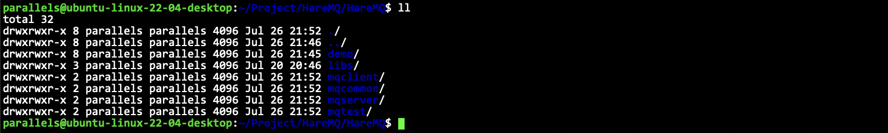
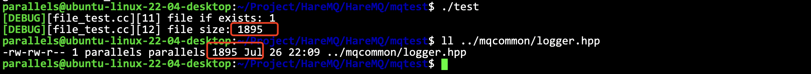
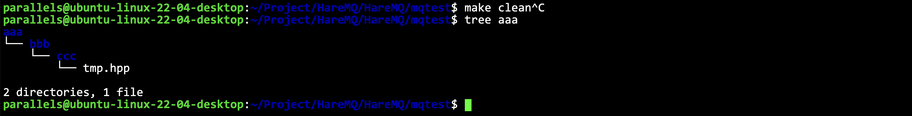
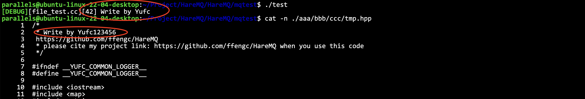
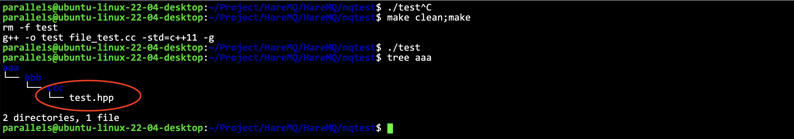
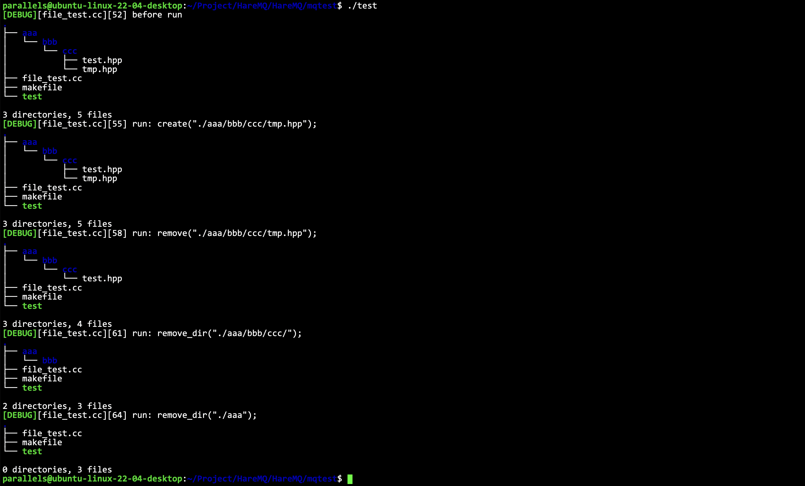

# 详细实现

- [详细实现](#详细实现)
  - [项目目录结构创建](#项目目录结构创建)
  - [工具类准备](#工具类准备)
    - [日志打印工具](#日志打印工具)
    - [sqlite基础操作](#sqlite基础操作)
    - [字符串操作](#字符串操作)
    - [UUID生成类](#uuid生成类)
    - [文件基础操作](#文件基础操作)
    - [测试文件相关操作](#测试文件相关操作)


## 项目目录结构创建



## 工具类准备

我们需要以下这些工具代码:

- 日志打印工具
- 文件基础操作
- sqlite基础操作
- 字符串操作
- UUID生成类


### 日志打印工具

这个日志组件我经常使用，直接见代码即可。`HareMQ/mqcommon/logger.hpp`。

### sqlite基础操作

在 `mqcommon` 里面创建一个 `helper.hpp` 即可，把 demo 里面实现的 `db.hpp` 里面的内容复制过去即可。

**具体解释可以见 demo 的文档: [docs/sqlite.md](../docs/sqlite.md)**

### 字符串操作

其实就是字符串切割，之前也写过很多次了，用`boost`里面的就行了。

```cpp
class string_helper {
    static size_t split(const std::string& str, const std::string& sep, std::vector<std::string>* out, bool if_compress = true) {
        // boost split
        if (if_compress) {
            boost::split(*out, str, boost::is_any_of(sep), boost::token_compress_on);
            return out->size();
        } else {
            boost::split(*out, str, boost::is_any_of(sep), boost::token_compress_off);
            return out->size();
        }
    }
};
```

### UUID生成类

> [!TIP]
> UUID(Universally Unique ldentifier), 也叫通用唯一识别码，通常由32位16进制数字字符组成。UUID的标准型式包含32个16进制数字字符，以连字号分为五段，形式为8-4-4-4-12的32个字符，如: `550e8400-e29b-41d4-a716-446655440000`。在这里，uuid生成，我们采用生成8个随机数字，加上8字节序号，共16字节数组生成32位16进制字符的组合形式来确保全局唯一的同时能够根据序号来分辨数据。

```cpp
class uuid_helper {
public:
    std::string uuid() {
        std::random_device rd;
        std::mt19937_64 generator(rd());
        std::uniform_int_distribution<int> distribution(0, 255);
        std::stringstream ss;
        for (int i = 0; i < 8; ++i) {
            ss << std::setw(2) << std::setfill('0') << std::hex << distribution(generator);
            if (i == 3 || i == 5 || i == 7)
                ss << "-";
            static std::atomic<size_t> seq(1); // 这里一定要静态，保证多次调用都是自增的
            size_t num = seq.fetch_add(1);
            for (int i = 7; i >= 0; i--) {
                ss << std::setw(2) << std::setfill('0') << std::hex << ((num >> (i * 8)) & 0xff);
                if (i == 6)
                    ss << "-";
            }
        }
        return ss.str();
    }
};
```

### 文件基础操作


基本框架:

```cpp
class file_helper {
private:
    std::string __file_name;

public:
    file_helper(const std::string& file_name)
        : __file_name(file_name) { }
    ~file_helper() = default;

public:
    bool exists();
    size_t size();
    bool read(std::string& body);
    bool read(std::string& body, size_t offset, size_t len);
    bool write(const std::string& body);
    bool write(const std::string& body, size_t offset);
    bool create();
    bool remove();
    bool create_dir();
    bool remove_dir();
    static std::string parent_dir(const std::string& file_name);
    bool rename(const std::string& name);
};
```

### 测试文件相关操作

`mptest/file_test.cc`

先测试两个简单的功能:

```cpp
void test1() {
    hare_mq::file_helper helper("../mqcommon/logger.hpp");
    hare_mq::LOG(DEBUG) << "file if exists: " << helper.exists() << std::endl;
    hare_mq::LOG(DEBUG) << "file size: " << helper.size() << std::endl;
}
```




测试目录创建和文件创建：

```cpp
void test2() {
    hare_mq::file_helper helper("./aaa/bbb/ccc/tmp.hpp");
    if (helper.exists() == false) {
        std::string p = hare_mq::file_helper::parent_dir(helper.path()); // 先获取父级目录
        hare_mq::LOG(DEBUG) << p << std::endl;
        if (hare_mq::file_helper(p).exists() == false) {
            // 创建目录
            hare_mq::file_helper::create_dir(p);
        }
        hare_mq::file_helper::create(helper.path());
    }
}
```



测试全局的读写:


```cpp
void test3() {
    hare_mq::file_helper helper1("../mqcommon/logger.hpp");
    hare_mq::file_helper helper2("./aaa/bbb/ccc/tmp.hpp");
    std::string body;
    helper1.read(body);
    // write to tmp.hpp
    helper2.write(body);
}
```

把`logger.hpp`里面的数据读出来，然后写到`tmp.hpp`里面去。


测试特定位置的读写:

```cpp
void test4() {
    hare_mq::file_helper helper("./aaa/bbb/ccc/tmp.hpp");
    // 把6-19个字节读取出来
    char str[16] = {0};
    helper.read(str, 6, 13); // 这里要读 (6, 19] 这些字符，应该传入 6, 13
    hare_mq::LOG(DEBUG) << std::string(str) << std::endl;
    helper.write("123456\n", 19, 7);
}
```



通过测试。


测试一下`rename`:

```cpp
void test5() {
    hare_mq::file_helper helper("./aaa/bbb/ccc/tmp.hpp");
    helper.rename(hare_mq::file_helper::parent_dir(helper.path()) + "/test.hpp");
}
```



符合预期。


测试删除:

```cpp
void test6() {
    hare_mq::LOG(DEBUG) << "before run" << std::endl;
    system("tree .");
    hare_mq::file_helper::create("./aaa/bbb/ccc/tmp.hpp");
    hare_mq::LOG(DEBUG) << "run: create(\"./aaa/bbb/ccc/tmp.hpp\");" << std::endl;
    system("tree .");
    hare_mq::file_helper::remove("./aaa/bbb/ccc/tmp.hpp");
    hare_mq::LOG(DEBUG) << "run: remove(\"./aaa/bbb/ccc/tmp.hpp\");" << std::endl;
    system("tree .");
    hare_mq::file_helper::remove_dir("./aaa/bbb/ccc/");
    hare_mq::LOG(DEBUG) << "run: remove_dir(\"./aaa/bbb/ccc/\");" << std::endl;
    system("tree .");
    hare_mq::file_helper::remove_dir("./aaa");
    hare_mq::LOG(DEBUG) << "run: remove_dir(\"./aaa\");" << std::endl;
    system("tree .");
}
```



符合预期。

