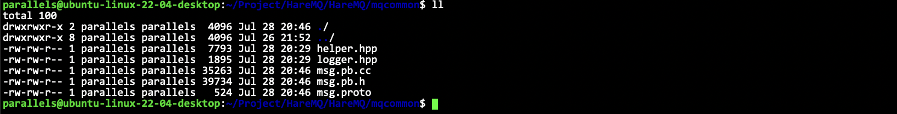

# 详细实现

- [详细实现](#详细实现)
  - [项目目录结构创建](#项目目录结构创建)
  - [工具类准备](#工具类准备)
    - [日志打印工具](#日志打印工具)
    - [sqlite基础操作](#sqlite基础操作)
    - [字符串操作](#字符串操作)
    - [UUID生成类](#uuid生成类)
    - [文件基础操作](#文件基础操作)
    - [测试文件相关操作](#测试文件相关操作)
  - [消息类型定义](#消息类型定义)
  - [交换机数据管理](#交换机数据管理)
  - [交换机部分单元测试](#交换机部分单元测试)
  - [队列数据管理](#队列数据管理)
  - [队列部分单元测试](#队列部分单元测试)
  - [绑定信息管理](#绑定信息管理)
  - [绑定信息管理测试](#绑定信息管理测试)
  - [消息管理](#消息管理)
    - [消息包括哪些数据](#消息包括哪些数据)
    - [消息的持久化管理](#消息的持久化管理)
      - [持久化的思想](#持久化的思想)
      - [提供的接口操作](#提供的接口操作)
    - [消息持久化的实现](#消息持久化的实现)
    - [消息在内存中的管理](#消息在内存中的管理)
    - [对外的总体消息管理类](#对外的总体消息管理类)
  - [虚拟机操作模块](#虚拟机操作模块)
  - [路由交换模块](#路由交换模块)
    - [基本概念](#基本概念)
    - [`binding_key` 和 `routing_key` 的规则](#binding_key-和-routing_key-的规则)
    - [如何匹配](#如何匹配)


## 项目目录结构创建


## 工具类准备

我们需要以下这些工具代码:

- 日志打印工具
- 文件基础操作
- sqlite基础操作
- 字符串操作
- UUID生成类


### 日志打印工具

这个日志组件我经常使用，直接见代码即可。`HareMQ/mqcommon/logger.hpp`。

### sqlite基础操作

在 `mqcommon` 里面创建一个 `helper.hpp` 即可，把 demo 里面实现的 `db.hpp` 里面的内容复制过去即可。

**具体解释可以见 demo 的文档: [docs/sqlite.md](../docs/sqlite.md)**

### 字符串操作

其实就是字符串切割，之前也写过很多次了，用`boost`里面的就行了。

```cpp
class string_helper {
    static size_t split(const std::string& str, const std::string& sep, std::vector<std::string>* out, bool if_compress = true) {
        // boost split
        if (if_compress) {
            boost::split(*out, str, boost::is_any_of(sep), boost::token_compress_on);
            return out->size();
        } else {
            boost::split(*out, str, boost::is_any_of(sep), boost::token_compress_off);
            return out->size();
        }
    }
};
```

### UUID生成类

> [!TIP]
> UUID(Universally Unique ldentifier), 也叫通用唯一识别码，通常由32位16进制数字字符组成。UUID的标准型式包含32个16进制数字字符，以连字号分为五段，形式为8-4-4-4-12的32个字符，如: `550e8400-e29b-41d4-a716-446655440000`。在这里，uuid生成，我们采用生成8个随机数字，加上8字节序号，共16字节数组生成32位16进制字符的组合形式来确保全局唯一的同时能够根据序号来分辨数据。

```cpp
class uuid_helper {
public:
    std::string uuid() {
        std::random_device rd;
        std::mt19937_64 generator(rd());
        std::uniform_int_distribution<int> distribution(0, 255);
        std::stringstream ss;
        for (int i = 0; i < 8; ++i) {
            ss << std::setw(2) << std::setfill('0') << std::hex << distribution(generator);
            if (i == 3 || i == 5 || i == 7)
                ss << "-";
            static std::atomic<size_t> seq(1); // 这里一定要静态，保证多次调用都是自增的
            size_t num = seq.fetch_add(1);
            for (int i = 7; i >= 0; i--) {
                ss << std::setw(2) << std::setfill('0') << std::hex << ((num >> (i * 8)) & 0xff);
                if (i == 6)
                    ss << "-";
            }
        }
        return ss.str();
    }
};
```

### 文件基础操作


基本框架:

```cpp
class file_helper {
private:
    std::string __file_name;

public:
    file_helper(const std::string& file_name)
        : __file_name(file_name) { }
    ~file_helper() = default;

public:
    bool exists();
    size_t size();
    bool read(std::string& body);
    bool read(std::string& body, size_t offset, size_t len);
    bool write(const std::string& body);
    bool write(const std::string& body, size_t offset);
    bool create();
    bool remove();
    bool create_dir();
    bool remove_dir();
    static std::string parent_dir(const std::string& file_name);
    bool rename(const std::string& name);
};
```

### 测试文件相关操作

`mptest/file_test.cc`

先测试两个简单的功能:

```cpp
void test1() {
    hare_mq::file_helper helper("../mqcommon/logger.hpp");
    hare_mq::LOG(DEBUG) << "file if exists: " << helper.exists() << std::endl;
    hare_mq::LOG(DEBUG) << "file size: " << helper.size() << std::endl;
}
```


测试目录创建和文件创建：

```cpp
void test2() {
    hare_mq::file_helper helper("./aaa/bbb/ccc/tmp.hpp");
    if (helper.exists() == false) {
        std::string p = hare_mq::file_helper::parent_dir(helper.path()); // 先获取父级目录
        hare_mq::LOG(DEBUG) << p << std::endl;
        if (hare_mq::file_helper(p).exists() == false) {
            // 创建目录
            hare_mq::file_helper::create_dir(p);
        }
        hare_mq::file_helper::create(helper.path());
    }
}
```


测试全局的读写:


```cpp
void test3() {
    hare_mq::file_helper helper1("../mqcommon/logger.hpp");
    hare_mq::file_helper helper2("./aaa/bbb/ccc/tmp.hpp");
    std::string body;
    helper1.read(body);
    // write to tmp.hpp
    helper2.write(body);
}
```

把`logger.hpp`里面的数据读出来，然后写到`tmp.hpp`里面去。


测试特定位置的读写:

```cpp
void test4() {
    hare_mq::file_helper helper("./aaa/bbb/ccc/tmp.hpp");
    // 把6-19个字节读取出来
    char str[16] = {0};
    helper.read(str, 6, 13); // 这里要读 (6, 19] 这些字符，应该传入 6, 13
    hare_mq::LOG(DEBUG) << std::string(str) << std::endl;
    helper.write("123456\n", 19, 7);
}
```


通过测试。


测试一下`rename`:

```cpp
void test5() {
    hare_mq::file_helper helper("./aaa/bbb/ccc/tmp.hpp");
    helper.rename(hare_mq::file_helper::parent_dir(helper.path()) + "/test.hpp");
}
```


符合预期。


测试删除:

```cpp
void test6() {
    hare_mq::LOG(DEBUG) << "before run" << std::endl;
    system("tree .");
    hare_mq::file_helper::create("./aaa/bbb/ccc/tmp.hpp");
    hare_mq::LOG(DEBUG) << "run: create(\"./aaa/bbb/ccc/tmp.hpp\");" << std::endl;
    system("tree .");
    hare_mq::file_helper::remove("./aaa/bbb/ccc/tmp.hpp");
    hare_mq::LOG(DEBUG) << "run: remove(\"./aaa/bbb/ccc/tmp.hpp\");" << std::endl;
    system("tree .");
    hare_mq::file_helper::remove_dir("./aaa/bbb/ccc/");
    hare_mq::LOG(DEBUG) << "run: remove_dir(\"./aaa/bbb/ccc/\");" << std::endl;
    system("tree .");
    hare_mq::file_helper::remove_dir("./aaa");
    hare_mq::LOG(DEBUG) << "run: remove_dir(\"./aaa\");" << std::endl;
    system("tree .");
}
```


符合预期。


## 消息类型定义

因此定义消息类型，其实就是定义一个消息类型的proto文件，并生成相关代码。

消息的结构:
1. 消息本身要素：
   1. 消息属性: 消息属性包含这些内容。消息ID、消息投递模式: 非持久化/持久化模式、消息的`routing_key`
   2. 消息有效载荷内容
2. 消息额外存储所需要素
3. 消息额外存储所需要素
   1. 消息的存储长度
   2. 消息的长度
   3. 消息是否有效：注意这里并不使用bool类型，而是使用字符0/1，因为bool类型在持久化的时候所占长度不同，会导致，修改文件中消息有效位后消息长度发生变化，因此不用bool类型。

定义proto文件。
```proto
syntax = "proto3";
package hare_mq;
enum ExchangeType {
    UNKNOWTYPE = 0;
    DIRECT = 1;
    FANOUT = 2;
    TOPIC = 3;
};
enum DeliveryMode {
    UNKNOWTYPE = 0;
    UNDURABLE = 1;
    DURABLE = 2;
};
message BasicProperties {
    string id = 1;
    DeliveryMode delivery_mode = 2;
    string routing_key = 3;
};
message Message {
    message Payload {
        BasicProperties properties = 1;
        string body = 2;
    };
    Payload payload = 1;
    uint32 offset = 2;
    uint32 length = 3;
    string valid = 4;
};
```



## 交换机数据管理

现在要开始编写`mqserver`里面的`exchagne,.hpp`了。

代码基本结构如下所示:

```cpp
namespace hare_mq {
/**
 * 1. 交换机类
 * 2. 交换机数据持久化管理类
 * 3. 交换机数据内存管理类
 */
struct exchange {
    /* 交换机类 */
public:
    using ptr = std::shared_ptr<exchange>;
    std::string name; // 交换机名称
    ExchangeType type; // 交换机类型
    bool durable; // 持久化标志
    bool auto_delete; // 自动删除标志
    std::unordered_map<std::string, std::string> args; // 其他参数
public:
    exchange(const std::string ename,
        ExchangeType etype,
        bool edurable,
        bool eauto_delete,
        const std::unordered_map<std::string, std::string>& eargs)
        : name(ename)
        , type(etype)
        , auto_delete(eauto_delete)
        , args(eargs) { }
    // args存储的格式是键值对，在存储数据库的时候，会组织一个字符串进行存储 key=value&key=value
    void set_args(const std::string& str_args) {
        /**
         * 解析 str_args 字符串: key=value&key=value... 存到 args 成员变量中去
         */
    }
    std::string get_args() {
        /**
         * set_args()的反操作，把args里面的数据序列化成 key=value&key=value... 的格式
         */
    }
};

class exchange_mapper {
    /* 交换机数据持久化管理类 */
private:
    sqlite_helper __sql_helper; // sqlite操作句柄
public:
    exchange_mapper(const std::string& dbfile); // 构造，需要传递数据库文件名称
public:
    void create_table(); // 创建表
    void remove_table(); // 删除表
    void insert(exchange::ptr& e); // 插入交换机
    void remove(const std::string& name); // 移除交换机
    exchange::ptr one(const std::string& name); // 获取单个交换机
    std::unordered_map<std::string, exchange::ptr> all(); // 获取全部交换机
};

class exchange_manager {
    /* 交换机数据内存管理类 */
private:
    exchange_mapper __mapper; // 持久化管理
    std::unordered_map<std::string, exchange::ptr> __exchanges; // 管理所有的交换机
    std::mutex __mtx; // exchange_manager 会被多线程调用，管理一个互斥锁
public:
    exchange_manager(const std::string& dbfile);
    void declare_exchange(const std::string& name,
        ExchangeType type,
        bool durable,
        bool auto_delete,
        std::unordered_map<std::string, std::string>& args); // 声明交换机
    void delete_exchange(const std::string& name); // 删除交换机
    exchange::ptr select_exchange(const std::string& name); // 选择一台交换机
    bool exists(const std::string& name); // 判断交换机是否存在
    void clear_exchange(); // 清理所有交换机
};

} // namespace hare_mq
```

具体代码可以见代码所示。

## 交换机部分单元测试

单元测试部分我找到了很多bug，改了一些地方。具体见代码。`HareMQ/mqtest/exchange_test.cc`

## 队列数据管理

这一部分的基本结构如下所示。

**定义队列描述数据类:**
1. 队列名称
2. 是否持久化标志

**定义队列数据持久化类（数据持久化的sqlite3数据库中）**
1. 创建/删除队列数据表
2. 新增队列数据
3. 移除队列数据
4. 查询所有队列数据

**定义队列数据管理类：**
1. 创建队列，并添加管理（存在则不创建）
2. 删除队列
3. 获取指定队列
4. 判断所有队列
5. 判断指定队列是否存在
6. 获取队列数量
7. 销毁所有队列数据

具体代码和`exchange.hpp`的基本是完全一样的，这里不重复，具体可见代码。

## 队列部分单元测试

这一部分和交换机部分基本完全相同。

具体见代码。`HareMQ/mqtest/queue_test.cc`

## 绑定信息管理

本质上就是一个交换机关联了哪些队列的描述。

**定义绑定信息类：**
1. 交换机名称
2. 队列名称
3. `binding_key`(分发匹配规则-决定了哪些数据能被交换机放入队列)

**定义绑定信息数据持久化类：**
1. 创建/删除绑定信息数据表
2. 新增绑定信息数据
3. 移除指定绑定信息数据
4. 移除指定交换机相关绑定信息数据
5. 移除指定队列相关绑定信息数据
6. 查询所有绑定信息数据
7. 查询指定绑定信息数据（根据交换机-队列名称）

**定义绑定信息数据管理类：**
1. 创建绑定信息，并添加管理（存在则OK，不存在则创建）
2. 删除指定队列的所有绑定信息
3. 删除交换机相关的所有绑定信息
4. 获取交换机相关的所有绑定信息
5. 判断当前绑定信息是否存在
6. 获取当前绑定信息数量
7. 销毁所有绑定信息数据

同样，也是第三个类才是对外的，和前面其实都是一样的。


**一些实现的tips:**

```cpp
using msg_queue_binding_map = std::unordered_map<std::string, binding::ptr>;
using binding_map = std::unordered_map<std::string, msg_queue_binding_map>;
```
为什么这样设计?

**因为一个交换机可以有多个绑定信息，但是一个绑定信息一定只对应一个队列。**

**所以让队列和绑定信息先构造一个一一对应的map。**

其余基本东西和前面写过的基本都相同。要注意这里:


```cpp
    static int select_callback(void* arg, int numcol, char** row, char** fields) {
        binding_map* result = (binding_map*)arg;
        binding::ptr bp = std::make_shared<binding>(row[0], row[1], row[2]);
        // 为了防止绑定信息已经存在，不能直接创建队列映射，直接添加，这样会覆盖历史数据
        // 因此要先获得交换机对应的映射对象，往里面添加数据
        // 但是若这个时候没有交换机对应的映射信息，因此这里的获取要使用引用（会保证不存在则自动创建）
        msg_queue_binding_map& qmap = (*result)[bp->exchange_name]; // 这里比较巧妙
        qmap.insert({ bp->msg_queue_name, bp });
        return 0;
    }
```
注意类型，不是直接插入。注意这两种类型即可。

```cpp
using msg_queue_binding_map = std::unordered_map<std::string, binding::ptr>;
using binding_map = std::unordered_map<std::string, msg_queue_binding_map>;
```

绑定信息是否需要持久化取决于：交换机持久化+队列持久化，绑定信息才需要持久化。

```cpp
bool bind(const std::string& ename, const std::string& qname, const std::string& key, bool durable)
```

但是为了这些hpp之间是解耦合的，因此这里直接传递`bool durable`，让外部，让联合调用的时候直接告诉我是否需要持久化即可，而不是在这个文件里面去获取交换机和队列的数据，这样就耦合起来了，不是特别好。

## 绑定信息管理测试

测试和前面基本相同，不再重复，具体可见代码。`HareMQ/mqtest/binding_test.cc`。

## 消息管理

### 消息包括哪些数据

前面的章节基本上都是在做准备，从消息管理开始就是核心了。

消息有什么要素，这个protobuf文件里面都有定义好了，现在重新解释一下。

```protobuf
message BasicProperties {
    string id = 1;
    DeliveryMode delivery_mode = 2;
    string routing_key = 3;
};
message Message {
    message Payload {
        BasicProperties properties = 1;
        string body = 2;
        string valid = 3;
    };
    Payload payload = 1;
    uint32 offset = 2;
    uint32 length = 3;
};
```

消息是可以分为两部分的，第一部分是数据消息本身，也就是网络传输的核心数据，就是上面的`Payload`，第二部分就是服务器上的消息管理所需要的额外要素，最主要的就是持久化管理。

在服务器上消息管理需要的额外要素有哪些呢:
1. 消息的有效标志: 这个字段是需要随着消息的持久化内容一起进行持久化的。
   每一条消息都有可能要进行持久化存储，等到推送给客户端就会删除掉
   然而每一次删除一条数据就重写一次文件，效率太低下了
   如果设置了有效标志为，每次只需要将这个有效标志位对应的数据给修改成无效即可
2. 消息的实际存储位置（相对于文件起始位置的偏移量）
   当要删除某条消息时，需要重写覆盖这条消息在文件中的对应位置（将有效标志位置为无效）
   这个时候是需要找到这条信息的
3. 消息的长度
   当恢复历史消息以及读取消息内容的时候，需要解决粘包问题，所以必须知道消息多长

关于`valid`字段，修改一下要放到`Payload`里面才行，因为`Payload`的内容都是需要持久化存储的。


### 消息的持久化管理

#### 持久化的思想

思想：以队列为单元进行消息的持久化管理。

> 当消息文件垃圾回收时，需要加载所有有效消息，重新生成新的数据文件。但是生成新的数据文件后，消息的存储位置就发生了变化，这时候需要更新内存中的数据。
> 这时候就需要将所有的队列数据进行加锁，然后进行更新，这样锁的冲突太频繁，效率低。
> 因此，如果每个队列都有自己独立的数据文件，则每次只需要对操作的队列数据进行加锁即可。

这里要注意：

> [!NOTE]
> 消息的持久化管理是不使用数据库的，我们直接使用文件，因为我们不是用来查询的，而是用来备份的，而且消息的长度经常不定，所以选择使用文件更好。

如果要存储到文件中，就要把格式规范好。

我们的格式是: `[4字节长度|数据][4字节长度|数据][4字节长度|数据][4字节长度|数据]...` 这种格式进行存储。

通过这种方法就能解决粘包问题了。

#### 提供的接口操作

1. 消息文件的创建和删除
2. 消息新增持久化/删除消息的持久化（并不是真正的删除，只是将标志位置为无效）
3. 历史数据恢复/垃圾回收
   1. 什么情况需要垃圾回收：因为每次删除数据其实都是置为无效而已，不是真正的删除，因此文件中的数据会越来越多，但是也不是每次删除都需要回收，当文件中消息超过2000条，且其中有效的比例小于50%才回收。
   2. 回收思想：
      - 加载文件中的所有有效消息，然后删除原来的文件，然后生成新的文件把数据写入。（这种方法存在风险，万一写入失败了怎么办？）
      - 加载文件中的所有有效消息，先写入到一个临时文件中，然后再去删除原文件，最后将临时文件的名称改为对应的名称即可。

### 消息持久化的实现

框架如下所示。

```cpp
namespace hare_mq {
#define DATAFILE_SUBFIX ".mqd"
#define TMPFILE_SUBFIX ".mqd.tmp" // 定义持久化文件和临时文件的文件名后缀
using message_ptr = std::shared_ptr<Message>;
class message_mapper {
private:
    std::string __queue_name; // 队列名
    std::string __data_file; // 持久化文件
    std::string __tmp_file; // 临时文件
public:
    message_mapper(const std::string& base_dir, const std::string& qname);
    void create_msg_file();
    void remove_msg_file();
    void insert(message_ptr& msg);
    void remove(const message_ptr& msg);
    std::list<message_ptr> gc(); // 垃圾回收
};
} // namespace hare_mq
```

具体实现可以见代码。

### 消息在内存中的管理

对应持久化管理（消息在磁盘中），现在在内存中的管理，也是要以队列为单位进行管理。

所以需要两层封装的，每一个队列都需要一个类去对他进行管理，然后最终对外的，要管理所有队列，因此还需要一层封装。

**所以内层：队列消息管理**

操作:
1. 构造对象时: 创建/打开队列数据文件，恢复队列历史消息数据
2. 新增消息/确认消息（删除）: 垃圾回收在每一次ack(remove)后，检查一下，当持久化数据总量超过2000，且有效比例低于50%则进行垃圾回收
3. 获取队首消息
4. 删除队列所有消息
5. 获取待推送消息数量
6. 获取待确认消息数量
7. 获取持久化消息数量

字段:

0. 队列名称
1. 持久化的管理句柄
2. 待推送消息消息链表：头插尾删的方式
3. 持久化消息的一个哈希表：垃圾回收后需要更新消息数据（实际存储位置）
4. 待确认消息的一个哈希表：一条消息被推送给客户端，推送了，客户端是否有收到？所以需要确认，但是不是所有的消息都需要确认，所以是需要区分的。所以推送一条消息给客户端，就要先把消息取出来（一定要取出来，不然后续就重复推送了），然后放到待确认的map中等待被确认。
5. 持久化文件中有效消息数量
6. 持久化文件中总体消息数量：可以用来计算文件中的有效消息比例，来决定是否进行垃圾回收。

基本结构如下所示:

```cpp
/* 队列管理（上面是持久化，这里是内存的）*/
class queue_message {
private:
    std::string __queue_name; // 队列名称
    size_t __valid_count; // 有效消息数量
    size_t __total_count; // 总共消息数量
    message_mapper __mapper; // 持久化的句柄
    std::list<message_ptr> __msgs; // 待推送的消息
    std::unordered_map<std::string, message_ptr> __durable_msgs; // 待持久化的消息
    std::unordered_map<std::string, message_ptr> __wait_ack_msgs; // 待确认的消息
public:
    queue_message(const std::string& base_dir, const std::string& qname)
        : __mapper(base_dir, qname) { }
    bool insert(const BasicProperties* bp, const std::string& body);
    bool remove(const std::string& msg_id); // ack, 每次remove后要去检查是否需要gc
    message_ptr front(); // 获取队首消息
    size_t push_count();
    size_t total_count();
    size_t durable_count();
    size_t wait_ack_count();
    void clear();
};
```

### 对外的总体消息管理类

管理的是每一个队列的消息。

管理的成员：
- 互斥锁
- 每个队列的消息管理句柄：队列名称&队列消息管理句柄的hash表

提供的操作：
- 初始化队列的消息管理句柄：创建队列的时候调用
- 销毁队列的消息管理句柄：删除队列的时候调用
- 队列的各项消息操作
  - 向队列新增消息
  - 获取队首消息
  - 对队列进行消息确认
  - 获取队列的消息数量：可获取消息数量，持久化消息数量，待确认消息数量，总的持久化消息数量
  - 恢复队列历史消息


```cpp
class message_manager {
private:
    std::mutex __mtx;
    std::string __base_dir;
    std::unordered_map<std::string, queue_message::ptr> __queue_msgs; //  map
public:
    using ptr = std::shared_ptr<message_manager>;
    message_manager(const std::string& base_dir)
        : __base_dir(base_dir) { }
    void init_queue_msg(const std::string& qname) {
        queue_message::ptr qmp;
        { // lock
            std::unique_lock<std::mutex> lock(__mtx);
            auto it = __queue_msgs.find(qname);
            if (it != __queue_msgs.end())
                return;
            qmp = std::make_shared<queue_message>(__base_dir, qname);
            __queue_msgs.insert(std::make_pair(qname, qmp));
        }
        qmp->recovery(); // no lock
    } // 创建队列
    void destroy_queue_msg(const std::string& qname) {
        queue_message::ptr qmp;
        {
            std::unique_lock<std::mutex> lock(__mtx);
            auto it = __queue_msgs.find(qname);
            if (it == __queue_msgs.end()) // 没找到这个队列，直接返回
                return;
            qmp = it->second;
            __queue_msgs.erase(it);
        }
        qmp->clear();
    } // 销毁队列
    bool insert(const std::string& qname, BasicProperties* bp, const std::string& body, DeliveryMode mode) {
        queue_message::ptr qmp;
        {
            std::unique_lock<std::mutex> lock(__mtx);
            auto it = __queue_msgs.find(qname);
            if (it == __queue_msgs.end()) {
                LOG(ERROR) << "insert msg failed, no this queue: " << qname << std::endl;
                return false;
            }
            qmp = it->second;
        }
        return qmp->insert(bp, body, mode);
    } // 向 qname 插入一个消息
    message_ptr front(const std::string& qname) {
        queue_message::ptr qmp;
        {
            std::unique_lock<std::mutex> lock(__mtx);
            auto it = __queue_msgs.find(qname);
            if (it == __queue_msgs.end()) {
                LOG(ERROR) << "get queue front failed, no this queue: " << qname << std::endl;
                return message_ptr();
            }
            qmp = it->second;
        }
        return qmp->front();
    } // 获取 qname 这个队列的队首消息
    void ack(const std::string& qname, const std::string msg_id) {
        queue_message::ptr qmp;
        {
            std::unique_lock<std::mutex> lock(__mtx);
            auto it = __queue_msgs.find(qname);
            if (it == __queue_msgs.end()) {
                LOG(ERROR) << "ack mesg failed, no this queue: " << qname << std::endl;
                return;
            }
            qmp = it->second;
        }
        qmp->remove(msg_id); // 确认就是删除
    } // 对 qname 中的 msg_id 进行确认
    size_t getable_count(const std::string& qname) {
        queue_message::ptr qmp;
        {
            std::unique_lock<std::mutex> lock(__mtx);
            auto it = __queue_msgs.find(qname);
            if (it == __queue_msgs.end()) {
                LOG(ERROR) << "error in getable_count(), no this queue: " << qname << std::endl;
                return 0;
            }
            qmp = it->second;
        }
        return qmp->getable_count();
    }
    size_t total_count(const std::string& qname) {
        queue_message::ptr qmp;
        {
            std::unique_lock<std::mutex> lock(__mtx);
            auto it = __queue_msgs.find(qname);
            if (it == __queue_msgs.end()) {
                LOG(ERROR) << "error in total_count(), no this queue: " << qname << std::endl;
                return 0;
            }
            qmp = it->second;
        }
        return qmp->total_count();
    }
    size_t durable_count(const std::string& qname) {
        queue_message::ptr qmp;
        {
            std::unique_lock<std::mutex> lock(__mtx);
            auto it = __queue_msgs.find(qname);
            if (it == __queue_msgs.end()) {
                LOG(ERROR) << "error in durable_count(), no this queue: " << qname << std::endl;
                return 0;
            }
            qmp = it->second;
        }
        return qmp->durable_count();
    }
    size_t wait_ack_count(const std::string& qname) {
        queue_message::ptr qmp;
        {
            std::unique_lock<std::mutex> lock(__mtx);
            auto it = __queue_msgs.find(qname);
            if (it == __queue_msgs.end()) {
                LOG(ERROR) << "error in wait_ack_count(), no this queue: " << qname << std::endl;
                return 0;
            }
            qmp = it->second;
        }
        return qmp->wait_ack_count();
    }
    void clear() {
        std::unique_lock<std::mutex> lock(__mtx);
        for (auto& q : __queue_msgs)
            q.second->clear();
    }
};
```

## 虚拟机操作模块

其实就是对前面的所有模块进行整合。让虚拟机这个操作类向更上一层提供接口。

本质：虚拟机操作模块就是对前面的模块的封装

**定义虚拟机类包含以下成员：**
- 交换机数据管理句柄
- 队列数据管理句柄
- 绑定数据管理句柄
- 消息数据管理句柄

**虚拟机的操作：**
- 声明交换机（若存在就不需要创建了）
- 删除交换机（同时删除绑定信息）
- 声明队列（若不存在则创建，创建的同时创建队列关联消息管理对象）
- 删除队列（同时删除绑定信息）
- 交换机-队列绑定
- 交换机-队列解绑
- 获取交换机相关的所有绑定信息
- 提供新增消息的功能
- 提供获取指定队列队首消息的功能

**虚拟机管理操作：**
- 增删查

虚拟机类的结构如下所示
```cpp
namespace hare_mq {
class virtual_host {
private:
    exchange_manager::ptr __emp;
    msg_queue_manager::ptr __mqmp;
    binding_manager::ptr __bmp;
    message_manager::ptr __mmp; // 四个句柄
public:
    virtual_host(const std::string& basedir, const std::string& dbfile);
    bool declare_exchange(const std::string& name,
        ExchangeType type,
        bool durable,
        bool auto_delete,
        std::unordered_map<std::string, std::string>& args); // 声明交换机
    void delete_exchange(const std::string& name); // 删除交换机
    bool declare_queue(const std::string& qname,
        bool qdurable,
        bool qexclusive,
        bool qauto_delete,
        const std::unordered_map<std::string, std::string>& qargs); // 声明队列
    void delete_queue(const std::string& name); // 删除队列
    bool bind(const std::string& ename, const std::string& qname, const std::string& key); // 绑定交换机和队列
    void unbind(const std::string& ename, const std::string& qname); // 解除绑定交换机和队列
    msg_queue_binding_map exchange_bindings(const std::string& ename); // 获取一台交换机的所有绑定信息
    bool basic_publish(const std::string& qname, BasicProperties* bp, const std::string& body, DeliveryMode mode); // 发布一条消息
    message_ptr basic_consume(const std::string& qname); // 消费一条消息
    bool basic_ack(const std::string& qname, const std::string& msgid); // 确认一条消息
};
} // namespace hare_mq
```

实现后的代码如代码所示。


## 路由交换模块

### 基本概念

> [!TIP]
> 这个模块的本质：判断一个消息中的 `routing_key` 与队列的 `binding_key` 是否匹配成功，即：这条到达交换机的消息，要发送到哪一个队列里面去？

客户端将消息发不到指定的交换机，交换机这时候要考虑这条数据该放入到哪些与自己绑定的队列中，而这个考量是通过交换机类型以及匹配规则来决定的。
- 广播交换：直接将消息交给所有绑定的队列，无需匹配
- 直接交换：队列绑定信息中的 `binding_key` 与消息中的 `routing_key` 一致则匹配成功，否则失败。
- 主题交换：只有匹配队列主题的消息才会被放入队列中。

首先需要总结的一点：只需要对传入的数据进行处理即可，不需要自己对数据进行管理！因此这个模块的接口，都应该是 `static` 的。

**需要提供的功能：**
1. 判断 `routing_key` 是否合法
2. 判断 `binding_key` 是否合法
3. 进行两种 `key` 的匹配

### `binding_key` 和 `routing_key` 的规则

**`routing_key`**

必须是: `a~z`, `A~Z`, `0~9`, `.`, `_` 组成

**`binding_key`**

必须是: `a~z`, `A~Z`, `0~9`, `.`, `_`, `#`, `*` 组成，注意，`#`, `*` 是通配符。`*`可以匹配任意一个单词，`#`可以匹配零个或者任意多个单词（注意是单词，不是字母），通配符要独立存在，比如可以 `a.#.b`, 不能 `a.a#.b`。
`#`两边不能有其他通配符，因为 `#` 本身就表示多个单词，所以如果两边还有是没有意义的。

### 如何匹配

方法: 动态规划

这里的逻辑比较复杂。

**整体思路和 LeetCode 里面的这一题非常相像: [https://leetcode.cn/problems/wildcard-matching/description/](https://leetcode.cn/problems/wildcard-matching/description/)**

因此这里不重复解释原理了，具体直接见代码。

```cpp
    static bool __dp_matching(const std::string& routing_key, const std::string& binding_key) {
        // 1. 将binding_key与routing_key进行字符串分割，得到各个的单词数组
        std::vector<std::string> bkeys, rkeys;
        int n_bkey = string_helper::split(binding_key, ".", &bkeys);
        int n_rkey = string_helper::split(binding_key, ".", &rkeys);
        // 2. 定义标记数组，并初始化[0][0]位置为true，其他位置为false
        std::vector<std::vector<bool>> dp(n_bkey + 1, std::vector<bool>(n_rkey + 1, false));
        dp[0][0] = true;
        // 3. 如果binding_key以#起始，则将#对应行的第0位置置为1
        for (int i = 1; i <= bkeys.size(); ++i) {
            if (bkeys[i - 1] == "#") {
                dp[i][0] = true;
                continue;
            }
            break;
        }
        // 4. 使用routing_key中的每个单词与binding_key中的每个单词进行匹配并标记数组
        for (int i = 1; i <= n_bkey; i++) {
            for (int j = 1; j <= n_rkey; j++) {
                // 如果当前 bkey 是单词或者 * ，或者两个单词相同，表示单词匹配成功，从左上方继承结果
                if (bkeys[i - 1] == rkeys[j - 1] || bkeys[i - 1] == "*")
                    dp[i][j] = dp[i - 1][j - 1];
                // 如果当前 bkye 是 # , 则需要从左上，左边，上边继承结果
                else if (bkeys[i - 1] == "#")
                    dp[i][j] = dp[i - 1][j - 1] || dp[i][j - 1] || dp[i - 1][j];
            }
        }
        return dp[n_bkey][n_rkey];
    }
```